## 介绍  
本项目创建于2024年4月，保证这是你见过的最详细的 OpenClash 图文设置方案  

由 Wiki 的编辑历史可以检索到 Wiki 第一个版本是2024年5月6日编写，前后修订几十个版本进行了完善。  
[Wiki 编辑历史](https://github.com/Aethersailor/Custom_OpenClash_Rules/wiki/_history?page=6)  
鄙视所有转载不注明出处的行为！  

请尊重开源社区的基本守则！  

**注意：**  

* **本项目使用 `Fake-IP` 模式，介意这一点的麻烦关闭网页。**  

* **本项目依赖 OpenClash 的`绕过中国大陆`功能，介意这一点的麻烦关闭网页。**  

* **本项目不提供 yaml 文件下载，完全依靠 luci 页面设置以及订阅转换来实现效果，介意这一点的麻烦关闭网页。**  

* **本项目维护者反对部署所谓的“旁路由”网络架构，本项目所有教程均以主路由环境为例，仅对旁路由网络架构下的设置差异作简单提示。“旁路由”用户请自行融会贯通举一反三，出了问题也不要提问，谁教你用旁路由的你去找谁，感谢合作。**  

* Wiki 页面右边有目录  

## 本方案所实现的效果  

严格按照本方案的内容去设置你的 OpenClash 插件，无需套娃其他工具（如 Mosdns）即可实现以下功能：  

* **优化的 DNS 设置，闪电般的国内访问速度。**  
国内域名采用运营商 DNS 解析，域名和 IP 均绕过 OpenClash 内核并返回真实 IP，让 OpenClash 对国内访问的影响降低到几乎为零。

* **杜绝 DNS 污染和泄露，无需搭配其他插件。**  
海外域名采用使用远端节点服务器的 DNS 进行解析并访问，确保隐私的同时取得最佳解析结果。

* **彻底告别套娃设置。**  
免去各种 DNS 插件带来的搭配烦恼，全部特性依靠 OpenClash 一个插件实现，且保证 OpenClash 即使挂了也不影响访问国内网站。  

* **傻瓜化的设置操作。**  
鼠标点击+复制粘贴几分钟即可完成完美设置，无需手搓配置。  

* **丰富的分流策略组。**  
包含流媒体服务、AI 工具、电商、游戏平台等在内的大量常见的分流策略组，同时也为轻量化需求用户提供简化版本的规则。

* **支持节点按地区分类测速优选。**  
自动优选最快节点，不用自己折腾切换。  

* **Steam 访问优化。**  
单独列出 Steam 规则并强制 Steam 下载 CDN 走直连，解决 Steam 下载 CDN 定位到海外的问题，确保 Steam 下载流量不走代理。  

* **自动更新，长期无人值守。**  
设置完成后即可长期无人值守，每日定时自动更新上游规则、GEO 数据库和大陆白名单，以及维护者修改的模板等具有时效性要求的数据，无需自己动手。    

* **海外下载流量优化。**  
尽力避免海外下载流量走节点，节约节点流量。（尚不完善）。  

* **支持广告屏蔽功能和 hosts 加速。**  
依靠 OpenClash 配合系统自带 Dnsmasq 实现广告过滤和 hosts 加速功能，并实现每日自动更新，支持添加多个规则。（可选）

* **增加更多的节点区域分组。**  
增加包括英国、加拿大等国家的节点分组，参考本项目推荐机场的节点地区设定。

* **增加若干冷门域名规则。**  
增加了一些小众网站的直连规则，可以自己 PR 提交域名参与完善规则。  

## 0. 使用前的一些提醒

### 0.1. 关于推荐固件  

推荐使用 ImmortalWrt 官方编译固件，备选 OpenWrt 官方编译固件。  

详细内容：[关于推荐固件](5.故障排除.md#%E6%8E%A8%E8%8D%90%E5%9B%BA%E4%BB%B6)  

### 0.2. 关于旁路由  

“旁路由”是一种**错误**的组网方法，**反对**部署所谓的“旁路由”，**强烈建议**使用 OpenWrt 作为唯一主路由。  

我个人始终坚持认为如果一个主路由可以满足使用需求的情况下，用旁路由纯粹就是脱裤子放屁，人为制造问题给自己找麻烦。  

个人观点：[关于旁路由的一些吐槽](6.关于“旁路由”的一些吐槽.md)  

所以下文的设置内容虽然都是根据主路由环境而设置的，但是亦在旁路由涉及的设置差异方面进行了对应的说明，请旁路由用户根据自身理解自行修改对应的设置。未说明的部分无需改变。    
  
本项目 issue 和 TG 群组内出现的问题，90%都是和旁路由有关，更加印证了我的观点。  

项目维护者部署的所有设备都是主路由以做到网路环境尽量从简，所以任何关于旁路由下的设置出现的问题，要么不予解答要么就是凭经验和猜测解答，不对结果负责。  

### 0.3. 关于 IPv6  

在确保你的宽带运营商提供了 IPv6 服务，且节点支持 IPv6 出站的情况下，搭配本项目另一个方案实现 OpenClash 和 IPv6 的完美兼容  

https://github.com/Aethersailor/Custom_OpenClash_Rules/wiki/OpenWrt-IPv6-设置方案  

不清楚自己的节点是否支持 IPv6 的话，可以向机场客服发工单来确定，或者按照方案内容进行设置后测试节点如果不具备 IPv6 出站能力再关闭 OpenClash 的 IPv6 功能  

### 0.4. 关于 DNS  

> **强烈建议使用运营商通告的 DNS 进行国内域名的解析**，不论是解析速度还是结果的科学性，都不是第三方 DNS 可以比拟的  

三大运营商的 DNS 都不存在对国内域名的污染，而且绝对是你的线路的最优解析结果，根本不需要用第三方 DNS 替代，更不需要用 SmartDNS 或 Mosdns 之类的工具进行 DNS 优选。  

> 以上结论仅仅是项目维护者根据本人实际经验得出。Mosdns 和 SmartDNS 都是非常优秀的 DNS 工具，这一点毋庸置疑。  

根据本人长期测试，三大运营商 DNS 提供的国内域名解析服务永远是最优最近的 CDN，和 DNS 插件优选的解析结果一致。  

以本人所在的城市为例，电信和联通线路的 DNS 延迟都非常低，及时是高峰时段，延迟也只有1-2毫秒，白天的话可以稳定只有 1 毫秒的延迟，这时候还去用 DNS 插件很有可能是负优化  

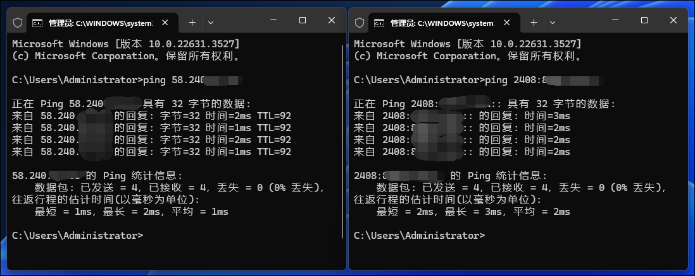  

当然了，我这里和运营商 DNS 在同一个城市，所以延迟表现比较优秀。如果你和运营商 DNS 不是同城的话，延迟可能就没那么优秀了，但一般也会优于第三方 DNS。  

按照本项目的方案设置后，运行商 DNS 只用于解析中国大陆域名，不存在污染问题，完全不用担心运营商 DNS 没有 DoT/DoH 加密。海外域名全部远端解析取得离机场最近的 CDN，更没有污染，也没有隐私泄露风险。  

```
坚持要使用第三方 DNS 的话，请使用国内的 DOH 服务器。请勿使用 UDP 服务器，大概率会被运营商劫持。
```

### 0.5. 关于“套娃”设置  

以维护者所在的网络环境为例，部署本方案后，使用脚本去批量测试 1000 次国内外主流域名的解析速度，dnsmasq 提供的解析延迟稳定在 1-1.5ms 左右，而加了 AdGuard Home 并开启缓存后，解析延迟也不过是降低大约 1ms，仅仅压缩了 1ms，而代价则是要面对缓存和 Fake-IP 并存导致的各种问题。  

网上某些教程教小白用 AdGuardHome 等插件一顿折腾，添加一堆没用的第三方 DNS，套娃一层套一层，然后弄出来个 5ms 甚至 10ms 更高的解析延迟，再告诉你这是“优化”了，这种纯属扯淡。不信你去换个最垃圾的百元硬路由， DHCP 直接默认就给你分配运营商 DNS 的那种，你会发现网页打开就是光速，你猜为什么。

另外，请勿迷信什么乐观缓存，Fake-IP 模式下搭配其他前置缓存插件只会导致更多的问题，路由器上什么缓存都没有浏览器和操作系统自带的 DNS 缓存作用大。  

**除非你是使用的长城宽带之类的存在流量穿透的宽带线路，DNS 延迟很高或无法正确解析到离你地理位置最近的 CDN，否则根本就没有必要用 DNS 优化插件。**  

**如果你坚持认为 1ms 的解析时间差距会明显影响上网体验，而愿意承受套娃带来的其他副作用，那我无话可说**  

```
套娃强迫症，不套娃不舒服，坚持要“套娃”设置，仅建议在 Nameserver 上游添加 SmartDNS。
完全无副作用。
```

### 0.6. 关于广告过滤  

按照本项目方案，只使用 OpenClash 一个插件，且中国大陆域名均绕过了 OpenClash 内核，因此无法依靠 OpenClash 的规则来完成广告过滤。  

所以本方案使用了 Dnsmasq 来实现广告过滤功能，借助 OpenClash 的“开发者选项”，实现 OpenClash 每次启动时，为 Dnsmasq 拉取最新的广告过滤规则。同时由于 OpenClash 每次启动会重启 Dnsmasq，可以使广告过滤规则即时生效。  

具体本项目 Wiki 中的方案：  

[广告拦截设置方法](4.无插件广告拦截功能设置方案.md)  

**注意：任何 DNS 广告过滤规则的过滤效果都比不上浏览器插件的过滤效果。**  

### 0.7. 为何不提供 uci 一键设置脚本  

uci 一键设置脚本可以实现一键应用本方案的设置内容至 OpenClash 中，从技术上来说毫无难度。  

但是项目维护者坚持认为，授人以鱼不如授人以渔，希望看到本方案的小白可以按图索骥，亲手完成设置，并由此延伸至了解 OpenClash 的各项设置的功能。  

因此，暂时不提供一键设置脚本，也许以后会吧……  

(主要还是我懒，给自己找个理由)  

### 0.8. 为何不提供 yaml 文件下载  

> 本项目实现的相关特性，均可使用 OpenClash 的 luci 界面的既有选项完成，无需在配置文件中添加任何额外的参数。对于本项目来说，导入 yaml 文件没有任何意义。

总有小白迷信手搓的 yaml 配置文件更高端，一提到订阅转换就对这个功能嗤之以鼻，就好像不是手搓的配置文件的 Clash 就完全不能用似的，我实在不理解这些人的心理。  

首先希望小白们明白一点，不管是使用 OpenClash luci 界面设置+订阅转换生成配置，还是导入 .yaml 文件，本质上都是为 Clash 内核创建一个符合用户需求、可供启动的 yaml 配置文件。  

yaml 文件省去的仅仅是设置 OpenClash 覆写设置+订阅转化的步骤，对于 OpenClash 插件提供的 Clash 内核之外的的一些功能，例如绕过中国大陆、各种数据库的更新等等，是无法通过导入 yaml 文件来实现的，依然需要去 luci 界面上修改设置（别跟我说你觉得在 ssh 下修改更快）。  

如果导入 yaml 的同时，还要再去修改某些设置，我个人觉得那么不如干脆一次性改完好了，多点几下鼠标有何麻烦。

订阅转换服务是将你的节点信息“搓”入标准的配置文件中，然后 OpenClash 的各个设置特别是覆写设置，在 OpenClash 在启动时对订阅转换服务生成的默认配置文件进行覆写修改，本质上是 OpenClash 替你“搓”了一个 yaml 文件。  


**使用插件设置+覆写设置+订阅转换：**

优点：
* 完全无人值守，上游分流模板更新会随着自动更新下发
* 便捷的根据实际情况快速修改设置，例如 IPv6，切换是否使用 Smart 功能等等 

缺点：
* 无法实现覆写设置+订阅转换后端以外的高级设置，配置文件内容仅在 OpenClash 覆写设置+订阅转换后端支持的范围内  
* 公共订阅转换可能会泄露订阅链接的。（可以通过 [搭建 Cloudflare Worker 反代](https://www.youtube.com/watch?v=X7CC5jrgazo) 或者自建订阅转换后端解决  


**上传 yaml 文件：**

优点：
* 完全 100% 的自由度，可以实现更高级的功能，例如链式代理等等
* 不受订阅转换后端服务器影响

缺点：
* 作者修改一次，你就得下载并重新导入一次  
* 配置的修改远不如图形界面来的方便


无论以上哪种方式，都要在 OpenClash 界面中修改某些既有选项。  

所以，如果你不刚需某些高级功能，或者说网上某些 yaml 配置根本就没有额外的功能，那么你告诉我，导入 yaml 文件的意义是什么呢。  

> 订阅转换是个很方便的功能，绝不是“落后”的功能

本项目实现的相关特性，均可使用 OpenClash 的 luci 界面的既有选项完成，无需在配置文件中添加任何额外的参数。对于本项目来说，导入 yaml 文件没有任何意义。  

另外，由于本项目要实现配置后完全无人值守，维护者对分流模板的修改可以通过定时订阅转换自动同步给每一个人。如果每次修改分流模板就要发布一次 yaml 文件，未免太不现实，对于用户来说也太麻烦。  

> 如果你对手搓 yaml 配置文件感兴趣，可以在依托本方案完成设置让 OpenClash 正常工作后，从配置管理中导出现成的配置文件，在此基础上再进行修改。

> 当然了，本文仅作抛砖引玉，维护者更希望看到这个方案的人，将来完全玩转这个插件以及任何 Clash 内核的插件，而不需要再依赖这篇方案或者任何人的配置文件。

***

# OpenClash 图文设置方案  

> 严格按照文字和图片中的内容进行设置，其他选项不清楚如何设置的，照抄即可。  

```
一定要认真阅读，一定要认真阅读，一定要认真阅读！
不要跳着看，不要只抄图片不看文字！
否则可能会错过关键设置！

整个教程内容冗长，但大多是讲解原理和功能，实际需要修改的设置并不复杂。
```

OpenWrt 做主路由和旁路由时的设置差异，相关的步骤中会提及，按照你的情况选择就行。  

不懂的情况下不要自己乱改设置！必须使用本项目的订阅模板！否则不保证效果正常。  

个别需要你自己根据实际情况进行选择的步骤，会讲明原理，只要智商正常都能看懂，仔细阅读即可。  

> 先按照本方案配置好，确保正常工作了，理解了相关设置，再自由发挥去修改，不要自己瞎设置出了问题再来问我，这是浪费时间  

> 如果你有个性化需求，先通过本方案搞明白设置，后续 fork 本项目自己修改模板即可  

## 1. 准备工作  

### 1.1. 查看运行商通告的 DNS  

首选确保你的 WAN 口设置中`启用`了`“自动获取 DNS 服务器”`，这样才能获取到运营商下发的 IPv4 DNS  

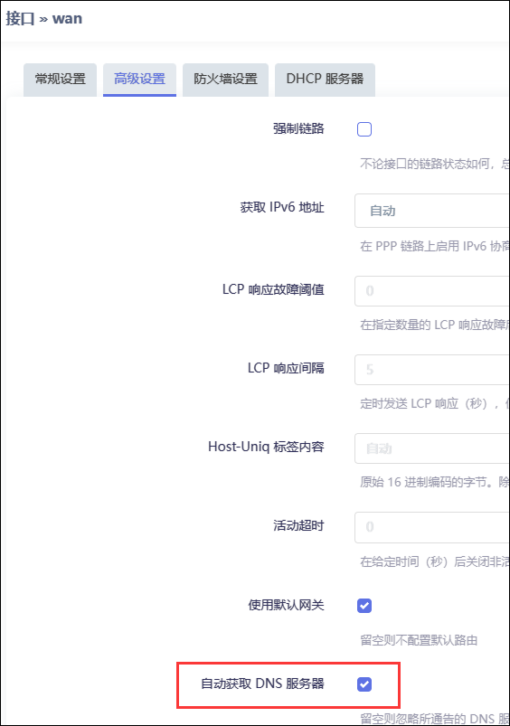  

然后在 OpenWrt 的首页查看是否取得了运营商下发的 DNS，如果你打算使用其他的国内第三方 DNS，可以跳过此步骤。  

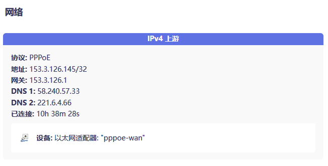    

### 1.2. 关闭 DNS 重定向功能  

该功能位于 网络 > DHCP/DNS 页面中，务必关闭  

> 若不关闭，有可能会引起 DNS 解析问题，并会导致本方案的广告拦截设置无法拦截国外域名  

某些固件中可能没有这个选项，忽略该步骤即可。  

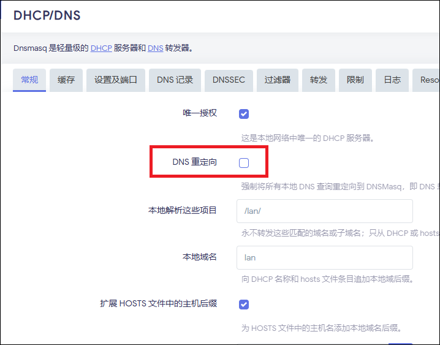  

### 1.3. 确保 OpenWrt 可以正常访问 GitHub 或加速 CDN

> OpenClash 的各项数据库以及插件和内核的更新，全部需要连接 GitHub 或者 jsDeliver CDN 才能完成  

不管你的网络能不能正常访问 GitHub （国内网络大概率不能或者间歇性不饿能），请提前在 OpenClash 中启用 GitHub 地址修改功能  

```
1. 进入 OpenClash > 覆写设置 > 常规设置
2. 在 GitHub 地址修改功能的下拉菜单中选择一个 CDN 节点
3. 推荐选择 testingcf，该 CDN 是 jsDeliver 的 Cloudflare 线路 CDN，同时建议根据自己的实际网络情况多做尝试
4. 点击页面下方的 “应用配置” 即可生效  
```
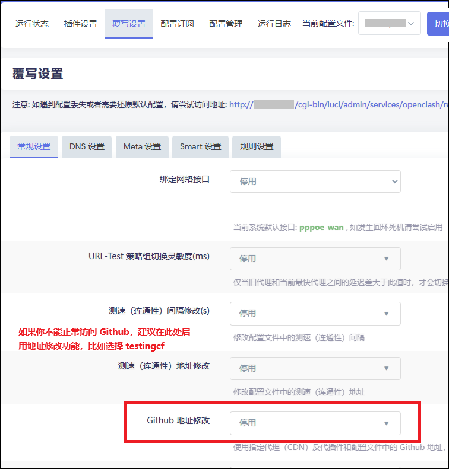  

准备工作完成，开始设置 OpenClash  

***

## 2. 设置 OpenClash 常规设置  

以下列出了 OpenClash 的设置内容，每个需要设置的页面均有图文说明，按照方案逐页进行设置即可。  

所有未提及的页面，均不需要设置。  


### 2.1 模式设置  

> **注意：本方案是适用 `Fake-IP` 模式的，如果你不愿意使用 Fake-IP 模式，可以关闭页面了**  

首先设置运行模式，在页面下方点击切换到 Fake-IP 模式，然后上方的运行模式选择 `Fake-IP（增强）`。   

如果你的页面上没有“使用 Meta 内核”的选项，是正常的，因为目前 OpenClash 只有 Meta 一个内核可选。  

```
Fake-IP（增强）模式可以提供最佳的性能，如果出现了 NAT 问题，可以尝试切换为 Fake-IP（混合）模式，记得要`启用` UDP 转发。
如果你的固件包含了 Docker 功能，直接选择 Fake-IP（TUN）模式即可。  
有游戏代理需求的，请自行尝试哪个模式下 NAT 状态最佳。  
```

> 不推荐使用带有 Docker 的固件，会出现很多问题。    

目前 OpenClash 默认使用 Meta 内核，如果你的页面上有“使用 Meta 内核”这个切换选项，说明你的 OpenClash 版本太老旧，请先更新插件到最新版。  

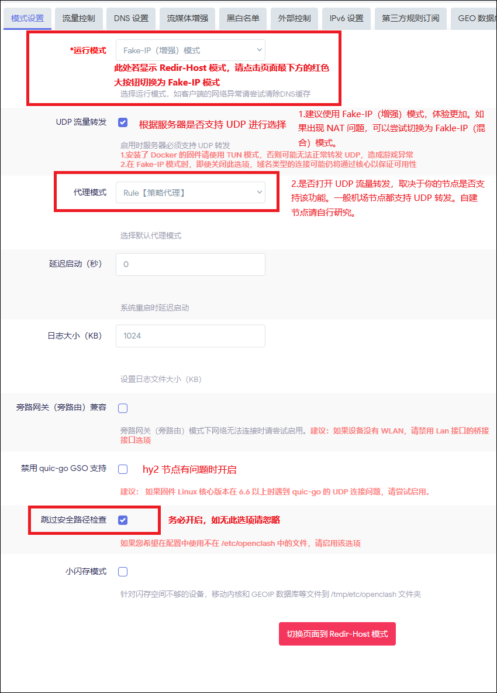  

### 2.2. 流量控制  

按照图中设置进行设置，务必`启用`“绕过中国大陆”功能来提升访问和下载性能。  

启用该功能后，所有包含在 GeoSite 数据库 CN 分类中并且解析 IP 在大陆白名单范围中的域名，都会绕过 Clash 内核进行访问。  

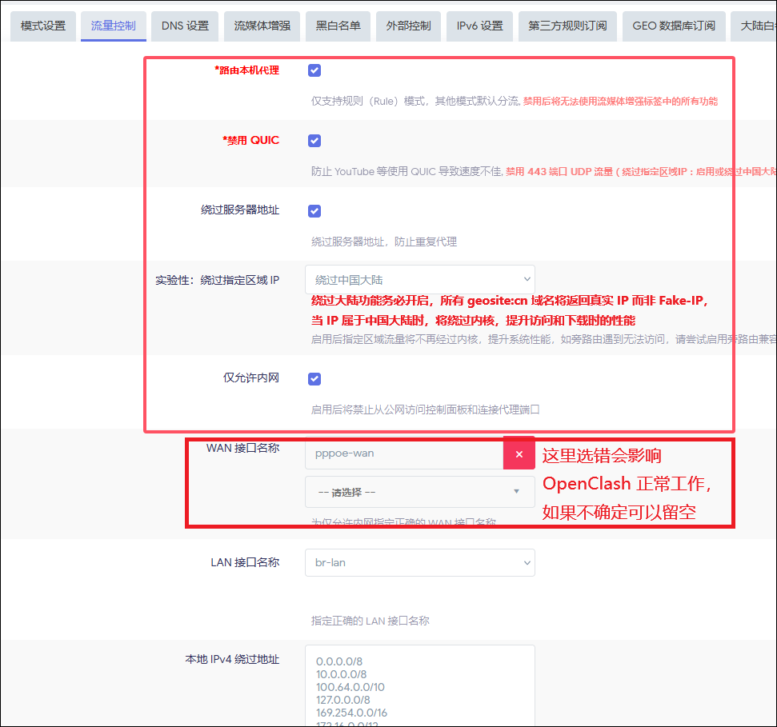  

如果你平时要使用 Google Play，请在 `流量控制 > 绕过指定区域 IPv4 黑名单`中添加如下四条域名：  

```
services.googleapis.cn
googleapis.cn
xn--ngstr-lra8j.com
clientservices.googleapis.com
```


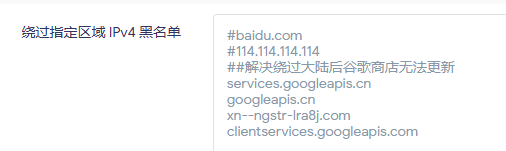  


### 2.3. DNS 设置

设置使用 Dnsmasq 进行转发，顺手点一下“Fake-IP 持久化缓存清理”按钮，不用管是否提示出错，然后点击页面下方的`“保存配置”`  

注意务必启用下方的`“禁止 Dnsmasq 缓存 DNS”`选项。新版本 OpenClash 中已经没有本条选项，忽略即可。 

`启用第二 DNS 服务器`功能，可以指定域名强制使用你指定的 DNS 进行解析，并直接返回真实 IP 而非 Fake-IP。  

返回真实 IP 后，再根据 IP 绕过内核或进入内核。

这里根据自己的需要进行填写（比如填写 DDNS 域名），一般情况下无需使用该功能。   

（图片懒得更新了）  

[](../doc/openclash/pics/3.png)  


### 2.4. 流媒体增强（可选）  

此处设置主要用于使 OpenClash 可在流媒体分流时在众多节点中自动选择解锁对应区域的流媒体服务的节点，此功能主要用于在一些流媒体解锁不稳定且混乱的杂牌机场中自动寻找对应的节点。  

**如果你所使用的机场的流媒体解锁服务相对比较稳定，或者已经知晓你所使用的机场哪些节点可以解锁你所需要的区域的流媒体服务，则可以跳过此页面的设置，设置完成后在 Clash 的控制面板中自行选择即可。**  

如果你要使用自动选择节点的功能，首先启用你要使用的流媒体服务，比如 Netflix，然后按照本方案的策略组名称在“策略组筛选”中进行填写，本方案中流媒体相关的策略组包括 Netflix、YouTube、Disney+等等  

解锁区域填写你要解锁的流媒体服务区域，比如你要解锁新加坡区就填写SG。解锁节点筛选填写需要测试的节点名称的关键词，比如填写“香港|新加坡”就会在包含以上关键词的节点中进行筛选  

例如设置了 `Netflix` 和 `SG`，OpenClash 启动后就会在你订阅的节点的清单中自动寻找解锁`新加坡（SG）` 区域的 Netflix 服务的节点作为分流策略组 `Netflix` 的指定节点  

设置后记得点击页面下方的“保存配置”，再次提醒此页是可选功能，非必要不使用。  

以图中内容为例，此处设置的为包含关键词为“Netflix”或“奈飞”的策略组探测能够解锁新加坡(SG)区域内容的节点，节点关键词为Singapore。  

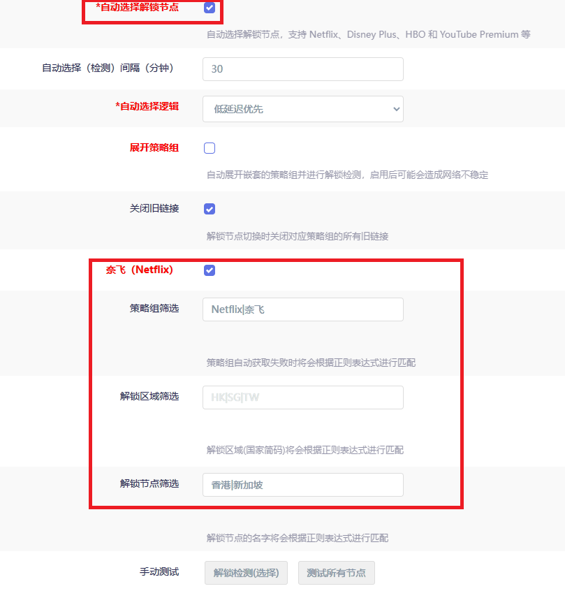  

在 OpenClash 启动后，会在日志中输出解锁结果  

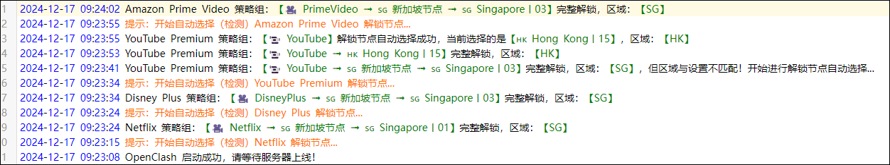  


### 2.5. IPv6 设置  

> 如果你打算启用 IPv6 功能，并且你的节点支持 IPv6 出站，则按照本项目的方案中的 IPv6 设置方案完成 OpenWrt 的 IPv6 设置后，再设置此页面即可。  

[OpenWrt IPv6 设置方案](https://github.com/Aethersailor/Custom_OpenClash_Rules/wiki/OpenWrt-IPv6-设置方案)  

维护者保证设置后 OpenClash 和 IPv6 功能完美兼容。  

旁路由建议放弃 IPv6 功能，或者自己折腾寻找出路。  

如果你的节点不支持 IPv6 出站，或者你的 OpenWrt 没有开启 IPv6 功能，请禁用 `IPv6 流量代理`和禁用`允许 IPv6 类型 DNS 解析`两个功能。    

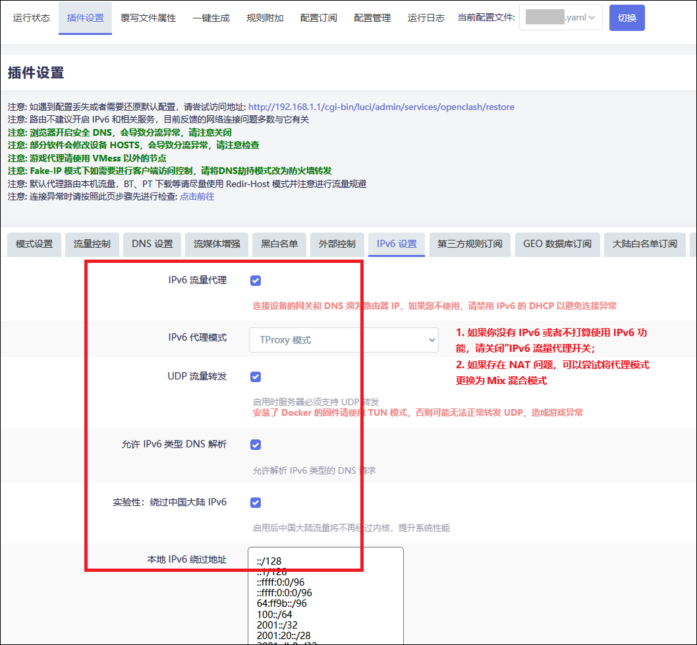  

如果你启用了此处的 IPv6 功能，并且平时要使用 Google Play，请绕过指定区域 IPv6 黑名单中添加如下四条域名：  

```
services.googleapis.cn
googleapis.cn
xn--ngstr-lra8j.com
clientservices.googleapis.com
```  

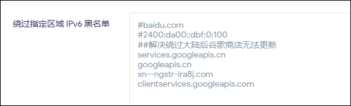  


### 2.6. GEO 数据库订阅  

一些分流数据库，必须保持更新，否则会对绕过大陆功能以及分流规则产生影响。按照图中设置即可，具体用途不多做解释，可以自行查找相关资料。  

图片可能存在滞后性，此页面所有的数据库全部需开启更新，包括图片中未包含的数据库选项。  

```
每次数据库更新成功后，OpenClash 会自动重启，届时将会短暂影响进入内核的连接，绕过内核的国内连接不会受到影响。
建议设置更新时间为每日不用网的时候，比如凌晨。
实际上各个数据库源并非每日更新，只有在检测到更新并成功更新后 OpenClash 才会重启。 
```

设置完后点击页面下方的“保存设置”，然后顺手把三个“检查并更新”按钮都点一遍。在 OpenClash 的“运行日志”页面可以查看更新结果，此操作可以顺带验证你的 OpenWrt 是否能顺利访问 GitHub 或者你在之前设置的 CDN 比如 testingcf.jsdeliver.net  

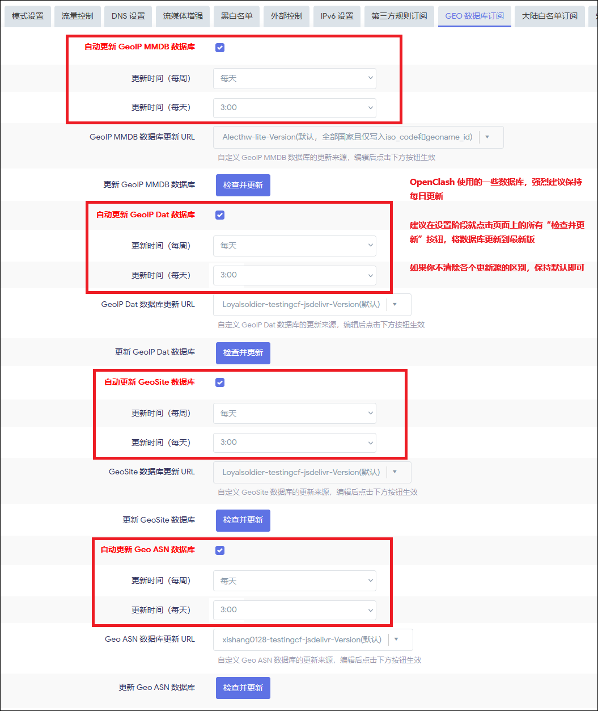  


### 2.7. 大陆白名单订阅  

OpenClash 绕过中国大陆功能使用的 IP 分流名单，必须保持更新,按照图中设置即可。  

```
每次数据库更新成功后，OpenClash 会自动重启，届时将会短暂影响进入内核的连接，绕过内核的国内连接不会受到影响。
建议设置更新时间为每日不用网的时候，比如凌晨。
实际上各个数据库源并非每日更新，只有在检测到更新并成功更新后 OpenClash 才会重启。  
```

设置完后点击页面下方的`“保存设置”`，然后顺手把`“检查并更新”`按钮点一下。在 OpenClash 的`“运行日志”`页面可以查看更新结果，此操作可以顺带验证你的 OpenWrt 是否能顺利访问 GitHub 或者你在之前设置的 CDN 比如 testingcf  

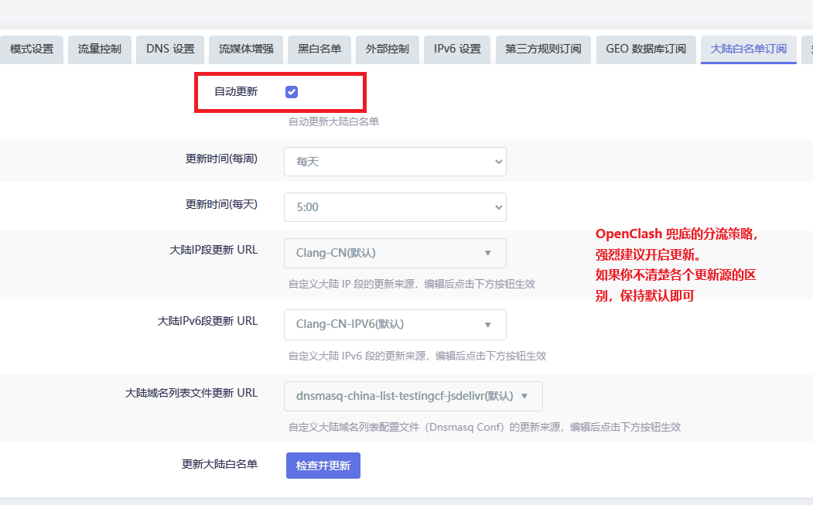  


### 2.8. 版本更新  

此页面用于更新 OpenClash 的内核以及 OpenClash 自身  

**建议**选择 `master` 版本，稳定性最佳。然后点击下方的一键更新，将内核和主程序更新为最新版。在 OpenClash 的`“运行日志”`页面可以查看更新结果，此操作可以顺带验证你的 OpenWrt 是否能顺利访问 GitHub 或者你在之前设置的 CDN 比如 testingcf  

喜欢追新可以选择 `dev` 版本，更新频率比较高，当然这样也要接受频繁升级以及偶发的 bug。就项目维护者的经验看来，dev 版本极少出现 bug。 

2024年12月18日：目前 `master` 版本和 `dev` 版本没有太大区别，追求稳定的话建议使用 `master` 版本。

本项目已完整支持 Smart 内核，如需使用 Smart 内核，此处完成内核的切换和更新后，后续教程对应步骤会提及如何使用。  

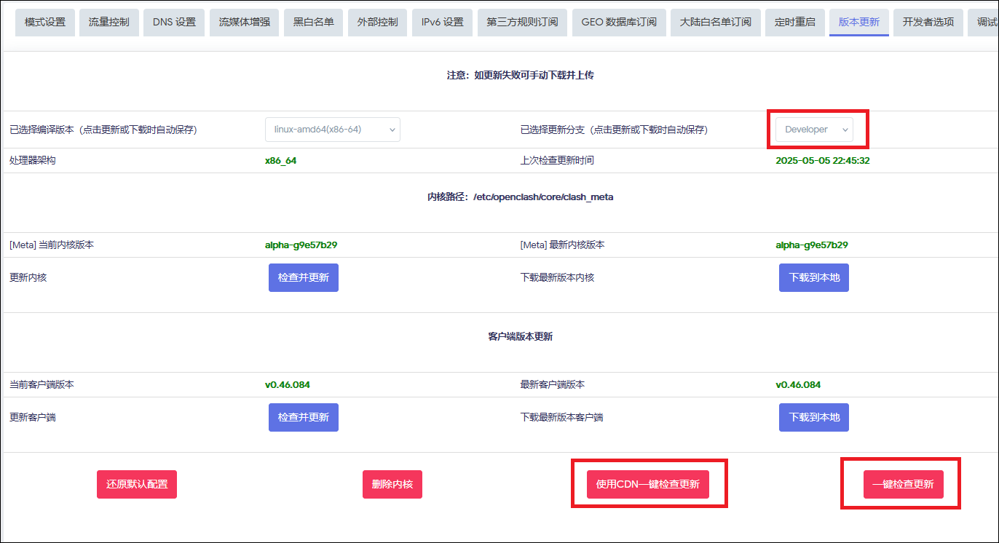  

PS：本项目维护者日常使用的是 dev 版本的 OpenClash 和 Meta 内核  

至此，OpenClash 中的常规设置设置完成  


***

## 3. 设置 OpenClash 覆写设置  

### 3.1. DNS 设置  

首先，启用`“自定义上游 DNS 服务器”`，并禁用下方的 `NameServer` 和 `Fallback` 下的所有服务器。  

然后根据以下三种情况，选择你对应的使用环境进行设置：  

* 主路由拨号 + 使用运营商 DNS 
```
1. 启用 “追加上游 DNS”
2. 禁用下方 NameServer 组的所有服务器
3. 禁用下方 Fallback 组的所有服务器
```
`追加上游 DNS`会将你的 WAN 口取得的 IPv4 DNS、IPv6 DNS 以及 PPPoE 网关均追加为 NameServer，省去了自己手动配置的麻烦。  

* 使用 `SmartDNS` 之类的 DNS 插件或其他公共 DNS 服务器（不区分主路由/旁路由）  
```
1. 禁用 “追加上游 DNS”
2. 启用 NameServer 组中的第一个服务器，并将地址修改为`SmartDNS`的`地址端口（例如 127.0.0.1:6053）
3. 禁用 Fallback 组下的所有服务器  
```
SmartDNS 自身的设置中，务必关闭 DNS 劫持，且只需要保留第一服务器组，并且只能添加国内 DNS。  

若要使用其他公共 DNS 服务器，在 `NameServer` 中填入或选择预置的服务器信息并启用即可。  

* “旁路由”用户  
```  
1. 禁用 “追加上游 DNS”
2. 启用 NameServer 组中的服务器，并将地址修改为你的运营商 DNS 地址或其他你要使用的 DNS。
3. 禁用 Fallback 组下的所有服务器。  
```
若使用了 SmartDNS，参考上一条 SmartDNS 的设置。  

注意`追加上游 DNS` 和下方的 `NameServer` 只需要`二选一`即可。OpenWrt 是主路由的情况下，建议此处设置按照图中进行设置。  

`追加上游 DNS`的作用：将你的 WAN 口取得的运营商通告的 IPv4 DNS 和 IPv6 DNS 以及 PPPoE 网关自动设置为设置为`NameServer`  

其余选项可以参考图中的设置进行。  

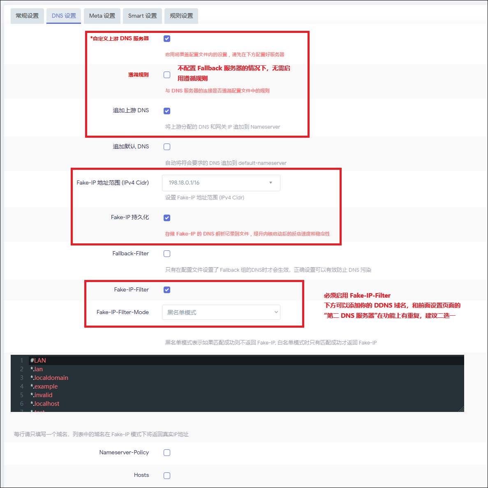  

在本方案中，NameServer 仅负责以下域名的 DNS 解析：
```
1. 绕过内核的大陆域名
2. 进入内核，但根据规则进行直连的域名
```
所以，在 Nameserver 中填入多个服务器并没有意义，更不要自作聪明的填写国外 DNS 服务器。  
如果有洁癖不愿意使用运营商 DNS ，可以使用阿里/DNSPOD 等第三方国内 DOH 服务器。  

为什么要取消 Fallback 服务器？  
```
在 Fake-IP 模式下，如果取消了 Fallback 服务器，OpenClash 会把域名解析请求传递到节点服务器上进行解析。
对于海外访问来说，这是取得最科学的解析结果的最佳办法。  
```

如果你的节点不能正常解析 DNS 请求，请启用 Fallback 服务器，一般选择 Google/Cloudflare 的 DOH 服务器即可，同时建议在本页面弃用`遵循规则`功能。  

如果你使用了域名类的 DOH 服务器（例如 https://dns.alidns.com/dns-query ），则需要启用 Default-Nameserver 服务器。  

设置完成后，点击页面下方的“保存配置”按钮  

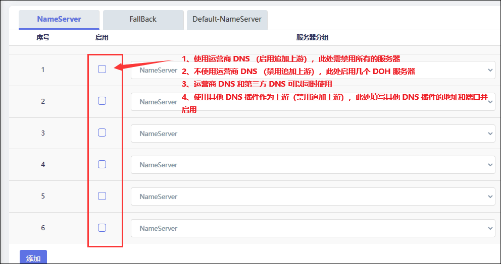  

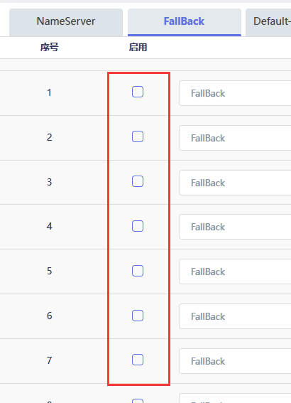  

### 3.2. Meta 设置  

按照图中内容，对红框中的选项进行设置。  
注意，务必开启`启用 GeoIP Dat 版数据库`选项。  

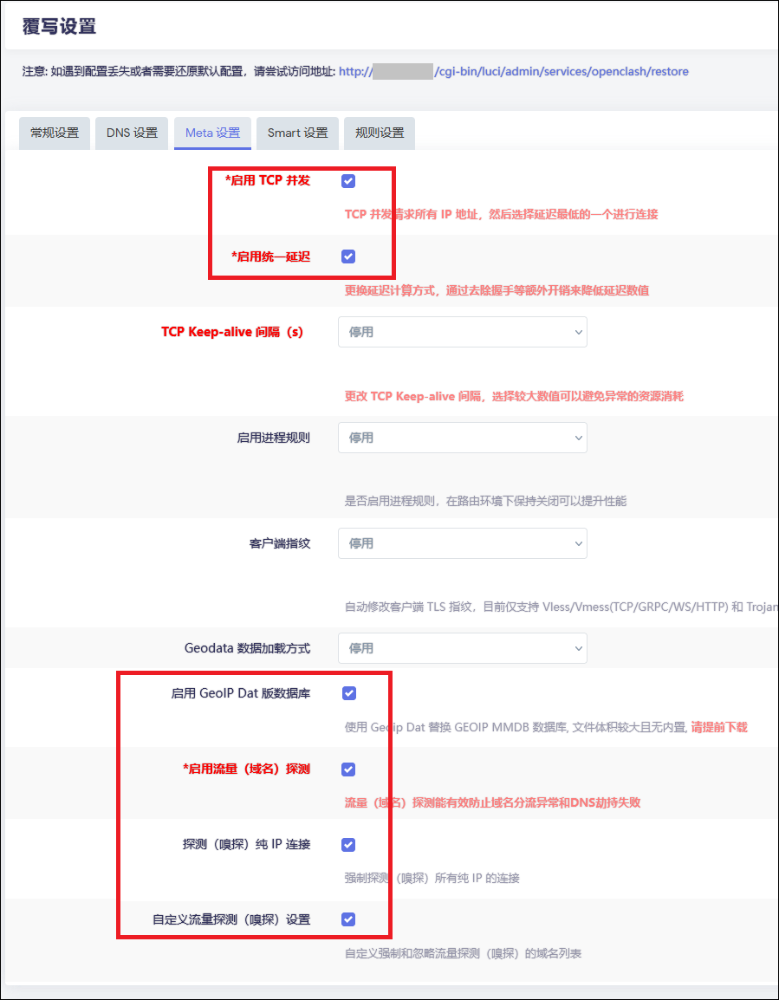  

### 3.3. 规则设置  

按照图中所示进行设置，该功能有一定的副作用，具体见 [vernesong/OpenClash#3942](https://github.com/vernesong/OpenClash/issues/3942)  

个人建议：有 BT、PT、P2P 下载的较强需求的开启，没有的则关闭  

2025年3月28日：当前 master 版本 0.46.079 下开启“仅代理命中流量”会导致 GeoIP 的规则无法生效，导致 Telegram 无法代理。请关闭该功能，或者升级 dev 版本 0.46.080 以上版本 

如果开启后仍然有相关流量走了代理，可以尝试将`漏网之鱼`策略组指定为直连，但是漏网之鱼策略组指定为直连会导致 DNS 泄露问题（仅仅是不能通过测试网站的测试，并非真正泄露），建议自行取舍。  

开启后，日志中可能出现少量 MATCH 报错，无需担心，不影响日常使用。  
  
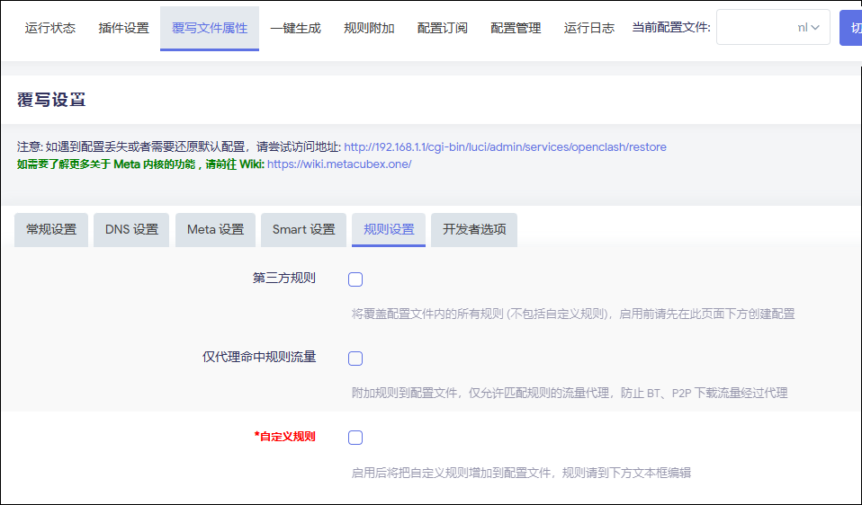  


下方的“自定义规则”启用后会出现文本框，可以添加你想附加的规则，规则相当丰富，具体格式见文本框内的注释，此处不做赘述。  

如果你的下载设备是 NAS 之类的独立设备，建议在此处通过自定义规则让下载设备的流量全部直连。  

具体参考：[如何添加自定义规则](https://github.com/Aethersailor/Custom_OpenClash_Rules/wiki/%E5%85%B6%E4%BB%96%E8%AF%B4%E6%98%8E#%E5%A6%82%E4%BD%95%E6%B7%BB%E5%8A%A0%E8%87%AA%E5%AE%9A%E4%B9%89%E8%A7%84%E5%88%99)  


### 3.4. 开发者选项  

此处无需修改。  

***

## 4. 为 OpenClash 配置订阅信息  

此处会区分 Smart 内核和非 Smart 内核的设置。  

### 4.1 通用设置

在页面中设置一个更新时间，这是本项目模板以及你的节点信息的更新时间，分流策略组和节点分组的修改、节点信息的更新，会随着订阅更新进行下发。

OpenClash 在更新订阅的过程中会短暂重启，所以建议设置在不用网的时间段内更新，比如凌晨。

注意：开启“绕过中国大陆”后，OpenClash 重启不会影响国内连接。   

设置好后点击“保存配置”，然后点击“添加”按钮，添加一个订阅  

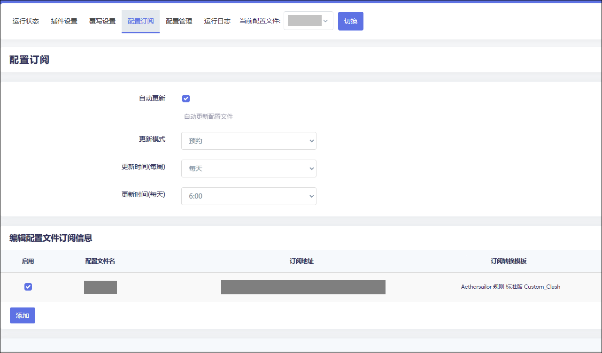  

按照图中内容填入订阅信息即可，配置文件名随意填写。  

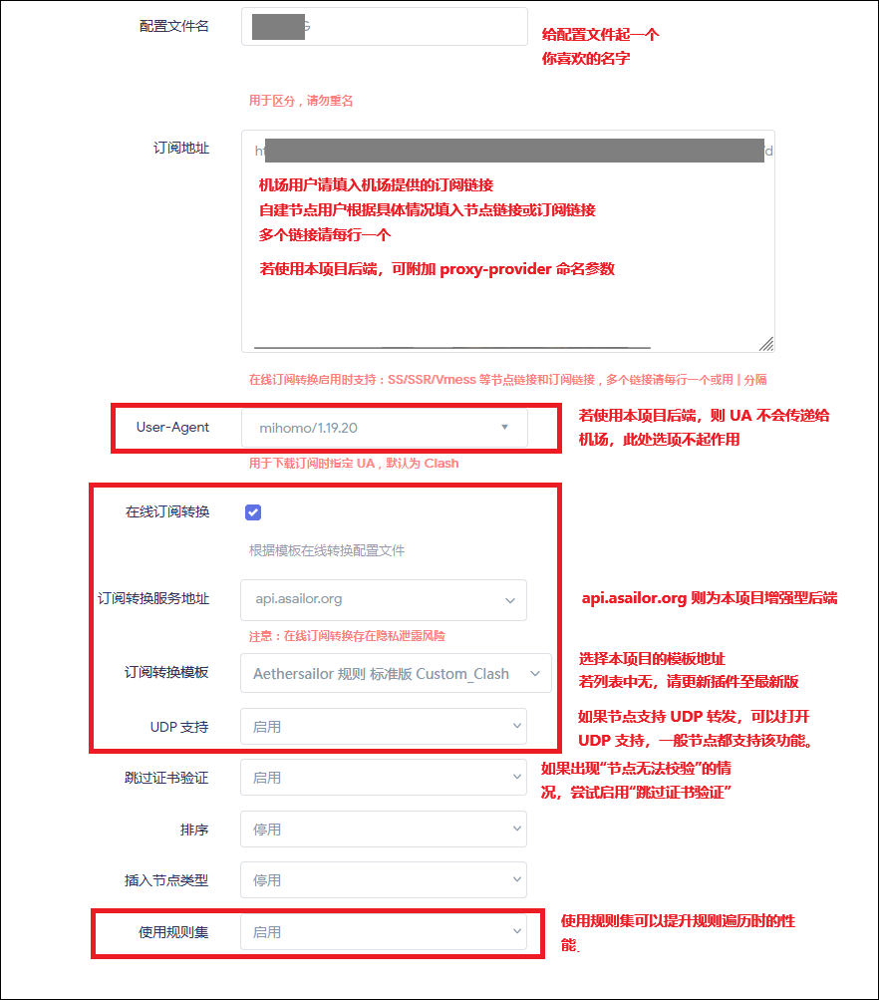  

如果你使用的是 Vless、hy2 等较新的格式的节点，请自行测试哪些后端支持此类节点，或者自行填写其他支持你的节点格式的第三方订阅后端（包括本项目后端，或者你自己搭建的后端）。  

个人经验：OpenClash 下拉列表里的几个订阅转换服务，偶尔会出现掉链子的情况，请根据自己的实际网络情况进行测试和选择。  

***
注意，订阅转换模板选择“自定义模板”，然后在下方填入本项目的自定义模板地址。

本项项目目前提供多个订阅转换模板，请根据自身需求，自行选择需要的订阅模板。  

各模板的功能和特性如下：  
    
|规则名|Custom_Clash|Custom_Clash_Lite|Custom_Clash_GFW|Custom_Clash_Full| 
|:-:|:-:|:-:|:-:|:-:|
|说明|全分组模板⭐|轻量化分组模板|gfwlist 规则模板|Full 重度分组模板|
|无 DNS 泄露|✅|✅|✅|✅|
|能否通过 DNS 泄露测试|✅|✅|❌|✅|
|基本国内外分流|✅|✅|❌|✅|
|gfwlist代理|✅|✅|✅|✅|
|流媒体分流|✅|❌|❌|✅|
|AI分流|✅|❌|❌|✅|
|海外网站默认连接方式|代理|代理|直连|代理|
***
应该选择使用哪个模板？  
（2025.6.25 之后，不再提供国内自建后端专用模板，所有模板地址使用 jsDeliver 加速，在国内外任意地区均可直接访问）  
* Custom_Clash.ini
```
本项目的标准订阅转换模板，适配所有需求，推荐使用。  
无 DNS 泄露，可通过泄露检测网站的测试。  
使用本项目推荐机场建议直接使用该模板，复刻维护者的使用体验。  
```
```
https://testingcf.jsdelivr.net/gh/Aethersailor/Custom_OpenClash_Rules@main/cfg/Custom_Clash.ini
```
***

* Custom_Clash_Lite.ini  
```
只具备基本的国内外分流功能，无DNS泄露，适合不需要流媒体解锁/AI分流等特殊分流功能，节点延迟较低且流量充裕的用户。  
无 DNS 泄露，可通过泄露检测网站的测试。  
```
```
https://testingcf.jsdelivr.net/gh/Aethersailor/Custom_OpenClash_Rules@main/cfg/Custom_Clash_Lite.ini
```
***
* Custom_Clash_GFW.ini  
```
无任何分流功能，仅代理 GFWList 网站和 Telegram 相关 IP，其余连接全部直连。适合流量较少或节点较慢的垃圾机场用户。  
无 DNS 泄露，但无法通过泄露检测网站的测试。  
```
```
https://testingcf.jsdelivr.net/gh/Aethersailor/Custom_OpenClash_Rules@main/cfg/Custom_Clash_GFW.ini
```
***
* Custom_Clash_Full.ini  
```
重度分流规则模板，任何人都可以向该规则内添加你认为可以用的到的规则或节点分组，可以通过 PR/issue/Telegram 群组 向维护者提出增加规则的请求。
该规则模板仅追求规则覆盖面，不做任何性能上的考量。  
无 DNS 泄露，可通过泄露检测网站的测试。  
```
```
https://testingcf.jsdelivr.net/gh/Aethersailor/Custom_OpenClash_Rules@main/cfg/Custom_Clash_Full.ini
```

***

还是看不懂该选哪个怎么办？请直接使用标准订阅转换模板 Custom_Clash.ini

**注意！必须使用本项目的订阅转换模板才能实现免套娃无 DNS 泄露！**  

如果在你的网络环境下， OpenClash 自带的订阅转换服务全部不可用，你可以使用本项目提供的订阅转换服务  

  

复制以下地址，填写进`“订阅转换服务地址”`中即可生效：  

```
https://api.asailor.org/sub
```   

本项目的订阅转换后端服务支持 vless/hy2 等较新的节点类型，支持 Smart 内核参数。**用爱发电，且用且珍惜。**  

最后点击下方的`“保存配置”`返回到配置订阅页面，此时整个设置工作已完成  

有隐私需求的用户，可以使用 Cloudflare 搭建后端反代服务。  

使用 ImmortalWrt 固件的用户，可以参考以下教程在 ImmortalWrt 中搭建本地订阅转换服务：[ImmortalWrt 下搭建订阅转换后端服务](7.一些零碎的教程.md#11-immortalwrt-%E4%B8%8B%E6%90%AD%E5%BB%BA%E8%AE%A2%E9%98%85%E8%BD%AC%E6%8D%A2%E5%90%8E%E7%AB%AF%E6%9C%8D%E5%8A%A1)  

### 4.2 Smart 内核用户设置  

Smart 内核用户，需要额外进行两个操作：  
```
1. 切换支持 Smart 内核参数的订阅转换后端
2. 切换支持 Smart 内核参数的订阅转换模板
```

本项目后端已实现对 Smart 内核参数的支持（参考上一节的替换方法）。  
本项目已提供对应的模板，任意普通模板添加 `_Smart` 字样即可实现切换。模板内容同普通模板，仅将各节点分组的测速功能替换为 Smart 功能。    

```
https://testingcf.jsdelivr.net/gh/Aethersailor/Custom_OpenClash_Rules@main/cfg/Custom_Clash_Smart.ini
```
```
https://testingcf.jsdelivr.net/gh/Aethersailor/Custom_OpenClash_Rules@main/cfg/Custom_Clash_Smart_Lite.ini
```
```
https://testingcf.jsdelivr.net/gh/Aethersailor/Custom_OpenClash_Rules@main/cfg/Custom_Clash_Smart_GFW.ini
```
```
https://testingcf.jsdelivr.net/gh/Aethersailor/Custom_OpenClash_Rules@main/cfg/Custom_Clash_Smart_Full.ini
```

***

## 5. 启动和启动后的动作

### 5.1. 更新配置并启动  

点击配置订阅页面中的`“更新配置”`按钮，OpenClash 即开始更新配置并启动  

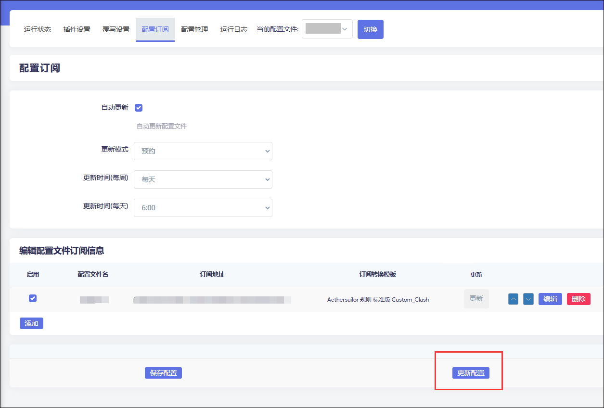  


### 5.2. 观察运行日志  

在上一步操作中点击`“更新配置”`后，切换到运行日志页面观察 OpenClash 的启动情况  

出现“OpenClash 启动成功，请等待服务器上线！”后，即表示 OpenClash 已经启动成功  

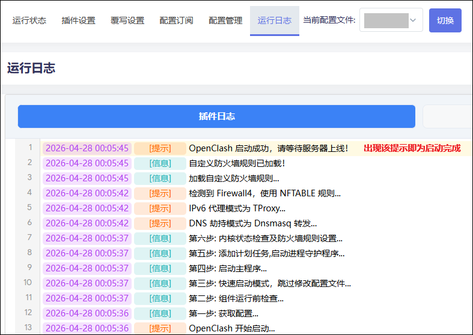  


### 5.3. 切换策略组 

在 OpenClash 的运行状态页面中，点击控制面板按钮启动控制面板。  

OpenClash 内置了多款控制面板，建议根据自己的使用习惯进行选择，新手可以先使用 Dashboard。  

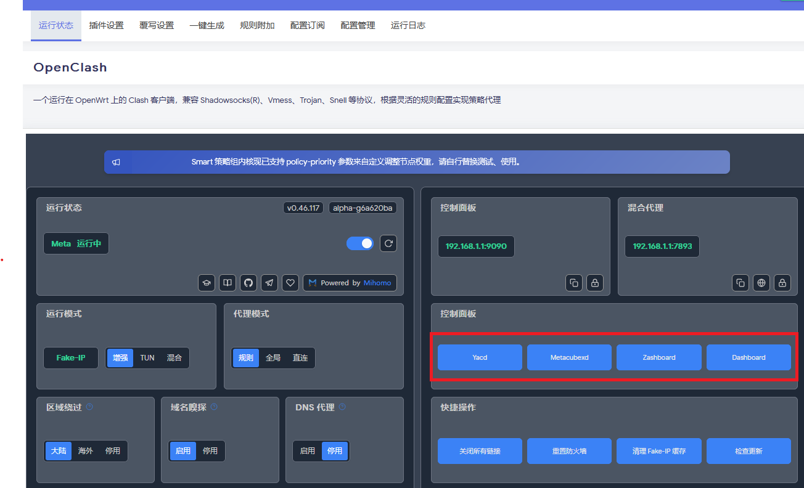  

在控制面版中可以按照个人喜好以及机场节点的情况更改对应分流策略的节点  

本项目的订阅转换模板中包括的策略已经足以应对大部分的分流需求  

**注意！考虑到流媒体用户大多需要简体中文资源，因此流媒体服务大多设置了默认为新加坡节点，如果你没有新加坡节点，记得自己手动切换为其他地区。  **  

**如果你是使用单一自建节点的用户，请在 dashboard 里将所有的策略组选择为你自建的节点！**  

请并观察 dashboard 中的策略组是否和截图中的本项目模板大体一致（因为截图未更新，会有一定不同）  

如果区别很大，说明你使用的后端未能正确拉取远程模板。此问题多见于自建后端，请自行解决网络问题确保后端可以访问远程模板。  

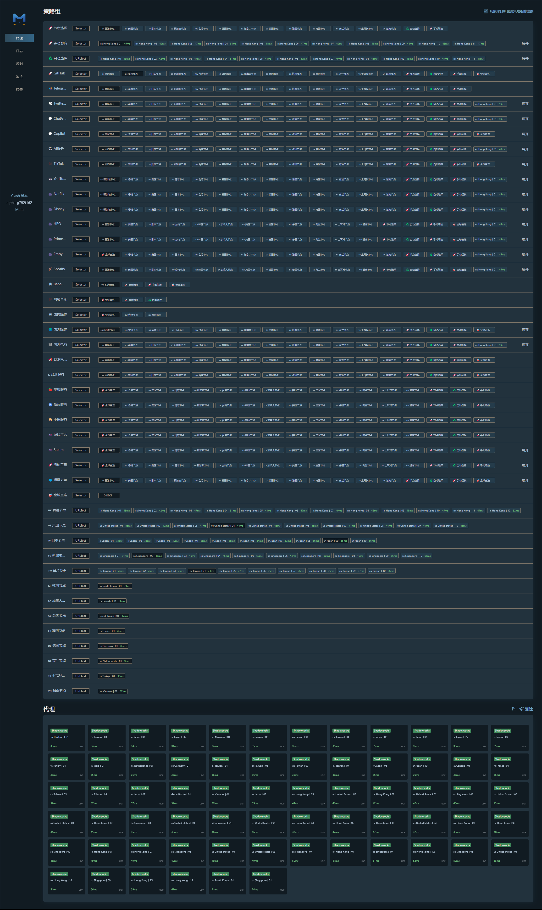  

至此，OpenClash 已经完美设置完毕，日常使用中几乎不需要打理，且会根据你的设置每日自动更新上游规则，理论上只要不遇到bug，不遇到停电，永远不需要人为操作干预。  


***

## 6. 检验结果  

下面检查以下你按照本方案实现的效果吧！  

注意，Clash 面板中，`“漏网之鱼”`策略组不要选择直连，否则泄露检测网站会无法通过测试！  

### 6.1. 检查 DNS 是否存在泄漏  

访问 IPLEAK.NET 检查 DNS 是否存在泄漏  
https://ipleak.net/  

正常情况下，页面上方应当出现你的机场节点的 IPv4 和 IPv6 地址，页面下方无中国大陆 DNS 出现即为 DNS 无泄漏情况  

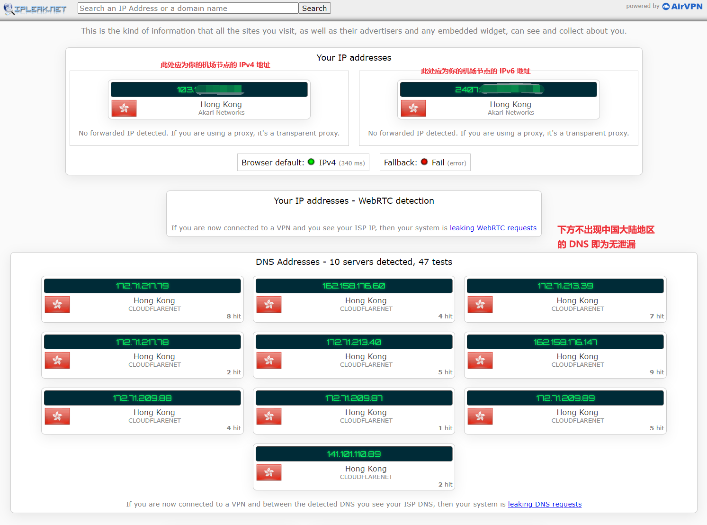  

注意：泄露检测以 https://ipleak.net/ 和 https://browserleaks.com/dns 的检测结果为准  

某些 DNS 泄漏检测网站（例如 https://www.browserscan.net/zh/dns-leak ） 的检测服务器使用了某些 DDNS 机构的域名，为了确保 DDNS 服务不受影响，DDNS 类域名在本项目的规则中是强制直连并使用国内服务器进行解析，因此这类泄露检测网站会显示泄露，属于正常现象，忽略即可。  

### 6.2. 检查 IPv6 分流情况  

仅限使用了支持 IPv6 出站的节点。

```
请使用 `Edge/Chrome` 或者其他 `Chromium 内核浏`览器，在`关闭`了浏览器的`安全 DNS 功能`的情况下，进行 IPv6 测试。  
请勿使用 Firefox 进行测试，除非你已经为 Firefox 开启了 IPv6 功能。 
```

访问 IPv6 test：https://ipv6-test.com/  

网页中的“Address”项目应当显示当前节点的 IPv4 和 IPv6 地址，证明节点的 IPv4 和 IPv6 出站均正常工作  

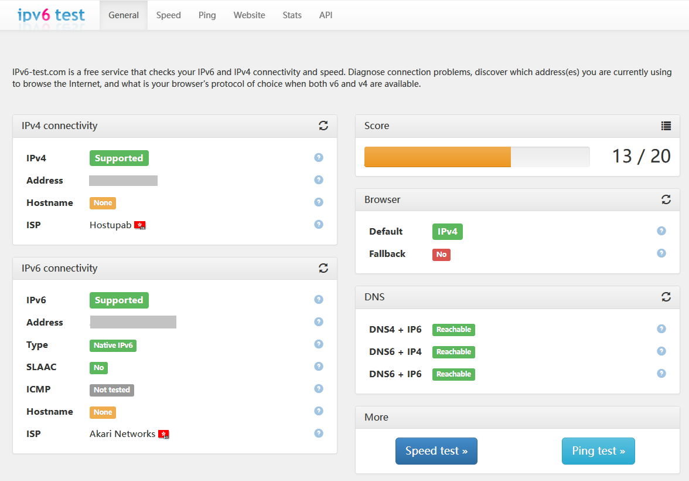  

分别访问 IPv6 测试网站 test-ipv6 的国内镜像站点和国外镜像站点  
  
  - 国内 IPv6 测试  

国内站点：https://testipv6.cn/  

访问国内镜像站点时，检测页面上应当出现你的宽带的 IPv4 和 IPv6 地址以及国内运营商名称（比如 CHINA UNICOM 即为中国联通），并且以10/10的评分通过测试  

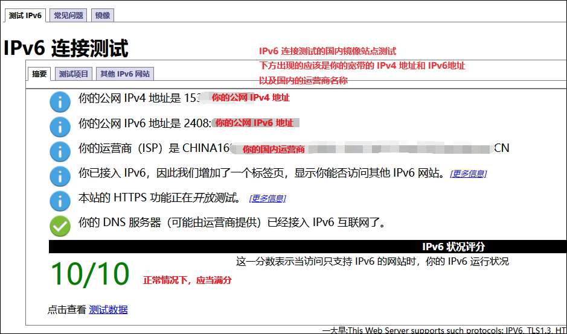  


  - 国外 IPv6 测试  

国外站点：http://test-ipv6.com/  

开启 OpenClash 的情况下，访问国外镜像站点时，检测页面上应当出现你的机场节点的 IPv4 和 IPv6 地址以及节点服务器的网络运营商名称（比如 Akari Networks 之类的境外网络运营商），并且以10/10的评分通过测试  

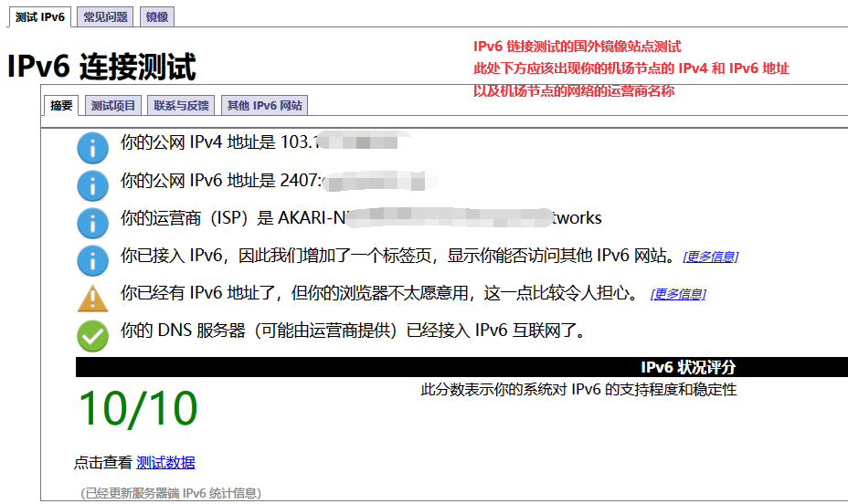  

如果以上两个网站测试均通过，即为 IPv6 已经完美分流  

**至此，你的 OpenWrt 上已经拥有了绝对完美、秒杀全网一切方案贴的 OpenClash 完美设置，且所有的细节设置都已经尽力为性能、安全和效率而优化，尽情享受吧！**  

### 6.3. 访问不正常？  

请查看：[故障排除](5.故障排除.md)  

建议加入本项目 Telegram 群组：[Custom_OpenClash_Rules | 交流群](https://t.me/custom_openclash_rules_group)   

群内求助效率更高。  

***

## 声明 

本方案编写于2024年4月，由 Wiki 的编辑历史可以检索到 Wiki 第一个版本是2024年5月6日编写，前后修订几十个版本进行了完善。  

[Wiki 编辑历史](https://github.com/Aethersailor/Custom_OpenClash_Rules/wiki/_history?page=6)  

项目维护者允许转载本方案内容和以本方案内容进行二次创作，比如以本项目内容制作视频等，但不得从事非法活动。  

**请注明本项目的地址！**  

**请注明你引用的一切内容的来源地址！**  

**请尊重开源社区的基本守则！**  

**感谢合作！**