# ⚙️ OpenClash 图文设置方案

## 📖 介绍

本项目创建于 2024 年 4 月，保证这是你见过的最详细的 OpenClash 图文设置方案。  

由于某些原因，本文不得不刻意避讳某些词语。如遇晦涩难懂的部分（例如“第三方远端服务”），请自行理解，或翻看历史版本进行对照。

本文仅作抛砖引玉之用途，旨在提供一个快速设置方案，让用户可以通过基础的操作方式将 OpenClash 设置为适合自己的网络环境且可长期使用、免维护的状态，并对相关选项作用原理进行一定的解读，便于用户熟悉其功能。

> [!CAUTION]
> 1. 本文仅作学习和研究之用途。
> 2. **请搭配合法的“第三方远端服务”使用。**
> 3. 请勿使用本文内容从事任何违法活动，包括但不限于获取、传播依法被限制或阻断的境外违法信息等行为。  
> 4. 请勿转载于中国大陆境内任何网络平台之上。

> [!NOTE]
> 本文并不代表绝对意义上的最终正确设置（虽然我自认为已强于简中网络社群和油管上所有教程），但每个人的网络状况不同，需求也不同，建议在本文基础之上，根据个人需求进一步自由发挥。
>
> OpenClash 作为 OpenWrt 下功能完整的分流/规则路由插件，其功能并非仅局限于本文提及之范围。

<!-- -->

> [!CAUTION]
> **重要前置说明：**
>
> * **本方案采用`Luci 页面设置+三种订阅路径3选1`的原则完成对 OpenClash 的设置**。
> * **不推荐所谓的“一键导入”的配置**：某些 YouTuber 鼓吹的“下载一个 yaml 导入就能用”是错误的，Yaml 配置文件不是万能的，更不可能预知不同用户之间的需求差异。这种做法实际上是牺牲了用户根据自己需求个性化配置的权力（例如此类配置基本都会关闭 IPv6），本项目反对这种为了节目效果而发明的用法，每个人都应当根据自己实际使用环境和需求去个性化相关参数，而非使用通用配置。
> * **不推荐从零“手搓”配置**：99% 的新手搓出的都是残废配置文件，功能和规则科学性甚至不如订阅转换+覆写后生成的 Yaml，建议从使用本项目的订阅转换模板或 Yaml 开始使用和学习，日后根据自己需求再学习手搓配置文件。
> * **关于“旁路由”**：“旁路有”是一种错误的组网方式，本项目维护者强烈反对部署所谓的“旁路由”网络架构，本项目所有教程均以**主路由**环境为例，仅对旁路由网络架构下的设置差异作简单提示。“旁路由”用户请自行融会贯通举一反三，出了问题也不要提问，**谁教你用旁路由的你去找谁，感谢合作**。
> * **本方案使用 `Fake-IP` 模式**。
> * **本方案依赖 OpenClash 的 `绕过中国大陆` 功能**。
> * **非盈利声明**：本项目未运营任何付费教学或视频频道。
> * *(Wiki 页面右边有目录)*

---

## ✨ 本方案所实现的效果

严格按照本方案的内容去设置你的 OpenClash 插件，无需套娃其他工具（如 MosDNS）即可实现以下功能：

* 🚀 **优化的 DNS 与直连路径**
    常见直连域名使用本地解析，GEOSITE:CN + CNIP 重叠的访问流量不进入内核，降低性能损耗。

* 🛡️ **降低解析异常与泄漏风险**
    对需要经内核 Proxy 处理的域名，解析请求交由远端处理，以获得更一致的解析结果。

* 🧩 **减少“套娃”依赖**
    尽量用 OpenClash 本身完成分流与解析逻辑，全部特性依靠 OpenClash 一个插件实现，避免多插件叠加带来的不确定性。

* 🖱️ **可复刻的设置流程**
    按图操作即可完成一套可长期使用的基础设置，无需手搓配置。

* 🔀 **覆盖常见场景的策略组**
    包含常见应用/平台的策略组划分，同时提供轻量化版本供按需选择。

* ⚡ **支持策略组自动优选（可选）**
    可按延迟/可用性自动选择更合适的出站项，减少手动切换成本。

* 🎮 **Steam 访问优化**
    单独列出 Steam 规则并强制 Steam 下载 CDN 走直连，避免下载流量进入内核。

* 🤖 **自动更新，长期无人值守**
    设置完成后可定时更新上游规则、GEO 数据库与直连白名单等数据。

* 📥 **大流量下载优化（尝试）**
    尽量避免下载流量进入内核，降低不必要的消耗。

* 🚫 **支持广告过滤与 Hosts 加速（可选）**
    可配合系统自带 Dnsmasq 实现基础广告过滤与 Hosts 加速，并支持自动更新。

* 🕸️ **补充若干小众域名规则**
    可通过 PR 提交域名参与完善规则。

---

## 0. 🚦 使用前的一些提醒

### 0.1 关于推荐固件

> [!TIP]
> 推荐使用 **ImmortalWrt** 官方编译固件，备选 **OpenWrt** 官方编译固件。
>
> 详细内容：[关于推荐固件](5.故障排除.md#recommended-firmware)

### 0.2 关于旁路由

> [!WARNING]
> “旁路由”是一种**错误**的组网方法，**反对**部署所谓的“旁路由”，**强烈建议**使用 OpenWrt 作为唯一主路由。

我个人始终坚持认为如果一个主路由可以满足使用需求的情况下，用旁路由纯粹就是脱裤子放屁，人为制造问题给自己找麻烦。

> 个人观点：[关于旁路由的一些吐槽](6.关于“旁路由”的一些吐槽.md)

所以下文的设置内容虽然都是根据主路由环境而设置的，但是亦在旁路由涉及的设置差异方面进行了对应的说明，请旁路由用户根据自身理解自行修改对应的设置。未说明的部分无需改变。

**本项目 Issue 中出现的问题，90% 都是和旁路由有关，更加印证了我的观点。**

项目维护者部署的所有设备都是主路由，以做到网络环境尽量从简，所以任何关于旁路由设置的问题，要么不予解答，要么只能凭经验解答，不对结果负责。

### 0.3 关于 IPv6

在本地网络具备 IPv6 且你的出站配置支持 IPv6 出站的情况下，搭配本项目另一个方案实现 OpenClash 和 IPv6 的兼容：

🔗 [OpenWrt IPv6 设置方案](https://github.com/Aethersailor/Custom_OpenClash_Rules/wiki/OpenWrt-IPv6-设置方案)

如果不确定出站配置是否支持 IPv6 出站，可以先按方案开启并测试；如测试不通过，再关闭 OpenClash 的 IPv6 相关选项即可。

### 0.4 关于 DNS

> [!IMPORTANT]
> ~~**强烈建议使用运营商通告的 DNS 进行直连域名的解析**，不论是解析速度还是结果的科学性，都不是第三方 DNS 可以比拟的。~~
>
> 鉴于 2025 年以来部分网络环境的变化，运营商 DNS 在某些情况下不一定是最稳定的选择。如遇异常，推荐使用 AliDNS 等加密 DNS，并按需启用 DoH3。
>
> **以下内容，请结合你所在地网络环境自行判断。如遇 DNS 解析问题，建议选择可用的加密 DNS。**

多数情况下，运营商 DNS 对直连类域名的延迟和 CDN 命中更接近实际链路；一般不需要额外用第三方 DNS 做“优选”。

不同递归 DNS 在不同网络环境下，可能出现解析结果不一致或可用性不稳定的情况；如果你选择第三方 DNS，优先使用加密协议（DoH/DoT）并观察实际效果。

> 以上结论仅仅是项目维护者根据本人实际经验得出。MosDNS 和 SmartDNS 都是非常优秀的 DNS 工具，这一点毋庸置疑。

根据维护者过去在当地网络环境中的长期测试，三大运营商 DNS 通常能为直连域名返回较近的 CDN，和 DNS 插件优选的解析结果基本一致。该经验不代表所有地区与所有时间段；如遇异常，请按上文建议改用可用的加密 DNS。

以本人所在的城市为例，电信和联通线路的 DNS 延迟都非常低，即使是高峰时段，延迟也只有 1-2 毫秒，白天的话可以稳定只有 1 毫秒的延迟，这时候还去用 DNS 插件很有可能是负优化。

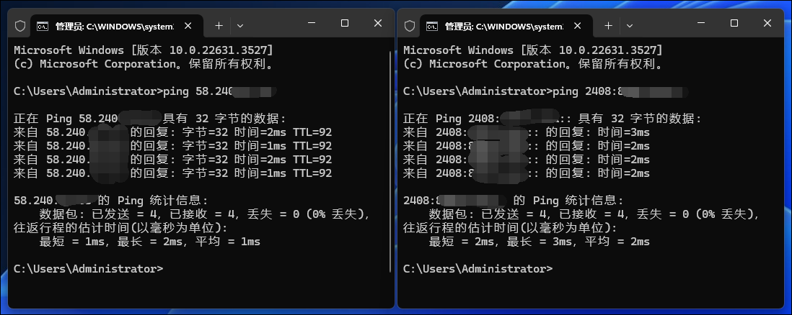

当然了，我这里和运营商 DNS 在同一个城市，所以延迟表现比较优秀。如果你和运营商 DNS 不是同城的话，延迟可能就没那么优秀了，但一般也会优于第三方 DNS。

以下数据，来自三线城市用户长期部署的 SmartDNS，猜猜哪些是运营商 DNS，哪些是第三方 DNS：

按照本方案设置后，运营商 DNS 主要用于解析直连类域名，一般不需要担心解析一致性问题。非直连域名的解析请求交由远端处理，可获得更一致的解析结果，并降低 DNS 泄漏风险。

> [!NOTE]
> 坚持要使用第三方 DNS 的话，建议优先使用 DoH/DoT/DoH3/DoQ 等加密协议。请勿随意使用明文 UDP 公共 DNS，以免出现被劫持或结果不一致。
>
> *2025.7.22 更新：部分地区用户反馈运营商服务器偶发异常；如遇直连访问不畅，建议切换为加密 DNS 来排除运营商侧影响。*

### 0.5 关于“套娃”设置

MosDNS、SmartDNS、AdGuardHome 本身都是非常优秀的 DNS 工具，但是有些时候并不是 1+1=2 那么简单，错误的插件堆砌反而会起到反作用。

**先说结论：在本方案的 Fake-IP 使用场景中，Nameserver 使用运营商 DNS 或可用的 DoH 服务器，同时 Fallback 不设置任何服务器，是维护者推荐的基础设置。** 这种设置兼顾性能开销与解析结果，一般不需要额外折腾；如实际网络环境存在异常，再按需调整。

对于非直连域名，最佳的解析方式通常是将解析请求交给远端来完成，这样更容易获得与出站链路一致的 CDN 命中。

从延迟以及性能开销的角度来考量，以维护者所在的网络环境为例，部署本方案后，使用脚本去批量测试 30000 次常见域名的解析速度，Dnsmasq 提供的解析延迟稳定在 1ms 左右，而加了 AdGuard Home 并开启缓存后，与 Dnsmasq 解析时间开销几乎没有区别，而代价则是要面对缓存和 Fake-IP 并存导致的各种问题，同时也破坏了 Clash 向客户端传递的 TTL 数值。  

在加载了巨量广告过滤规则后，AdGuardHome 解析的时间开销甚至比 dnsmasq 还高一点点点。（这一点很反常识，包括我在内的许多人过去都以为 AdGuard Home 在巨量规则的使用环境下应当是有性能优势的，但实际并非如此）  

网上某些教程教小白用 AdGuardHome 等插件一顿折腾，添加一堆没用的第三方 DNS，套娃一层套一层，然后弄出来个 5ms 甚至 10ms 更高的内网解析延迟，再告诉你这是“优化”了，这种纯属扯淡。不信你去换个最垃圾的百元硬路由，DHCP 直接默认就给你分配运营商 DNS 的那种，你会发现网页打开就是光速，你猜为什么。

另外，请勿迷信什么乐观缓存，Fake-IP 模式下搭配其他前置缓存插件只会导致更多的问题，路由器上什么缓存都没有浏览器和操作系统自带的 DNS 缓存作用大。

> [!WARNING]
> **如果你坚持认为 1ms 的解析时间差距会明显影响上网体验，而愿意承受套娃带来的其他副作用，那我无话可说。**

> [!WARNING]
> **什么情况下有套娃的意义**
> 1. 网络支持双栈，并且对国内网站同一域名的 IPv4 和 IPv6 地址的访问性能存在巨大差距。此时可在 Nameserver 上游设置 SmartDNS 进行双栈优选。
> 2. 你刚需监控和控制局域网设备的 DNS 请求的功能（例如控制和限制未成年人的访问特定网站），那么适合在下游设置 AdGuard Home。  
> 除了以上两种情况，其他情况一概没必要“套娃”

**除非你是使用的长城宽带之类的存在流量穿透的宽带线路，或者某些地区的移动大内网宽带，DNS 延迟很高或无法正确解析到离你地理位置最近的 CDN，否则根本就没有必要用 DNS 优化插件。**

### 0.6 关于广告过滤

> [!NOTE]
> 偏门实现方式，目前已不推荐，建议搭配使用 `luci-app-adblock-fast` 插件。

**已废弃的广告过滤说明：**

> 按照本方案，直连类域名尽量不进入 OpenClash 内核，因此无法单靠内核规则完成对直连流量的广告过滤。
>
> 所以本方案使用了 Dnsmasq 来实现广告过滤功能，借助 OpenClash 的"开发者选项"，实现 OpenClash 每次启动时，为 Dnsmasq 拉取最新的广告过滤规则。同时由于 OpenClash 每次启动会重启 Dnsmasq，可以使广告过滤规则即时生效。
>
> 具体本项目 Wiki 中的方案：[广告拦截设置方法](4.无插件广告拦截功能设置方案.md)

**注意：任何 DNS 广告过滤规则的过滤效果都比不上浏览器插件的过滤效果。**

### 0.7 关于配置文件实现方式  

无论你是使用订阅转换，还是手动上传 Yaml 文件，还是使用覆写模块调用远程托管的 Yaml 配置文件。  

本项目均强烈建议：根据自身环境，在 Luci 界面上完成插件的设置，再使用以上三种方式其中一种来加载配置文件。 

OpenClash 将会根据你的设置，对配置文件覆写，形成最终启动内核使用的配置文件。

> [!NOTE]
> 本项目对使用“第三方远程服务“的用户，提供 8 套 ini 订阅转换模板以及 8 套与订阅转换模板完全对齐的 Yaml 文件。
> 本项目对使用”自建服务+第三方远程服务“的用户，提供两套 Yaml 配置文件。  
> 并对以上所有 Yaml 配置文件，提供相应的覆写模块文件，方便用户实现对远程 Yaml 配置文件的订阅。

本项目不推荐新手从零“手搓 yaml”。更建议先按本文把插件的关键选项跑通，再以生成的成品 yaml 为基础做增量修改。  

另外推荐参考 mihomo 官方的配置完整示例：  
https://github.com/MetaCubeX/mihomo/blob/Meta/docs/config.yaml  
以及 mihomo 官方文档：  
https://wiki.metacubex.one/config/  

PS：配置文件是写给人类看的，只是恰好内核可以运行而已。所以本项目的 yaml 文件格式全部和 mihomo 官方完整示例保持一致。

若使用其他配置文件，仅推荐 666 大佬的配置：[666OS/YYDS](https://github.com/666OS/YYDS)

---

## 🛠️ OpenClash 图文设置方案

> 严格按照文字和图片中的内容进行设置，其他选项不清楚如何设置的，照抄即可。

<!-- -->

> [!IMPORTANT]
> **一定要认真阅读，一定要认真阅读，一定要认真阅读！**
> 不要跳着看，不要只抄图片不看文字！
> 否则可能会错过关键设置！
>
> 整个教程内容冗长，但大多是讲解原理和功能，实际需要修改的设置并不复杂。

OpenWrt 做主路由和旁路由时的设置差异，相关的步骤中会提及，按照你的情况选择就行。

不懂的情况下不要自己乱改设置！建议使用本项目模板，否则不保证效果正常。

个别需要你自己根据实际情况进行选择的步骤，会讲明原理，只要智商正常都能看懂，仔细阅读即可。

> [!WARNING]
> 先按照本方案配置好，确保正常工作了，理解了相关设置，再自由发挥去修改，不要自己瞎设置出了问题再来问我，这是浪费时间。
>
> 如果你有个性化需求，先通过本方案搞明白设置，后续 fork 本项目自己修改模板即可。

---

## 1. 🚦 准备工作

### 1.1 查看运营商通告的 DNS

> [!NOTE]
> 如果你不打算使用运营商 DNS，则跳过此步骤。

首先确保你的 WAN 口设置中 **启用** 了 `自动获取 DNS 服务器`，这样才能获取到运营商下发的 IPv4 DNS。

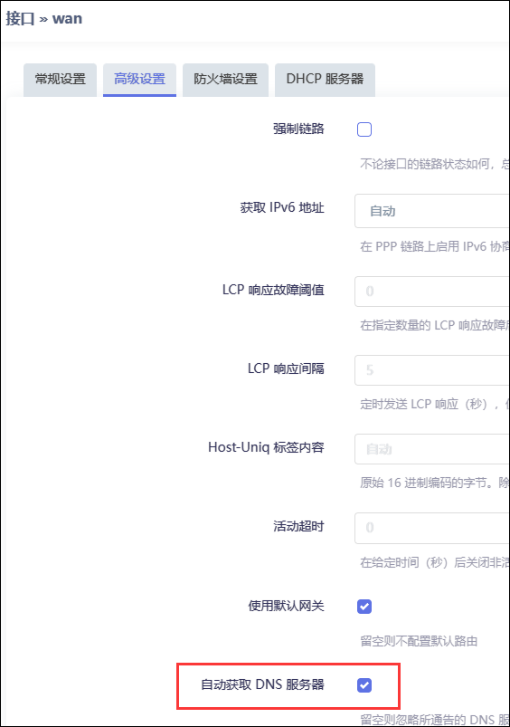

然后在 OpenWrt 的首页查看是否取得了运营商下发的 DNS，如果你打算使用其他的第三方 DNS，可以跳过此步骤。

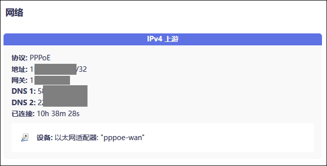

### 1.2 关闭 DNS 重定向功能

该功能位于 `网络` > `DHCP/DNS` 页面中，**务必关闭**。

> [!CAUTION]
> 若不关闭，有可能会引起 DNS 解析问题，并会导致本方案的广告拦截设置无法拦截部分非直连域名。

某些固件中可能没有这个选项，忽略该步骤即可。

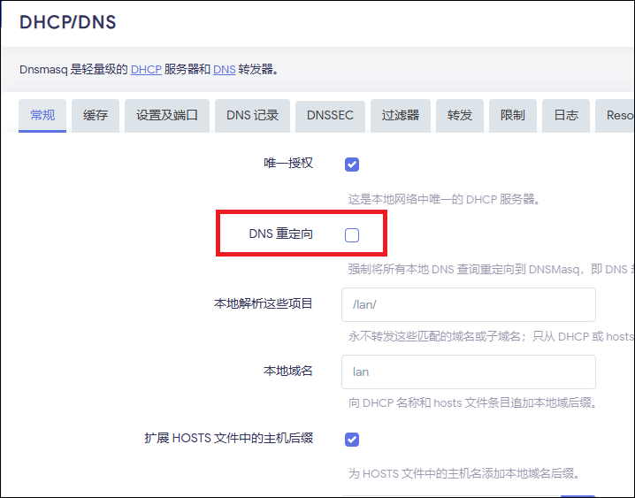

### 1.3 确保 OpenWrt 可以正常访问 GitHub 或加速 CDN

> OpenClash 的各项数据库以及插件和内核的更新，全部需要连接 GitHub 或者 jsDelivr CDN 才能完成。

不管你的网络能不能稳定访问 GitHub（部分网络环境下可能不稳定），请提前在 OpenClash 中启用 GitHub 地址修改功能。

1. 进入 `OpenClash` > `覆写设置` > `常规设置`
2. 在 `GitHub 地址修改` 功能的下拉菜单中选择一个 CDN 线路
3. 推荐选择 **testingcf**，该 CDN 是 jsDelivr 的 Cloudflare 线路 CDN，同时建议根据自己的实际网络情况多做尝试
4. 点击页面下方的 `“应用配置”` 即可生效

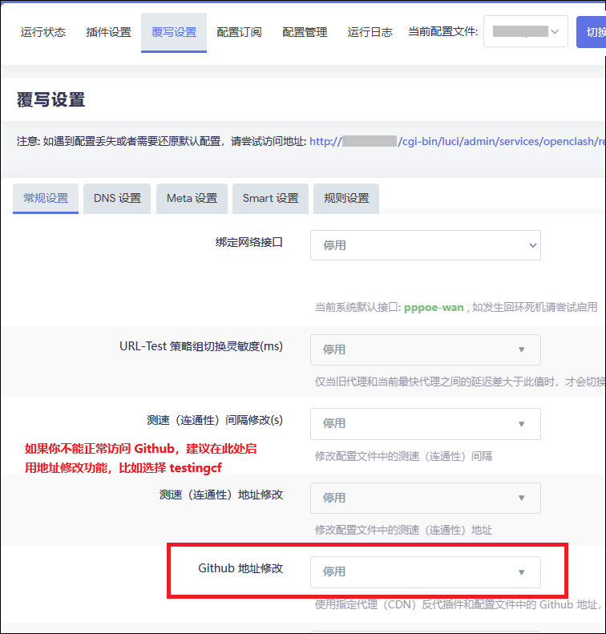

**准备工作完成，开始设置 OpenClash。**

---

## 2. ⚙️ 设置 OpenClash 常规设置

以下列出了 OpenClash 的设置内容，每个需要设置的页面均有图文说明，按照方案逐页进行设置即可。

所有未提及的页面，均不需要设置。

### 2.1 模式设置

> [!WARNING]
> **注意：本方案是适用 `Fake-IP` 模式的，如果你不愿意使用 Fake-IP 模式，可以关闭页面了。**

首先设置运行模式，在页面下方点击切换到 Fake-IP 模式，然后上方的运行模式选择 `Fake-IP（增强）`。

如果你的页面上没有“使用 Meta 内核”的选项，是正常的，因为目前 OpenClash 只有 Meta 一个内核可选。

> [!TIP]
> `Fake-IP（增强）` 模式可以提供最佳的性能，如果出现了 NAT 问题，可以尝试切换为 `Fake-IP（混合）` 模式，记得要 **启用** UDP 转发。
> 如果你的固件包含了 Docker 功能，直接选择 `Fake-IP（TUN）` 模式即可。
> 对非直连的游戏网络有特殊需求的，请自行尝试哪个模式下 NAT 状态最佳。

<!-- -->

> [!CAUTION]
> **不推荐使用带有 Docker 的固件，会出现很多问题。**

如果你的页面上有“使用 Meta 内核”这个切换选项，说明你的 OpenClash 版本太老旧，请先更新插件到最新版。

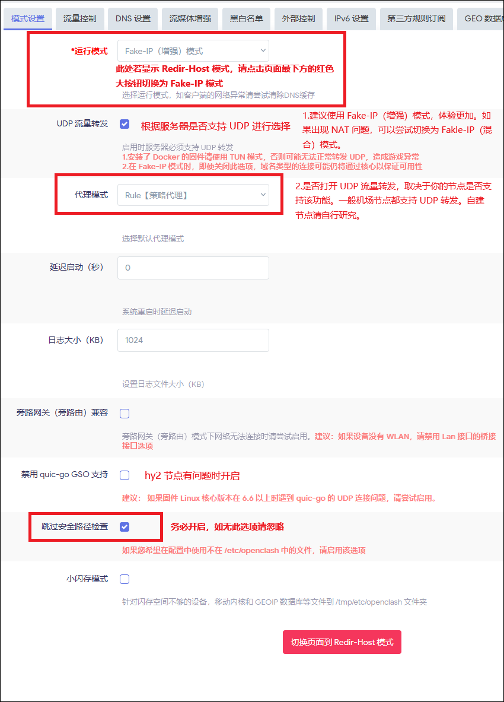

### 2.2 流量控制

按照图中设置进行设置，建议启用“实验性：绕过指定区域 IP”开关，并选择“绕过中国大陆”，以减少直连流量进入内核带来的性能损耗。

启用后，GeoSite 数据库中分类为 `CN` 的域名，且解析 IP 位于“中国大陆 IP 段”范围内的流量，将不进入内核。

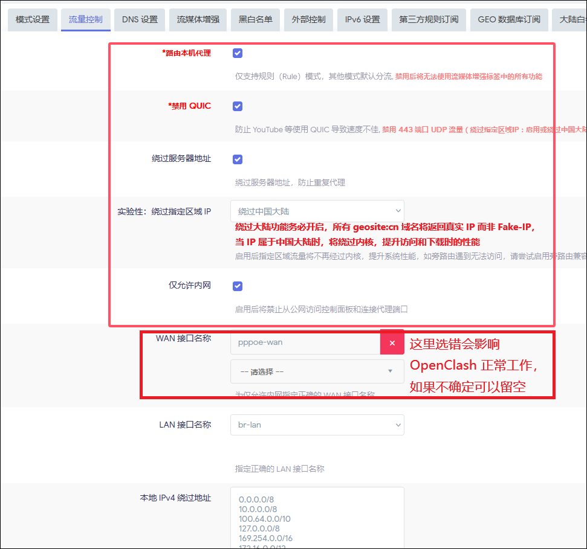

如果你有个别站点/应用需要做例外处理，可在本页的相关黑名单项中按域名添加规则；修改后记得保存并重启 OpenClash。

添加黑名单的域名和 IP 将不受“绕过策略”的影响，进入内核遵循规则的控制。

### 2.3 DNS 设置

设置使用 Dnsmasq 进行转发，顺手点一下 `“Fake-IP 持久化缓存清理”` 按钮，不用管是否提示出错，然后点击页面下方的 `“保存配置”`。

注意务必启用下方的 `“禁止 Dnsmasq 缓存 DNS”` 选项。新版本 OpenClash 中已经没有本条选项，忽略即可。

**启用第二 DNS 服务器** 功能，可以指定域名强制使用你指定的 DNS 进行解析，并直接返回真实 IP 而非 Fake-IP。

返回真实 IP 后，再根据 IP 绕过内核或进入内核。

这里根据自己的需要进行填写（比如填写 DDNS 域名），一般情况下无需使用该功能。

> [!NOTE]
> 截图可能滞后于当前 OpenClash 界面，请以选项名称和本文文字说明为准。

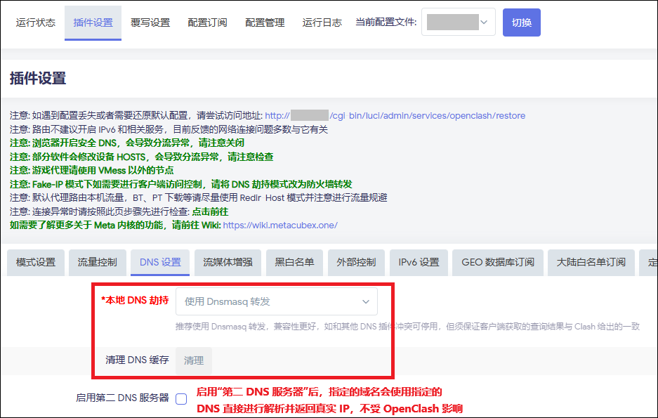

### 2.4 流媒体增强（可选）

此页用于“流媒体可用性探测”：当某些策略组包含多个出站项时，可按可用性/延迟自动挑选更合适的出站项。

如果你更习惯在控制面板里手动选择出站项，可以跳过本节。

常用做法：

1. 只启用你需要探测的流媒体服务名称。
2. 在“策略组筛选”中填入策略组名称关键词（与控制面板中显示一致），如“Netflix|奈飞”。
3. 在“解锁区域筛选”中填入你期望的解锁区域，如“SG”。
4. 在“解锁节点”筛选中填入你认为可用于解锁的节点范围关键词，进一步缩小筛选范围。（可选）
5. 其余选项按图示默认即可；设置完成后点击页面下方的 `“保存配置”`。

OpenClash 启动后，可在 `运行日志` 中查看探测结果与最终选用的出站路径。

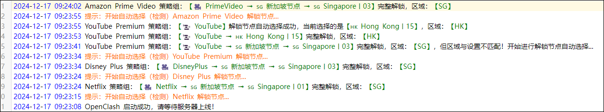

### 2.5 IPv6 设置

> 如果你打算启用 IPv6 功能，并且你的远端服务支持 IPv6 出站，则按照本项目的 IPv6 设置方案完成 OpenWrt 的 IPv6 设置后，再设置此页面即可。

* **教程**：[OpenWrt IPv6 设置方案](https://github.com/Aethersailor/Custom_OpenClash_Rules/wiki/OpenWrt-IPv6-设置方案)

按照维护者当前验证结果，完成对应设置后，OpenClash 可以与本文的 IPv6 方案配合使用；如插件界面或内核行为发生变化，请以实际测试结果为准。

> [!CAUTION]
> 旁路由建议放弃 IPv6 功能，或者自己折腾寻找出路。
>
> 如果你使用的“第三方远端服务”	不支持 IPv6 出站，或者你的 OpenWrt 没有开启 IPv6 功能，请**禁用** `IPv6 流量代理` 和禁用 `允许 IPv6 类型 DNS 解析` 两个功能。

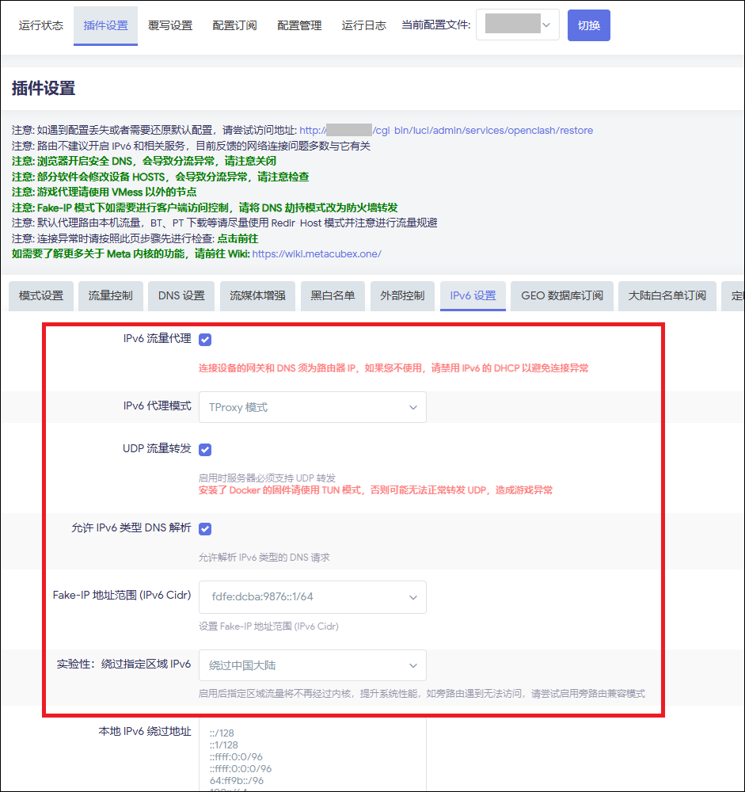

如有个别站点/应用在 IPv6 场景下需要做例外处理，可在本页的相关黑/白名单项中按域名添加规则；修改后记得保存并重启 OpenClash。

### 2.6 GEO 数据库订阅

一些分流数据库必须保持更新，否则会对直连分流与规则匹配产生影响。按照图中设置即可，具体用途不多做解释，可以自行查找相关资料。

图片可能存在滞后性，此页面所有的数据库全部需开启更新，包括图片中未包含的数据库选项。

> [!NOTE]
> 每次数据库更新成功后，OpenClash 会自动重启，届时将会短暂影响进入内核的连接；直连连接不会受到影响。
>
> 建议设置更新时间为每日不用网的时候，比如凌晨，更新时间可以重叠。
>
> 实际上各个数据库源并非每日更新，只有在检测到更新并成功更新后 OpenClash 才会重启。

设置完后点击页面下方的 `“保存设置”`，然后顺手把四个 `“检查并更新”` 按钮都点一遍。在 OpenClash 的 `“运行日志”` 页面可以查看更新结果，此操作可以顺带验证你的 OpenWrt 是否能顺利访问 GitHub 或者你在之前设置的 CDN 比如 testingcf.jsdelivr.net。

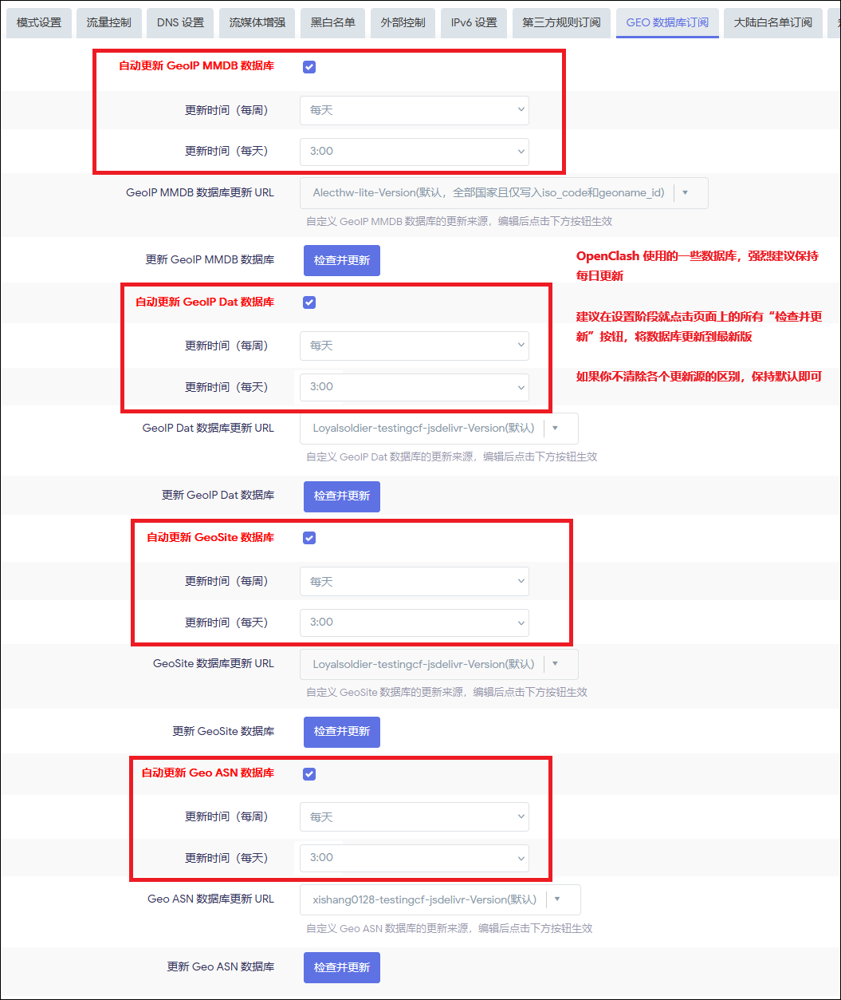

### 2.7 白名单订阅

用于直连分流的 IP 白名单必须保持更新，按照图中设置即可。

> [!NOTE]
> 每次数据库更新成功后，OpenClash 会自动重启，届时将会短暂影响进入内核的连接；直连连接不会受到影响。
>
> 建议设置更新时间为每日不用网的时候，比如凌晨。
>
> 实际上各个数据库源并非每日更新，只有在检测到更新并成功更新后 OpenClash 才会重启。

设置完后点击页面下方的 `“保存设置”`，然后顺手把 `“检查并更新”` 按钮点一下。在 OpenClash 的 `“运行日志”` 页面可以查看更新结果，此操作可以顺带验证你的 OpenWrt 是否能顺利访问 GitHub 或者你在之前设置的 CDN 比如 testingcf。

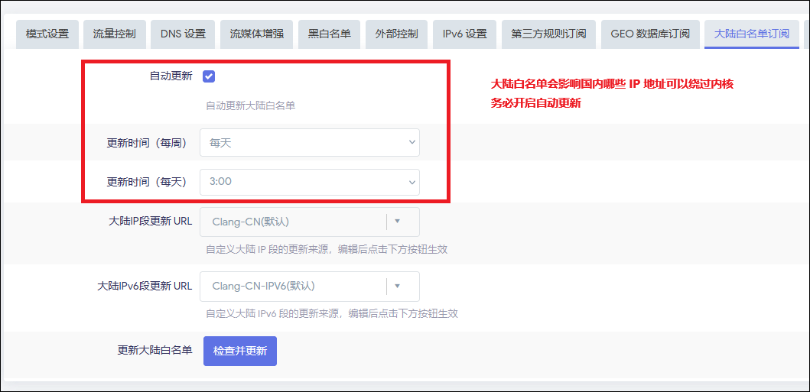

### 2.8 版本更新

此页面用于更新 OpenClash 的内核以及 OpenClash 自身。

**建议** 选择 `master` 版本，稳定性最佳。然后点击下方的一键更新，将内核和主程序更新为最新版。在 OpenClash 的 `“运行日志”` 页面可以查看更新结果，此操作可以顺带验证你的 OpenWrt 是否能顺利访问 GitHub 或者你在之前设置的 CDN 比如 testingcf。

喜欢追新可以选择 `dev` 版本，更新频率比较高，当然这样也要接受频繁升级以及偶发的 bug。就项目维护者的经验看来，dev 版本极少出现 bug。

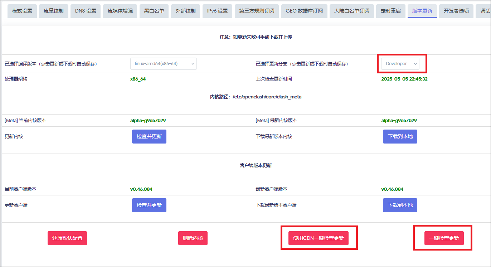

**至此，OpenClash 中的常规设置已完成。**

---

## 3. 🔧 设置 OpenClash 覆写设置

### 3.1 GitHub 地址修改

不管你所使用的网络是否能正常访问 GitHub，此处建议选择一个 CDN 以改善访问速度。
建议选择`https://testingcf.jsdelivr.net/`，其他选项保持默认即可。  

### 3.2 DNS 设置

首先，启用 `“自定义上游 DNS 服务器”`，然后根据以下两种情况，选择你对应的使用环境进行设置：

#### 情况一：主路由拨号 + 使用运营商 DNS (推荐)

1. **启用** `“追加上游 DNS”`
2. **禁用** 下方 NameServer 组的所有服务器
3. **禁用** 下方 Fallback 组的所有服务器

`追加上游 DNS` 会将你的 WAN 口取得的 IPv4 DNS、IPv6 DNS 以及 PPPoE 网关均追加为 NameServer，省去了自己手动配置的麻烦。

这是理论上的最佳设置，但部分地区运营商 DNS 可能偶发异常；如遇直连访问不顺畅，可尝试切换到下面的设置，改用加密 DoH 服务器替代运营商 DNS。

> *2025.7.22 更新：部分地区用户反馈运营商服务器偶发异常；可尝试切换为加密 DoH 服务器以排除运营商侧影响。*

#### 情况二：使用加密公共 DNS 服务器或 SmartDNS 之类的 DNS 插件（不区分主路由/旁路由）

1. **禁用** `“追加上游 DNS”`
2. **(使用第三方服务器)** 在 Nameserver 中启用阿里和 DNSPod 的 DoH (地址带 https 字样) 服务器，并保证 Default-Nameserver 中至少启用了一个服务器。
3. **(使用 SmartDNS)** 启用 NameServer 组中的第一个服务器，并将地址修改为 SmartDNS 的地址端口（例如 `127.0.0.1:6053`）。
4. **禁用** Fallback 组下的所有服务器。

SmartDNS 自身的设置中，务必关闭 DNS 劫持，且只需要保留第一服务器组，并且只添加你所在国家的 DNS 用于服务直连侧域名解析。

对于使用多入口或复杂链路环境的用户，如果启用了 SmartDNS，则建议在 Nameserver 中再额外启用一个 DoH 服务器，并在该服务器的设置中启用 `节点域名解析`并禁用 `直连域名解析`，以避免 OpenClash 使用 SmartDNS 解析节点域名。

> [!IMPORTANT]
> 注意 `追加上游 DNS` 和下方的 `NameServer` 只需要 **二选一** 即可，当然亦可叠加使用。OpenWrt 是主路由的情况下，建议此处设置按照图中进行设置。
>
> `追加上游 DNS` 的作用：将你的 WAN 口取得的运营商通告的 IPv4 DNS 和 IPv6 DNS 以及 PPPoE 网关自动设置为 NameServer。

其余选项可以参考图中的设置进行。

旁路由用户：参考上面的第二种设置，DNS 服务器根据自己实际需要进行选择。

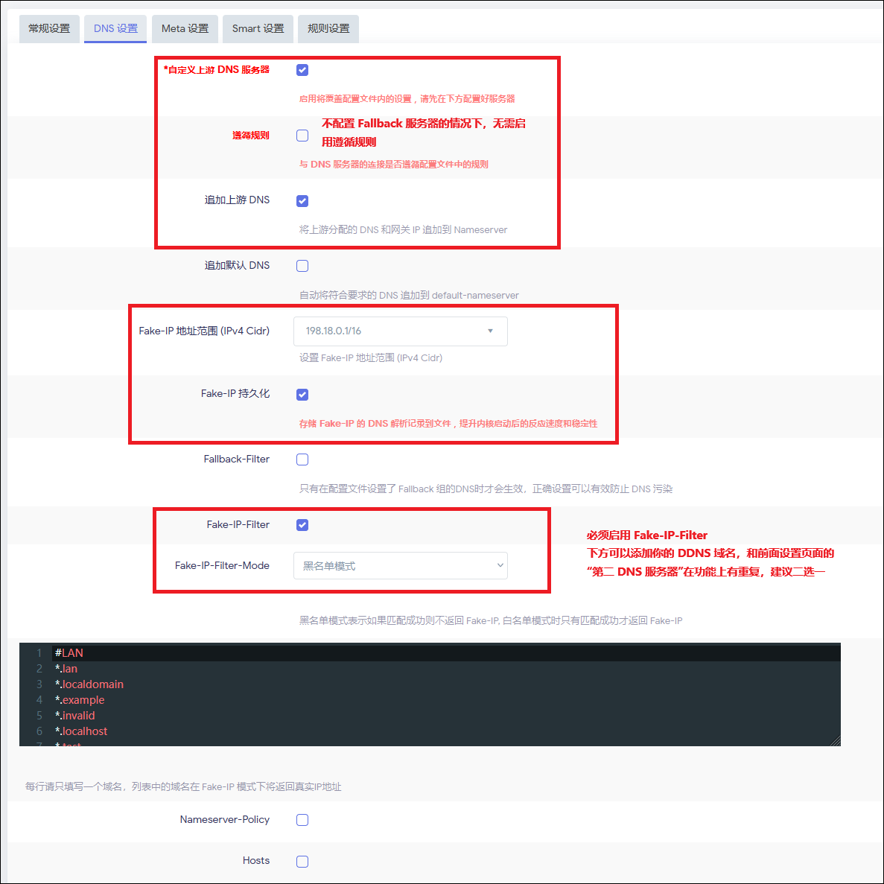

在本方案中，NameServer 仅负责以下域名的 DNS 解析：

1. 直连类域名（不经内核）。
2. 经内核处理但最终直连的域名。

所以，在 Nameserver 中填入多个服务器并没有意义，更不要自作聪明地填写其他国家和地区的公共 DNS 服务器。
如果不愿意使用运营商 DNS，可以使用 AliDNS / DNSPod 等第三方 DoH/DoT 服务器。注意部分 DoH 服务器支持 HTTP3 和 QUIC，启用可显著减少解析请求的时间开销。

> [!IMPORTANT]
> **为什么要取消 Fallback 服务器？**
>
> 在 Fake-IP 模式下，如果取消了 Fallback 服务器，OpenClash 会把解析请求交由远端完成。
> 让解析与实际出站链路保持一致，通常更容易获得可用且一致的解析结果。

如果出站侧解析不可用（少见），可以启用 Fallback 服务器作为兜底，选择任意可用的 DoH 服务器即可，同时建议在本页面启用 `遵循规则` 功能。

如果你使用了域名类的 DoH 服务器（例如 `https://dns.alidns.com/dns-query` ），则需要启用 Default-Nameserver 服务器。

设置完成后，点击页面下方的 `“保存配置”` 按钮。

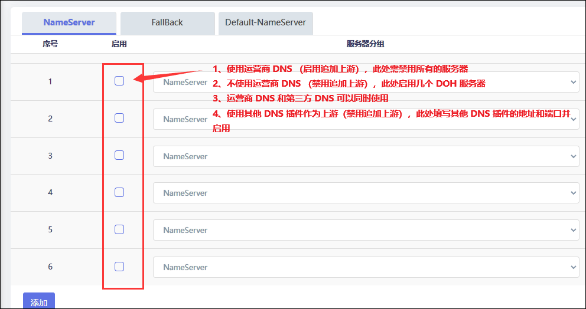

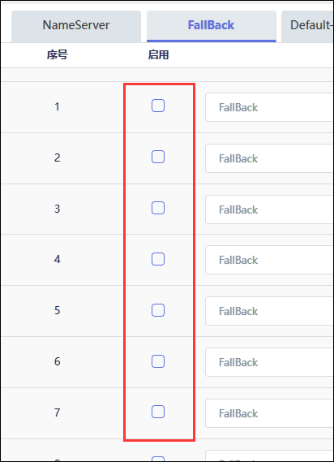

### 3.3 Meta 设置

按照图中内容，对红框中的选项进行设置。
注意，务必开启 `启用 GeoIP Dat 版数据库` 选项。

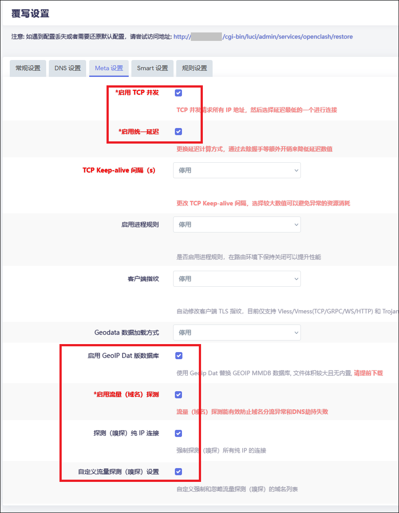

### 3.4 Smart 设置

如果需要使用 Smart 内核，可以在此处设置 Smart 内核相关的一些选项。

> [!IMPORTANT]
> 启用此页面设置前，请先启用 Smart 内核！否则 OpenClash 将报错退出。
> 在`插件设置`>`版本更新`页面中，将`Smart 内核`选项设置为`启用`，并点击内核版本号下方的`检查并更新`，等待更新结束即切换为 Smart 内核。

启用此处设置，OpenClash 会在启动时将配置文件中的所有 `url-test` 和 `load-balance` 节点组替换为 `Smart` 策略组。

如无特殊需求按照图中设置使用插件作者提供的模型即可。如需自己收集训练数据，则启用收集训练数据，此处不做赘述。

### 3.5 规则设置

如无特殊需求，按照图中所示进行设置。

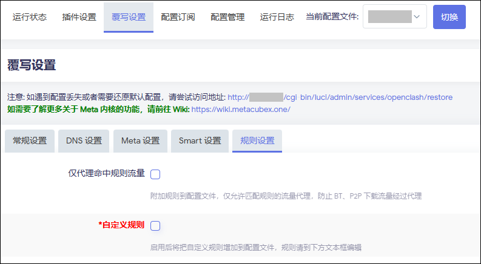

下方的“自定义规则”启用后会出现文本框，可以添加你想附加的规则，规则格式相当丰富，具体格式见文本框内的注释，此处不做赘述。

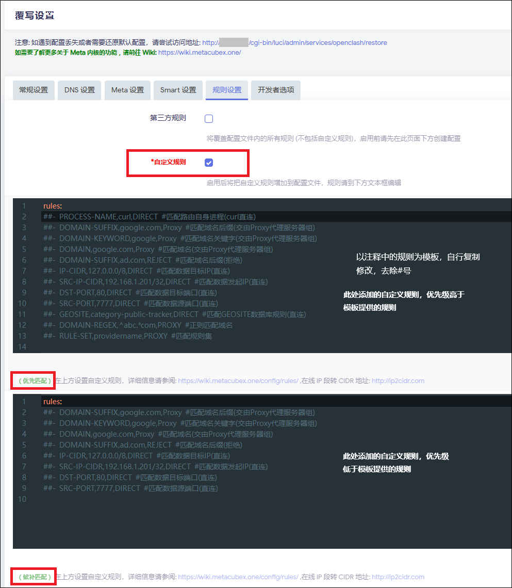

如果你的下载设备是 NAS 之类的独立设备，建议在此处通过自定义规则让下载设备的流量全部直连。

具体参考：[BT 和 PT 等下载流量分流问题](5.故障排除.md#bt-pt-routing)

你也可以通过该功能，自己补充自定义规则，指定某些域名直连或代理，以及指定局域网内某些直连或代理等等。

[如何添加自定义规则](9.其他说明.md#custom-rules)

### 3.6 开发者选项

此处无需修改。

---

## 4. 📝 添加订阅配置

OpenClash 需要添加一个远程第三方远端服务的订阅才能工作。本节仅说明如何在 OpenClash 中添加订阅和更新配置文件，不讨论服务来源。

在页面中设置一个更新时间，用于定时拉取配置与模板（如有启用）。OpenClash 在更新配置过程中可能会短暂重启，建议设置在不用网的时间段内更新，比如凌晨。

> [!NOTE]
> 若你启用了“绕过中国大陆”相关设置，OpenClash 重启不会影响未进入内核的直连连接。

设置好更新时间后点击 `“保存配置”`，然后点击 `“添加”`，新增一个配置项。

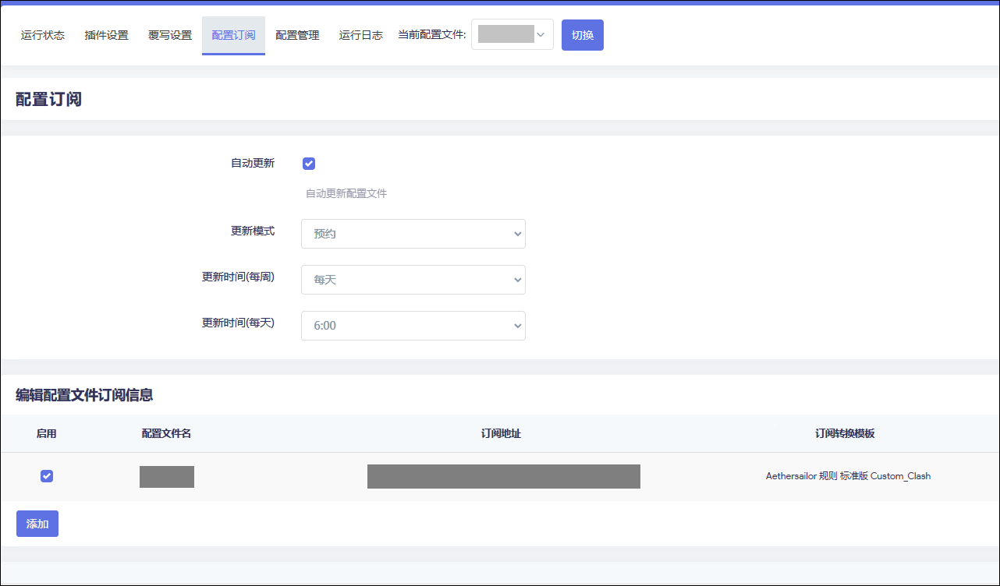

按照图中内容填写即可，配置文件名随意。  

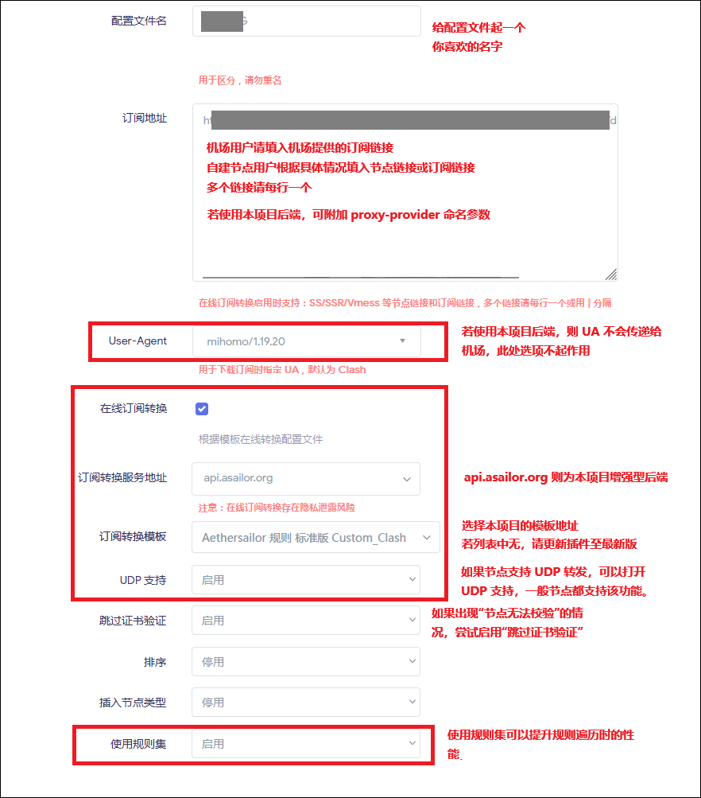

> [!TIP]
> 填写好你的远程第三方远端服务的订阅链接，然后完成图中的其他设置。未做说明的设置，按照图中示例进行设置即可。

OpenClash 内置三个`订阅转换服务地址`，其中`api.asailor.org`为本项目提供的增强型后端 SubConverter-Extended，兼容性更强。

> [!NOTE]
> api.asailor.org 仅为技术验证，不属于任何服务性质

如需使用其他转换后端或者你搭建的后端，按其文档填写即可；可用性以实际为准。

在 `订阅转换模板` 下拉中选择本项目模板即可。若下拉列表中没有对应模板，请先把 OpenClash 更新到最新的版本。

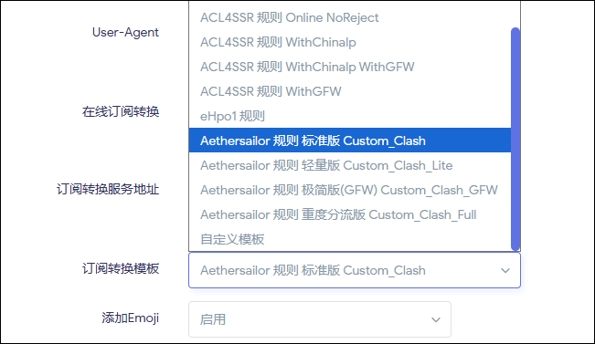

| 模板 | 特点 | 适合 |
| :-- | :-- | :-- |
| `Custom_Clash.ini` | 标准策略组与规则覆盖 | 大多数用户 |
| `Custom_Clash_Lite.ini` | 更轻量，策略组与规则更少 | 轻量需求/低性能设备 |
| `Custom_Clash_GFW.ini` | 极致轻量，仅覆盖 GFW List | 极致轻量需求/垃圾设备 |
| `Custom_Clash_Full.ini` | 覆盖更广，策略组更多 | 重度分流需求 |

看不懂怎么选时，默认使用 `Custom_Clash.ini`。

最后点击下方的 `“保存配置”` 返回到配置页面，此时整个设置工作已完成。

---

## 5. ✅ 启动和启动后的动作

### 5.1 更新配置并启动

点击“配置订阅”页面中的 `“更新配置”` 按钮，OpenClash 即开始更新配置并启动。

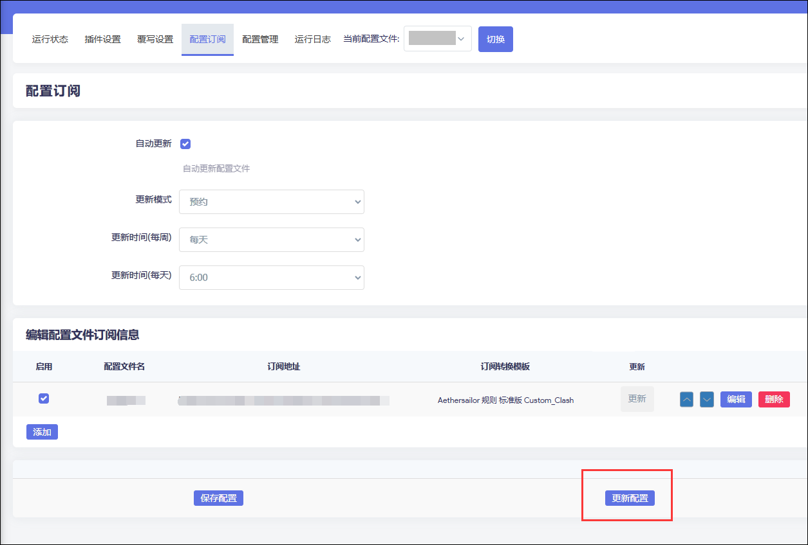

### 5.2 观察运行日志

在上一步操作中点击 `“更新配置”` 后，切换到运行日志页面观察 OpenClash 的启动情况。

出现“OpenClash 启动成功，请等待服务器上线！”后，即表示 OpenClash 已经启动成功。

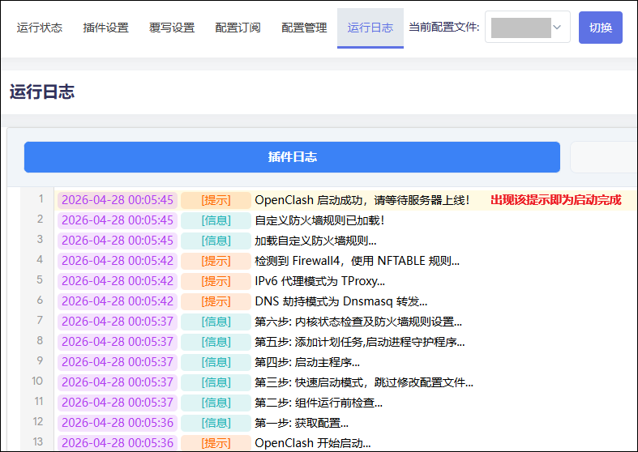

### 5.3 切换策略组

在 OpenClash 的 `运行状态` 页面中，点击 `控制面板` 按钮启动控制面板。

OpenClash 内置了多款控制面板，建议根据自己的使用习惯进行选择，新手可以先使用 zashboard。

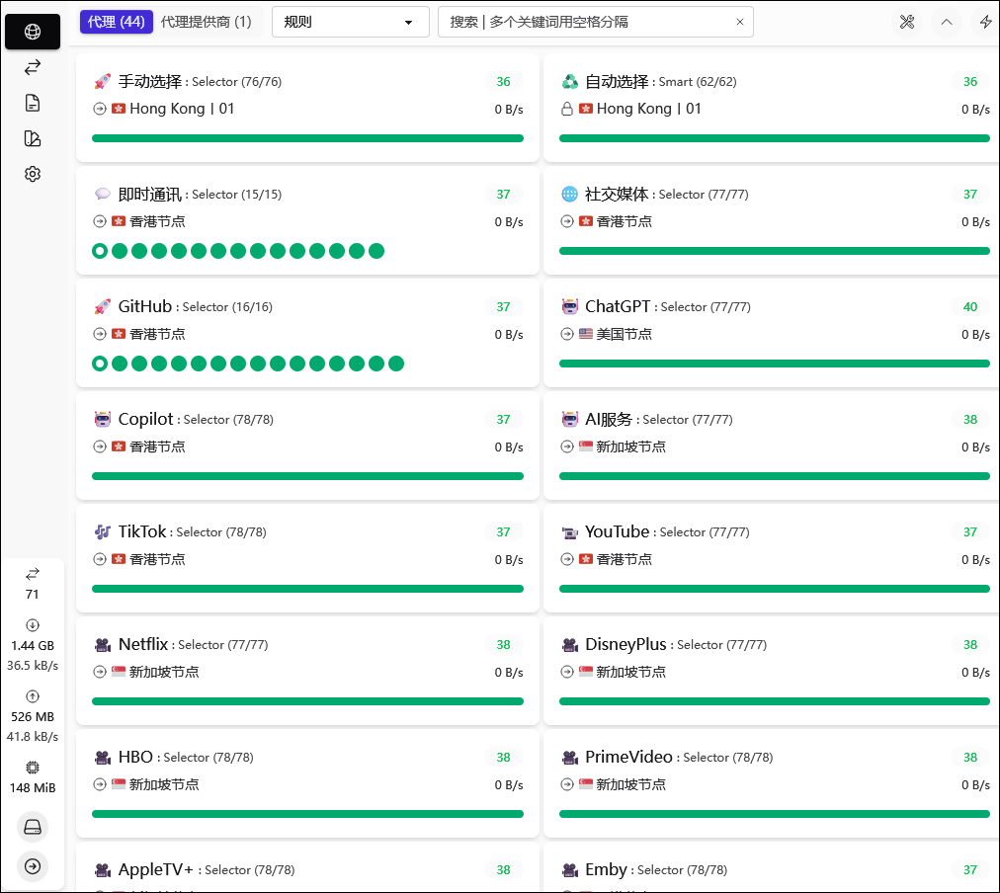

在控制面板中可以根据个人喜好与实际出站配置，调整各策略组的默认出站项。

本项目模板中预置的策略组结构通常足以应对大部分的分流需求。

> [!TIP]
> 如果某些策略组默认指向你不存在的分组/出站项，直接在控制面板里手动改成可用项即可。

请并观察 zashboard 中的策略组是否和截图中的本项目模板大体一致（因为截图未更新，会有一定不同）。

如果区别很大，通常是模板/规则未被正确拉取或缓存未更新。请自行解决网络问题确保后端可以访问远程模板。

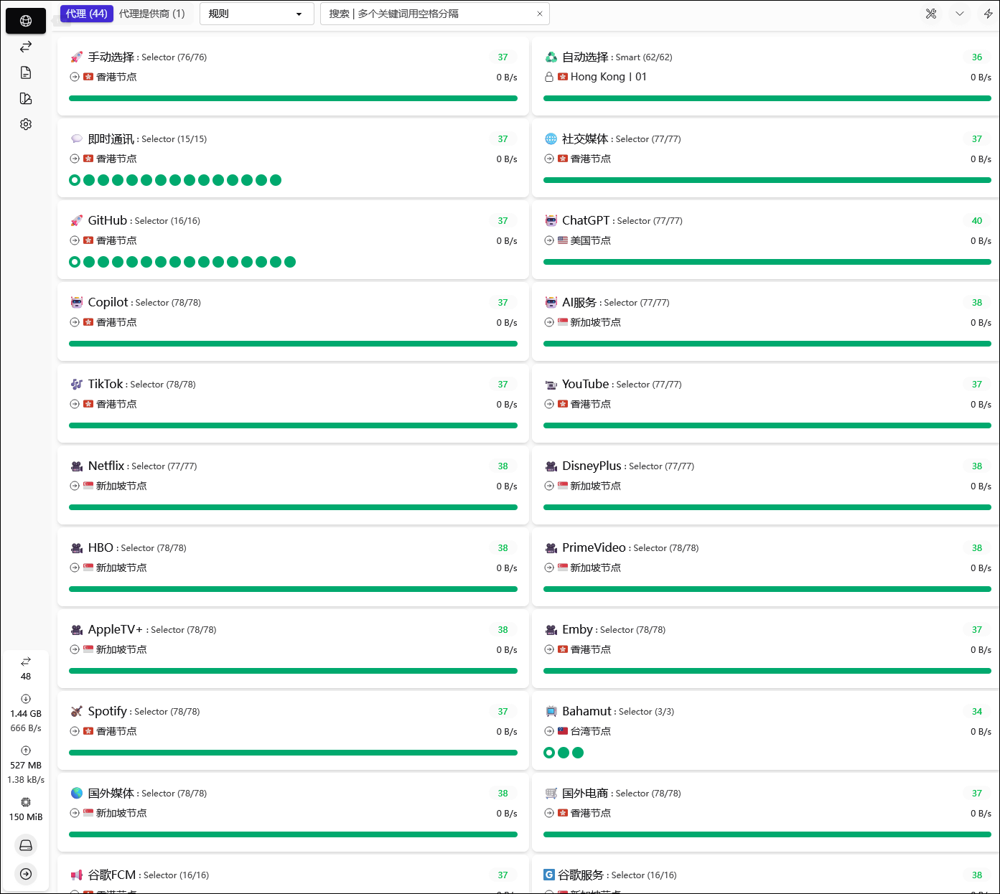

**至此，OpenClash 的基础设置已经完成。日常使用中通常不需要频繁维护，并会根据你的设置定期更新上游规则；插件、规则源或网络环境发生变化后，仍建议检查运行日志与更新结果。**

---

## 6. 🏆 检验结果

下面检查一下按照本方案设置后的效果吧！

> [!CAUTION]
> 注意，Clash 面板中，`“漏网之鱼”` 策略组不要选择直连，否则会无法通过 DNS 泄漏检测网站的测试！

### 6.1 检查 DNS 是否存在泄漏

访问 [IPLEAK.NET](https://ipleak.net/) 检查是否存在 DNS 泄漏。

正常情况下，页面上方应当出现当前出站的 IPv4/IPv6 地址（或仅 IPv4）；页面下方不应出现本地网络/运营商 DNS 服务器条目。

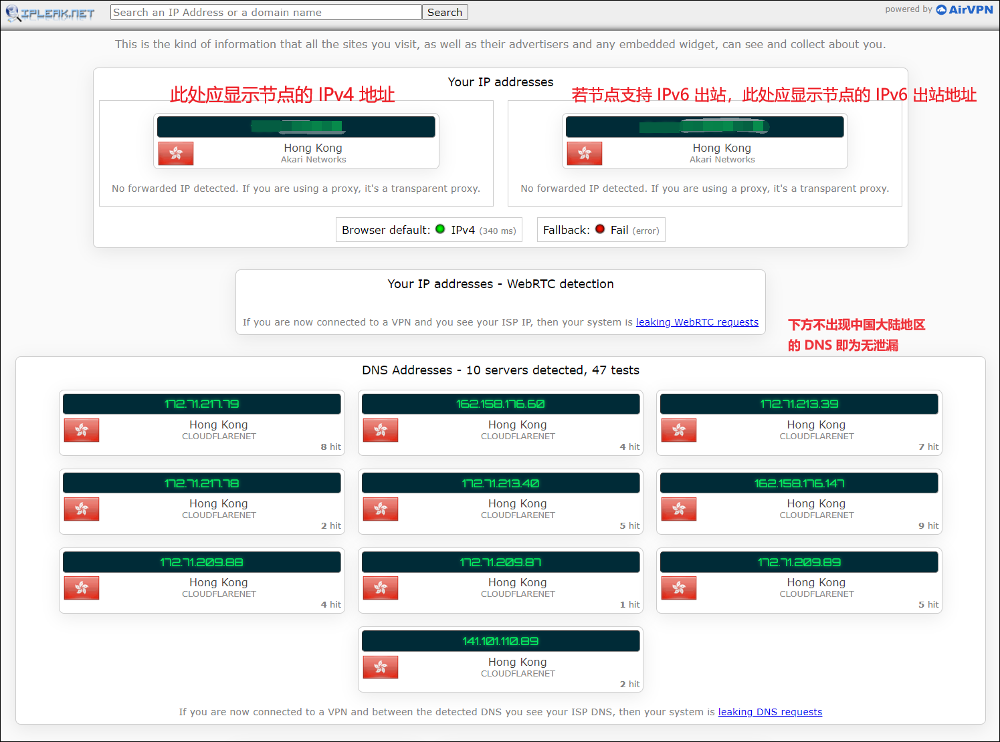

注意：DNS 泄漏检测以 `https://ipleak.net/` 和 `https://browserleaks.com/dns` 的检测结果为准。

某些 DNS 泄漏检测网站（例如 `https://www.browserscan.net/zh/dns-leak`）的检测服务器使用了某些 DDNS 机构的域名。为了避免影响 DDNS 服务，DDNS 类域名在本项目规则中是强制直连并使用本地解析器处理，因此这类检测网站可能会显示“泄漏”，属于正常现象，忽略即可。

### 6.2 检查 IPv6 分流情况

仅限第三方远端服务支持 IPv6 出站的情况。

> [!IMPORTANT]
> 请使用 Edge/Chrome 或者其他 Chromium 内核浏览器，在关闭了浏览器的安全 DNS 功能的情况下，进行 IPv6 测试。
> 请勿使用 Firefox 进行测试，除非你已经为 Firefox 开启了 IPv6 功能，具体开启方法请自行搜索或询问 AI。

访问 IPv6 test：[https://ipv6-test.com/](https://ipv6-test.com/)

网页中的“Address”项目应当显示当前第三方远端服务出站的 IPv4 和 IPv6 地址，证明 IPv4 和 IPv6 出站均正常工作。

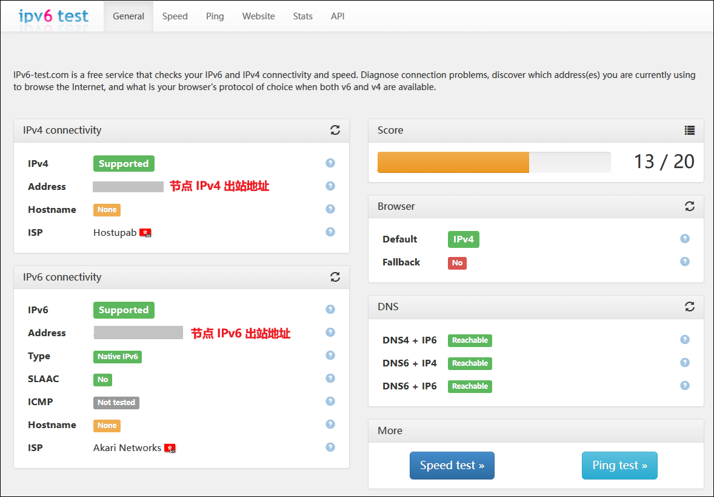

分别访问 IPv6 测试网站 test-ipv6 的镜像站点与原站点：

#### 1. 本地站点测试

镜像站点：[https://testipv6.cn/](https://testipv6.cn/)

访问镜像站点时，检测页面上应当出现你的宽带的 IPv4 和 IPv6 地址以及本地运营商名称（如 CHINA UNICOM），并且以 10/10 的评分通过测试。

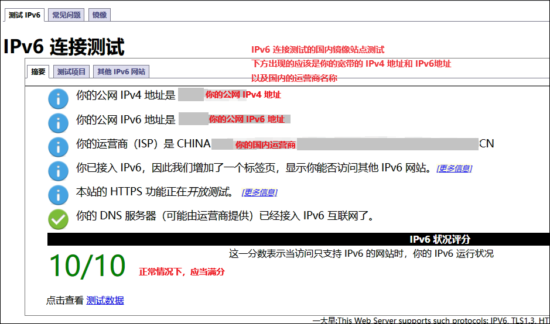

#### 2. 远端站点测试

原站点：[http://test-ipv6.com/](http://test-ipv6.com/)

开启 OpenClash 的情况下，访问远端站点时，检测页面上应当出现当前出站的第三方远端服务 IPv4 和 IPv6 地址以及对应的网络运营商信息，并且以 10/10 的评分通过测试。

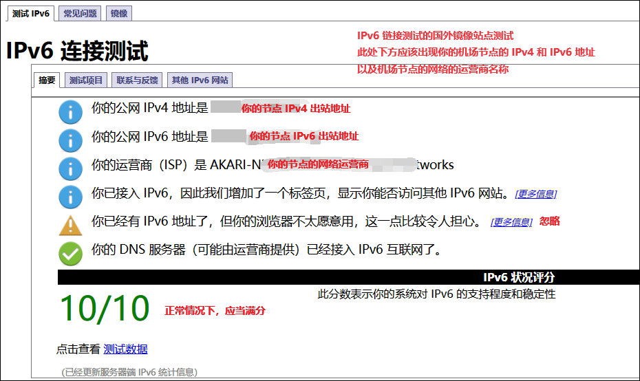

如果以上两个网站测试均通过，说明 IPv6 分流已达到本方案的预期结果。

**至此，你的 OpenWrt 已完成本方案的 OpenClash 设置；各项细节均已尽力兼顾性能、安全与效率，后续可根据实际网络环境继续微调。**

### 6.3 访问不正常？

请查看：[故障排除](5.故障排除.md)

如仍异常，可在 GitHub Issues 中描述问题并附上运行日志与复现步骤。
