## 0. 前言  

让你优雅的使用 OpenWrt 的 IPv6 功能。  

本方案设置以 OpenWrt 主路由拨号环境设置。  

### 0.1. 关于旁路由  

* **不提供旁路由的任何设置方案**  

* **强烈建议使用主路由架构，抛弃错误的旁路由。旁路由爱好者请自己想办法，谁教你架设旁路由的你去找谁，不要提问。**  

具体原因见：[关于旁路由的一些吐槽](6.关于“旁路由”的一些吐槽.md)  

### 0.2. 关于二级路由
二级路由的 IPv6 设置方法，网上教程很多，我自己没有这样的使用环境，所以也不提供任何设置方案，请自行百度。  

### 0.3. 关于 IPv6 设置前提 

现在三大运行商的家宽基本都提供 IPv6 地址，请确认光猫中已经开启 IPv6 功能（即 Internet 连接为 `IPv4&IPv6`）。  
你的宽带能够获得 IPv6-PD 地址，才能适用本方案。  
如果不能的话，暂时请寻求其他的解决方案。  

## 1. OpenWrt/ImmortalWrt 固件 IPv6 设置方案  

本方案仅仅提供 OpenWrt/ImmortalWrt 固件的详细设置步骤，对于 LEDE 固件暂不提供详细设置步骤。  

请确保你已经将光猫设置为桥接模式，使用 OpenWrt 作为主路由进行拨号。  

光猫改桥接请打光猫上的装维师傅电话进行修改。  
  
### 1.1. Dnsmasq 设置  

```
关闭 Dnsmasq 的“过滤 IPv6 AAAA 记录”功能。  
```

如果不关闭此项，Dnsmasq 解析的地址中不会返回 IPv6 地址，也就无法访问 IPv6 网站。  

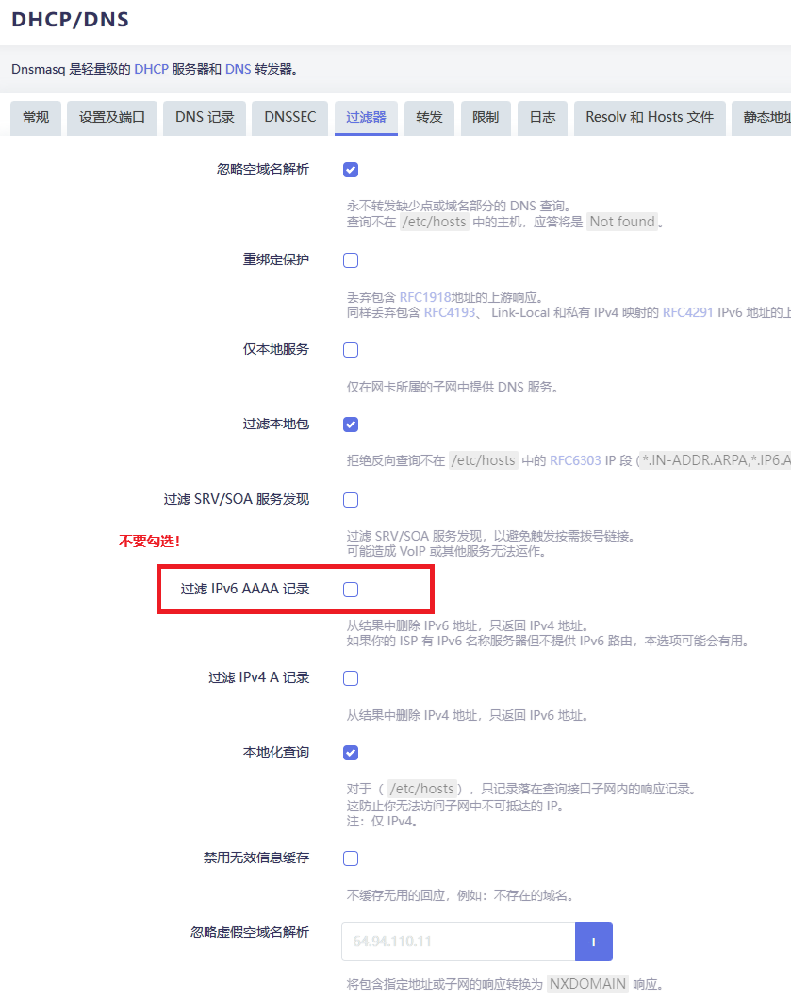  

***

### 1.2. WAN 口设置 IPv6 地址  

**WAN 口方法分为，自动创建和手动创建，请`二选一`即可。**  

* **自动创建**  

没什么特别的要求用自动创建就行。  

1. 不需要新建 WAN6，已有的 WAN6 接口要删除。  

2. 在 WAN 口的高级设置中，开启 IPv6 的选项，并勾选使用运行商通告的 DNS。  

3. 禁用`IPv6 分配长度`。

4. 启用`委托 IPv6 前缀`(启用的话 lan 是没有 IPv6 地址的)。  

5. `IPv6 首选项`不要填，填了会获取不到地址的。   

6. 按图设置。 

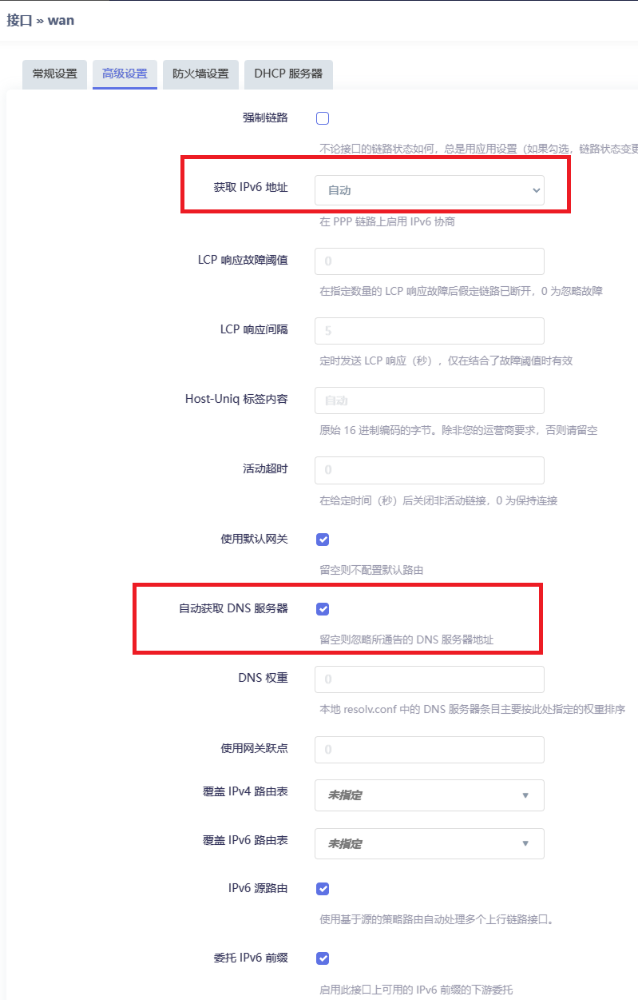  

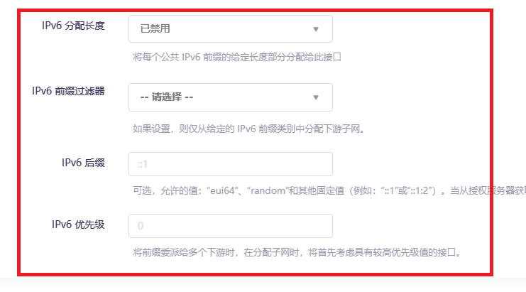  

* 在 `WAN 接口`的 `DHCP` 中检查设置，确保 `DHCP > IPv6 设置`已经关闭  

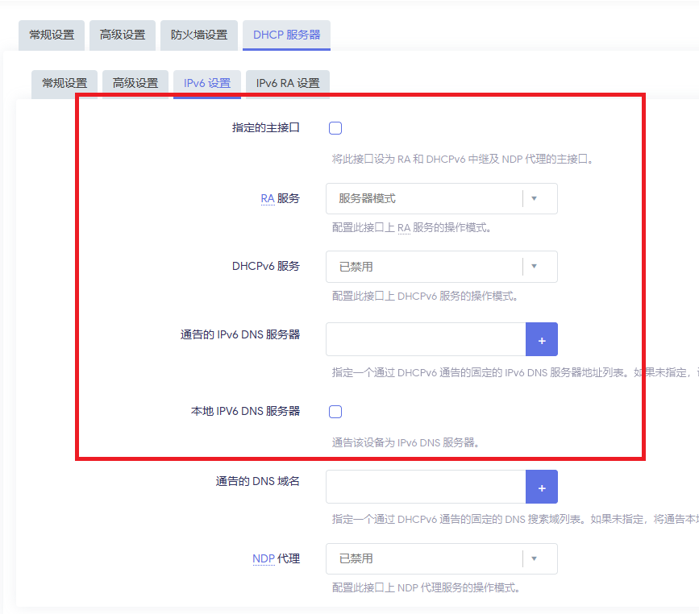  

* 保存并应用设置后，你的接口界面中应该会出现一个虚拟的 wan_6接口。注意此接口是无法编辑设置的。  

* 确认红框中的 `IPv6-PD` 地址，获取到了这个地址才能进行下一步操作。  

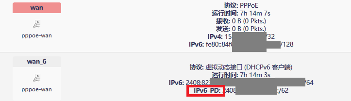   


* **手动创建**  

禁用以下选项：  

```
WAN > 高级设置 > 获取 IPv6 地址  
WAN > 高级设置 > IPv6 源路由
WAN > 高级设置 > 委托 IPv6 前缀
WAN > 高级设置 > IPv6 分配长度
```
在 `OpenWrt > 网络 > 接口`界面，新建一个接口，并命名为 `WAN6`  

按照图中内容对 `WAN6` 接口进行配置  

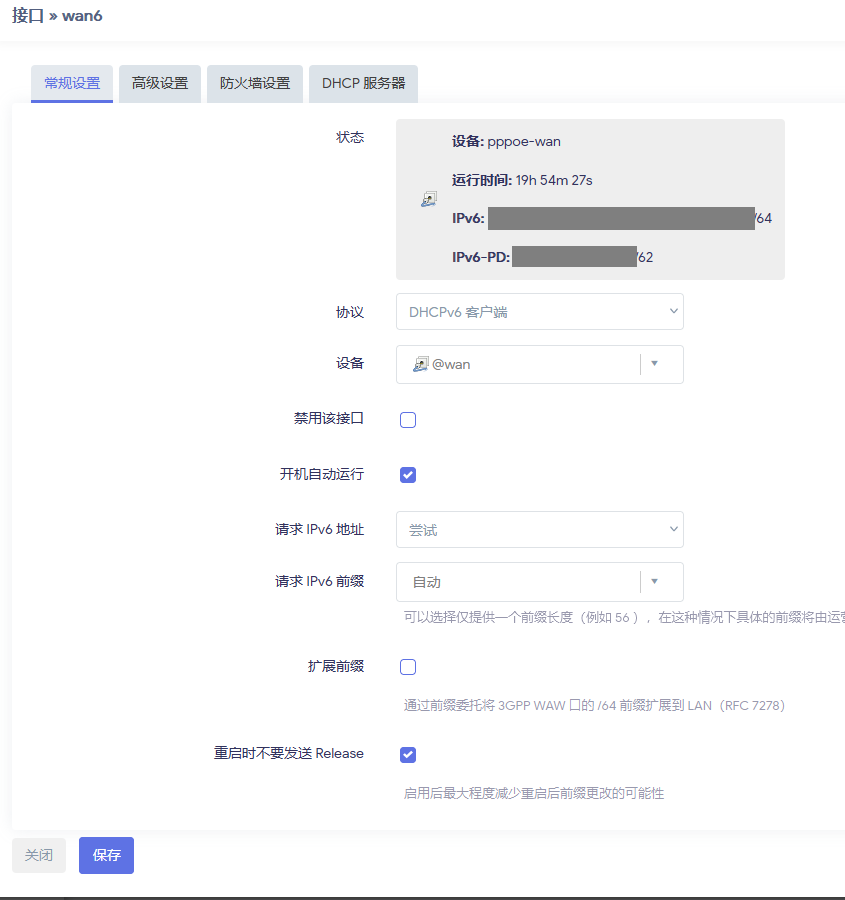  

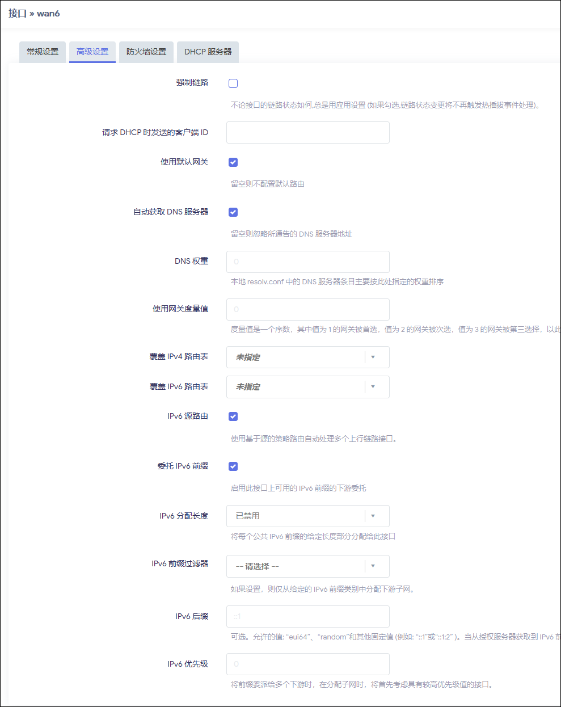  

保存并应用配置后，检查 WAN6 接口是否取得了 `IPv6-PD` 地址。  

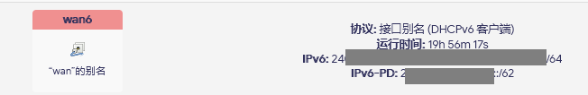  

如果你没有 PD 地址，说明你的 PD 地址被上一级路由占用了，或者干脆你的运行商没给。  

如果是前者，不适用本方案。如果是后者，直接打你光猫上的电话联系运营商的装维人员（不要打 10000 号等电话，浪费时间），和运维师傅确认宽带是否能提供 IPv6-PD 地址，以及你的光猫桥接设置中是否选择了 IPv4&IPv6（有些装维人员会只设置 IPv4）。   

***

### 1.3. LAN 口设置下发 IPv6 地址  

完成 WAN 设置后，接着进行 LAN 设置。

* `“委托 IPv6 前缀”`允许下级设备再划分子网，按需勾选。    

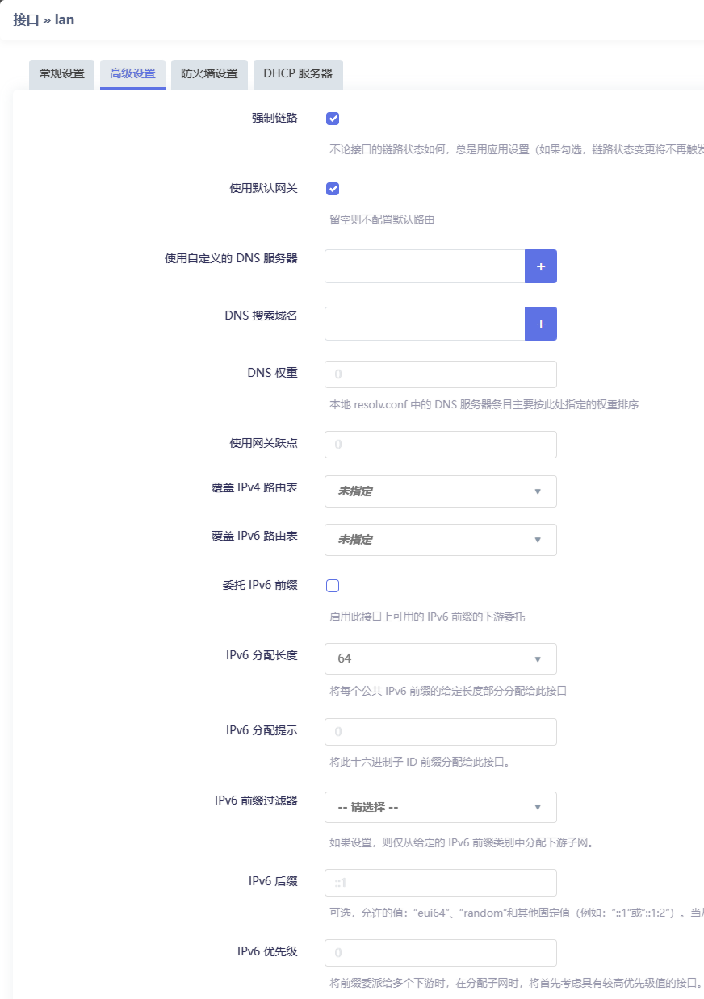  

接着设置 LAN 口的 IPv6 网络地址分配服务，让局域网设备可以取得 IPv6 地址。  

需要说明的是，IPv6 地址由前缀和后缀组成，前缀由运营商下发，后缀有两种获取 IP 的方式：  

* 1、SLAAC（无状态）：后缀由局域网设备自身生成。  
所有类型的设备都支持该功能。  

* 2、DHCPv6（有状态）：后缀由 OpenWrt 统一管理。  
安卓设备以及其他的一些设备（如智能家居设备）不支持该功能。

没有特殊需求的话，建议使用 SLAAC 分配 IPv6 地址即可。SLAAC 和 DHCPv6 可以共存，也可以单独开启。  

此处关闭 DHCPv6，启用 SLACC，并使用 `eui64` 参数来启用 EUI-64 网络地址分配方式，从而形成固定 IP。  

这里参考了如下设置：[immortalwrt/user-FAQ/如何优雅的使用IPV6？](https://github.com/immortalwrt/user-FAQ/blob/main/immortalwrt%20%E5%B8%B8%E8%A7%81%E9%97%AE%E9%A2%98%E6%8C%87%E5%8C%97.md#5-%E5%A6%82%E4%BD%95%E4%BC%98%E9%9B%85%E7%9A%84%E4%BD%BF%E7%94%A8ipv60)  

在 `LAN > 高级设置 > IPv6 后缀` 中填入 `eui64`  

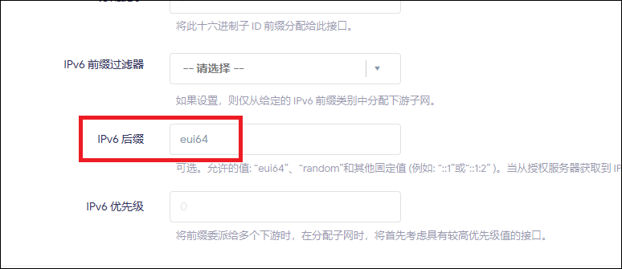  

EUI-64 可以让设备的后缀地址由 MAC 地址生成，因此可以生成唯一的后缀。  

EUI-64 网络地址分配方式的技术解释可以看 ImmortalWrt 仓库的文档：[immortalwrt/user-FAQ/关于eui64的一些说明](https://github.com/immortalwrt/user-FAQ/blob/main/%E5%85%B3%E4%BA%8Eeui64%E7%9A%84%E4%B8%80%E4%BA%9B%E8%AF%B4%E6%98%8E.md)

同时我们需要禁止 OpenWrt 通告 IPv6 地址的 DNS，因为设备只需要 OpenWrt 的 IPv4 DNS 地址即可实现 IPv6 解析。   

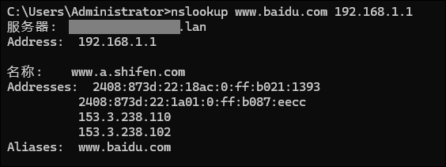  

强迫下游设备使用 OpenWrt 的 IPv4 地址（比如192.168.1.1）来解析包括 IPv6 域名在内的全部域名，防止 IPv6 DNS 抢答解析请求，不会影响设备正常访问 IPv6 域名，同时可以避免发生一些相关的问题。  

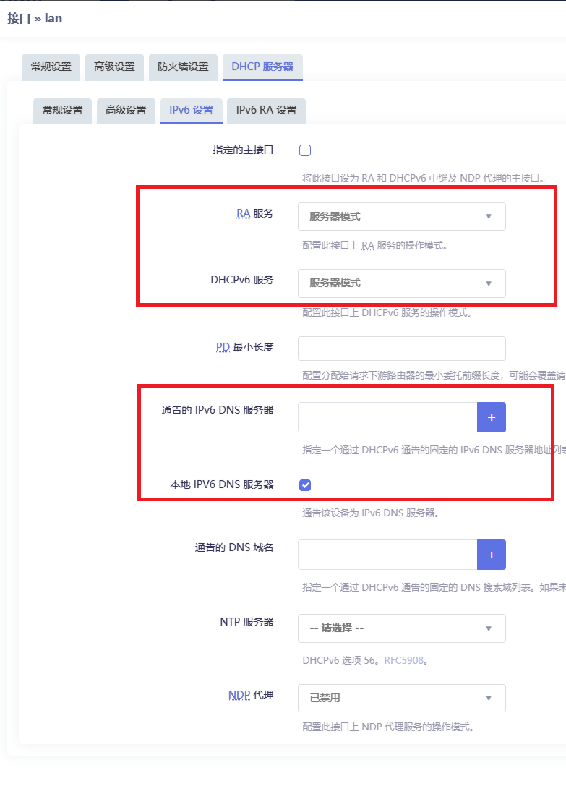  

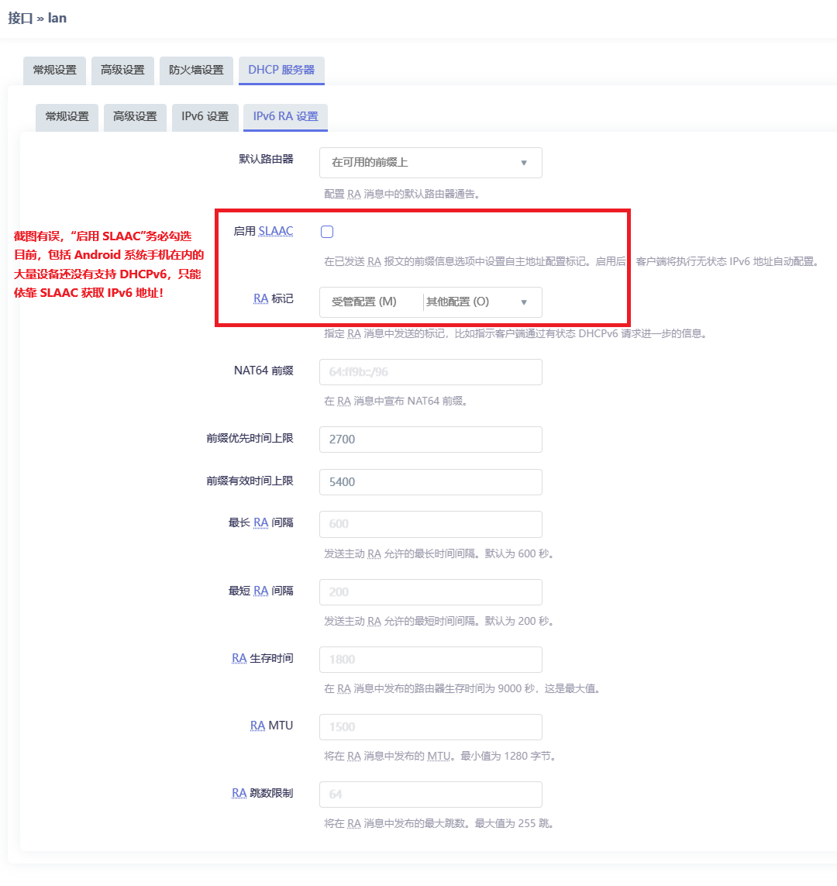  

如此设置之后，局域网支持 IPv6 的设备都将获得一个固定且唯一的 IPv6 地址，并且 IPv6 DNS 为空。  

注意：一些设备和系统（Windows、iOS、Debian 等）出于隐私防护的考虑，会在已获取 SLAAC 地址的情况下，强制生成额外的临时 IPv6 地址用于对外访问。  

例如：https://github.com/Aethersailor/Custom_OpenClash_Rules/issues/225

如果发现设备获取了多个 IPv6 地址，这是一种预期行为，不影响使用且无任何负面影响，设备由 SLAAC 获取的固定后缀 IPv6 地址仍然存在且可正常工作。  

你可以理解为固定 IP 和随机 IP 同时存在。设备对外访问使用了随机的 IPv6地址来 确保隐私，而你从外部访问设备仍然可以通过访问固定后缀 IPv6 地址来进行访问。  

**有特殊需求的用户**，请自己搜索或者询问 AI 如何在对应系统下关闭此类隐私防护设置，建议**保留**该功能。  


***

### 1.4. 测试  

使用 `Edge`/`Chrome` 或者其他 `Chromium 内核`的浏览器，在`关闭`浏览器`安全 DNS 功能`的情况下，访问 IPv6 测试网站来验证设置是否正确： 

请勿使用 Firefox 访问测试网站！ Firefox 默认 IPv4 优先，有可能无法通过测试。  

[https://testipv6.cn/](https://testipv6.cn/)  

正常情况下，会取得全部通过的结果  

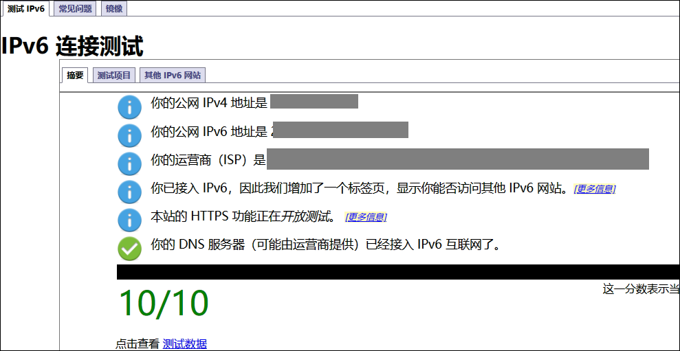  

至此，OpenWrt 的 IPv6 功能设置完毕。  

### 1.5. 日常使用  

* 如果想了解当前访问的网页，使用的是 IPv4 还是 IPv6 线路，可以使用浏览器插件`IPvFoo`，在 Chrome/Firefox 浏览器的插件商店中均有下载。  

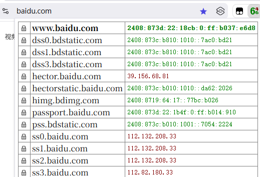  

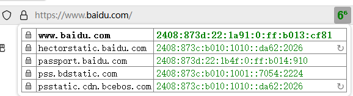  

* 使用 Firefox 浏览器，请在 `about:config` 中将 `network.dns.preferIPv6` 的值设定为 `true`，否则浏览器不会使用 IPv6 访问目标网站。  

## 2. Lean's LEDE 设置方案  

手头所有设备目前均不再使用 Lean's LEDE 源码固件，单纯是因为个人更喜欢官方版和 ImmortalWrt，所以以后也不会有 LEDE 的设置方案。  

请自行摸索相关设置，设置内容相似。   

图片仅供参考  

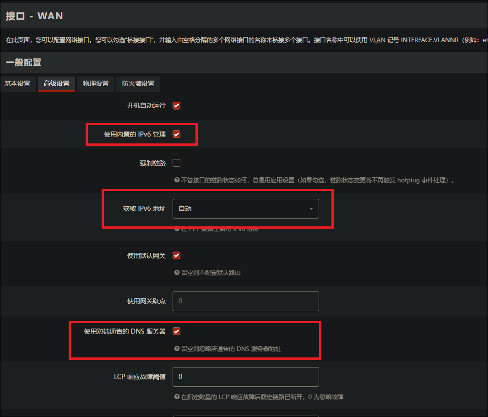  

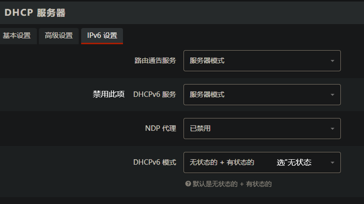  

***

## 3. IPv6 如何正确设置“端口转发”  

首先明确一点，你的下游设备取得的都是公网 IPv6 地址，因此此处实际上并不需要“端口转发”功能，只需要设置对应的防火墙放行规则，即可实现和 IPv4 的端口转发一样的使用效果。  

局域网内设备取得了 IPv6 公网地址，但是你会发现虽然从公网可以 ping 通这些地址，但是并不能直接访问这些地址的端口。  

原因在于 OpenWrt 的防火墙规则默认放行转发给下游设备的 IPv6 的 ICMP 数据包，但是并没有放行其他的数据包。这是一种安全的设定，可以避免下游设备在取得 IPv6 公网地址后不安全的暴露于公网环境中。  

如果你需要从公网访问 OpenWrt 的下游设备的 IPv6 地址的特定端口（比如群晖的 5000 端口，或者 SSH 的 22 端口），则需要建立相应的防火墙通信规则，对特定地址和端口进行放行。  

具体设置参考：[immortalwrt/user-FAQ/IPV6如何正确配置端口转发？](https://github.com/immortalwrt/user-FAQ/blob/main/immortalwrt%20%E5%B8%B8%E8%A7%81%E9%97%AE%E9%A2%98%E6%8C%87%E5%8C%97.md#6-ipv6%E5%A6%82%E4%BD%95%E6%AD%A3%E7%A1%AE%E9%85%8D%E7%BD%AE%E7%AB%AF%E5%8F%A3%E8%BD%AC%E5%8F%91)  

注意填写地址部分，只需要填写设备的 IPv6 地址的后16位，也就是由 MAC 生成的部分。  

这样防火墙规则会按照地址后缀去匹配设备，无需担心运营商下发的地址前缀变动。而地址后缀是根据 MAC 生成的固定后缀。    

***

## 4. 关于本地的 IPv6 DNS  

需要说明一点，能否解析 IPv6 的 AAAA 地址并不取决于服务器自身是否有 IPv6 地址。  

比如当你的 OpenWrt 的上游 DNS 服务器提供 IPv6 域名解析时，你的 OpenWrt 的 Dnsmasq 就可以提供 IPv6 域名的解析服务，这和你通过 IPv4 还是 IPv6 去请求 Dnsmasq 解析是无关的，即便你使用路由器的 IPv4 地址去请求域名解析，一样可以取得 IPv6 结果。    


也就是说，当 OpenWrt 作为你的 DNS 服务器时，只要你的局域网设备获得了 IPv6 地址并且可以正常访问 IPv6 网络，即使局域网设备只取得了 IPv4 的 DNS 地址（比如 192.168.1.1），仍然可以通过 IPv4 的 DNS（192.168.1.1）去解析获得 AAAA 记录从而正常访问 IPv6 网站。  

在我实际使用的过程中，Win11 就会偶尔出现可以 ping 通 OpenWrt 的 IPv4 局域网地址（192.168.1.1）但是无法 ping 通 OpenWrt 的 IPv6 ULA 地址（fda6:xxxx:xxxx::1）的情况，此时只要取消“本地 IPv6 DNS 服务器”勾选，并在“RA 标记”中取消“其他配置”的勾选，即让 OpenWrt 不再向 Win11 通告 IPv6 DNS 地址，从而强迫系统以 IPv4 DNS（192.168.1.1）来解析 IPv6 网站的域名来正常进行访问。  

有点拗口是不是，那么无脑按照图中内容设置即可。  

一句话解释：  
**你可以直接使用 IPv4 DNS （比如路由本身的192.168.1.1）来取得 IPv6 解析结果，不需要去折腾 IPv6 相关的 DNS 设置，让 OpenWrt 不要向下游设备通告 IPv6 DNS 地址即可，可以避免很多问题**
 