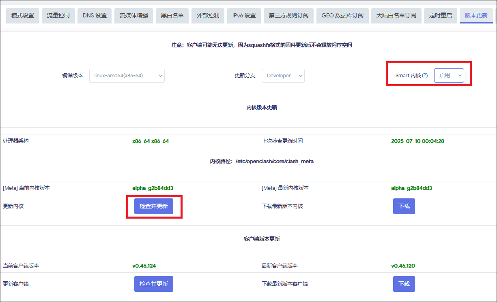
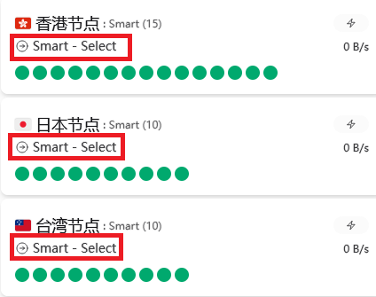

# 1. Smart 内核相关

## 1.1. 本项目方案如何使用 Smart 内核  

Smart 内核是 OpenClash 作者 vernesong 推出的魔改版内核，支持 Smart 节点分组功能，有点类似 Load-balance（负载均衡）节点分组，更加智能化。

内核特性：https://github.com/vernesong/OpenClash/releases/tag/mihomo  

### 1.1.1. 更换 Smart 内核

在 OpenClash `插件设置 > 版本更新`中，将 `Smart 内核`选择为`启用`，然后直接点击下方内核处的`检查并更新`按钮。 
 
注意选择启用后**切勿**点保存，务必**直接**点更新。 

> 没有 Smart 内核选项的，请更新 OpenClash 至最新版。



OpenClash 即会更新为 Smart 内核。 

更新好内核后，根据你使用的订阅转换后端的情况，以下实现方法`二选一`
```
二选一
二选一
二选一
```

### 1.1.2. 使用了支持 Smart 功能的订阅转换后端

如果你使用了本项目的订阅转换后端，则原生支持 Smart 模板的功能，只需使用后端 + Smart 模板即可实现 Smart 功能。

> （若使用不支持 Smart 功能的后端，请跳转下方[使用了不支持 Smart 功能的订阅转换后端](#113-使用了不支持-smart-功能的订阅转换后端)）

本项目订阅转换后端服务已完整支持 Smart 内核的相关参数。

```
https://api.asailor.org/sub
```
不想使用公共订阅转换后端的，可以选择自己搭建。 
[Aethersailor/subconverter](https://github.com/Aethersailor/subconverter)  
由本人维护的订阅转换后端已支持 Smart 内核相关参数。具体搭建流程此处不赘述。  

使用支持 Smart 功能的后端后，需切换 Smart 内核专用模板  

可以选择使用本项目的 Smart 内核专用模板，每个模板均有一个对应的 Smart 内核专用版本。  

在原有模板的链接中的文件名部分添加 `_Smart` 即可切换为 Smart 模板。  

```
https://testingcf.jsdelivr.net/gh/Aethersailor/Custom_OpenClash_Rules@main/cfg/Custom_Clash_Smart.ini
```
```
https://testingcf.jsdelivr.net/gh/Aethersailor/Custom_OpenClash_Rules@main/cfg/Custom_Clash_Smart_Lite.ini
```
```
https://testingcf.jsdelivr.net/gh/Aethersailor/Custom_OpenClash_Rules@main/cfg/Custom_Clash_Smart_GFW.ini
```
```
https://testingcf.jsdelivr.net/gh/Aethersailor/Custom_OpenClash_Rules@main/cfg/Custom_Clash_Smart_Full.ini
```
以上模板默认参数如下：
```
uselightgbm = true // 默认使用内核作者提供的大模型
collectdata = false // 默认关闭数据收集
strategy = sticky-sessions // 默认策略 sticky-sessions
```
本项目订阅后端服务依然支持简写的自定义模板地址，也就是仅填写文件名


## 1.1.3. 使用了不支持 Smart 功能的订阅转换后端

如果你使用了不支持 Smart 功能的订阅转换后端，你需要使用以下方法实现 Smart 功能。  

通过修改 `覆写设置 > 开发者选项`（注意不是`插件设置>开发者选项`！） 中的代码，可以在普通后端下实现支持 Smart 内核功能
```
原理：拉取配置文件后，由插件在启动时对配置文件进行本地修改，将`url-test`替换为`smart`并添加相应的参数。

使用此方法时，Smart 模板中的参数预设值会不生效，实际参数以添加的代码中的为准,因此使用 Smart 模板和非 Smart 模板不会有功能上的区别。  

由于你使用了不支持 Smart 的后端，拉取的远程配置文件中所有 smart 会被替换为 url-test，到本地后再由开发者选项的代码修改回 smart。
```

复制以下代码，插入原有代码的`CONFIG_FILE="$1"`之下：  
```
ruby -ryaml -rYAML -I "/usr/share/openclash" -E UTF-8 -e "
v = YAML.load_file('$CONFIG_FILE');
if v['proxy-groups']
  v['proxy-groups'].each {|g|
    if g['type'] == 'url-test'
      g['type'] = 'smart';
      g.delete('tolerance');
      g['uselightgbm'] = true;
      g['collectdata'] = false;
      g['strategy'] = 'sticky-sessions';
    end
  }
end
File.open('$CONFIG_FILE','w'){|f| YAML.dump(v, f)}
" 2>/dev/null >> $LOG_FILE
```

然后重新更新订阅即可。


 

以上代码默认参数如下：
```
uselightgbm = true // 默认使用内核作者提供的大模型
collectdata = false // 默认关闭数据收集
strategy = sticky-sessions // 默认策略 sticky-sessions
```

### 1.1.4. 检查是否生效  

使用以上任意方式启用 Smart 功能后，在主界面启动任意 dashboard，观察节点分组类型是否为 Smart。  



使用 Smart 模板时，节点组名称为“XX智能”。使用非 Smart 模板+开发者选项时，节点组名称为“XX节点”，这是正常的，实际功能没有区别。  


Smart 节点组的最佳使用方式是每个分组内均为相同地区的节点。因此，尽量选择特定地区的分组，尽量避免使用“自动智能/自动选择”这种包含了全部节点的分组，使用该分组会造成 IP 乱跳地区的情况。  

模板默认启用了 OpenClash 作者提供的 LightGBM 模型，不想折腾的使用默认参数即可。  

***

关于 Smart 内核的参数：

```
uselightgbm = true // 默认使用内核作者提供的模型，若不打算自己训练模型，保持开启即可
collectdata = false // 默认关闭数据收集，如果需要自己收集训数据训练模型，则需要开启
strategy = sticky-sessions // 默认策略 sticky-sessions，没什么特殊需求用这个就行

uselightgbm 和 collectdata 实际功能互斥但是，例如你开启了数据收集，就不要再开启预置的模型，否则你收集到的数据就是预置模型的训练数据了
```
如果你有兴趣折腾，可以参考油管上的众多教程，修改参数来开启数据收集功能，配合训练属于自己的模型。

因为推荐机场的节点质量相当好，所以我自己并没有使用 Smart 内核。  

所以，Smart 节点组的相关问题就不要问我了哈。  

