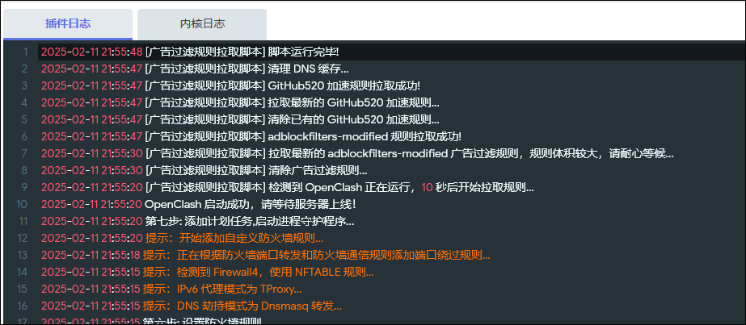
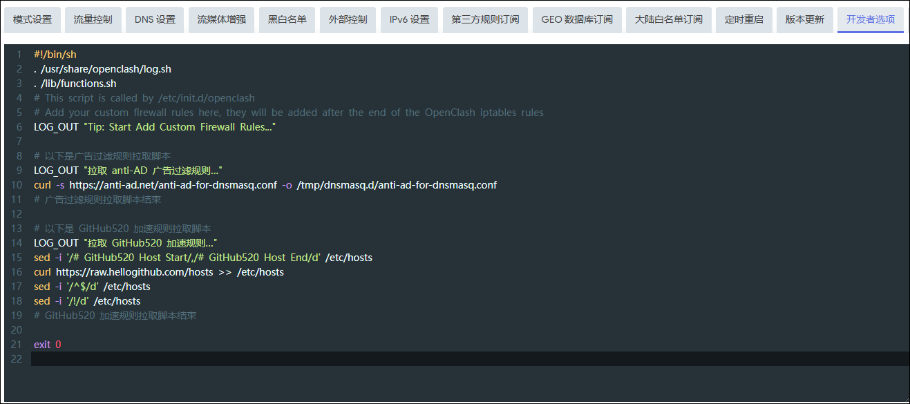
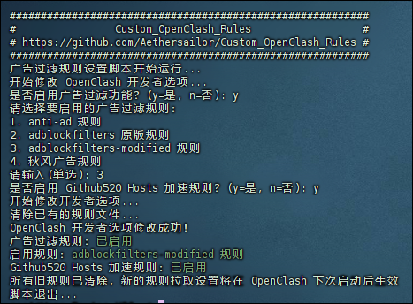
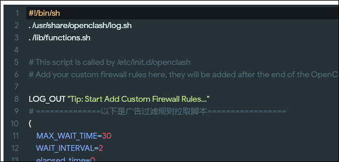
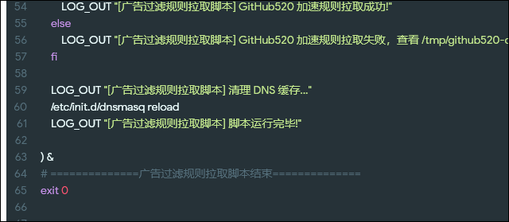

# 0. 介绍  

> 注意：2025.7.21，去广告功能可能存在 BUG，本教程不对任何不良后果负责。

***

**本方案已作废，本页面提及的去广告方式彻底弃用，坚持非要使用的，出问题请自己解决。**

**建议使用 luci-app-adblock(安装 luci-i18n-adblock-fast-zh-cn) 或 luci-app-adblock-fast(安装 luci-i18n-adblock-zh-cn) 实现 dnsmasq 广告拦截功能，效果同本方案，且更灵活**

***

准确的说，应该是“不使用第三方插件的广告拦截设置方案”，为防止其他转载的链接无法打开，所以将错就错，不改名了。  

按照本项目的设置方案，只使用 OpenClash 一个插件。由于中国大陆域名绕过了 OpenClash 内核，因此无法依靠 OpenClash 的规则来完成广告拦截。  

利用 OpenClash 的`“插件设置”>“开发者选项”`功能，让 OpenClash 每次启动时，运行脚本为 Dnsmasq 拉取相应的规则文件，并清理 DNS 缓存使规则生效，从而实现了无需第三方插件的广告拦截和隐私防护功能。  

该功能可在 OpenClash 的日志中输出相应的信息，以便使用者观察脚本运行状态。  

   

```
不要对 DNS 广告拦截的`网页广告拦截`效果抱有太大的期望，针对网页广告效果最好的拦截方式永远是`浏览器插件`。  
```

更没有必要去用广告拦截测试网站对本方案的效果进行测试，毕竟本方案只是针对域名的 DNS 拦截，不可能在测试网站取得高分。  

DNS 拦截除了可以拦截广告，也可以在一定程度上实现隐私保护（比如拦截手机 APP 以及智能家居设备向外发送的调试信息或统计数据）。其服务对象更多的是面向 App 以及智能家居设备等。  


```
2025年2月6日更新，使用子进程功能改写脚本，已重新适配当前 OpenClash 最新 Dev 版本 v0.46.071，同时兼容 master 版本。自动检测固件类型，兼容 OpenWrt/ImmortalWrt 和 LEDE。

2025年3月11日更新，兼容新老固件不同 dnsmasq 规则目录，自动检测。  

2025年7月1日更新，有些固件无法正常的运行超长的 curl 命令，导致拉取广告过滤规则失败并导致 dnsmasq 工作不正常。
由于我本人使用的固件没这个问题，所以无法测试和修改。如果遇到拉取报错，自行修改代码或放弃使用该功能。  
```

**使用本方案部署广告拦截功能后，务必用 nslookup 命令检查任意域名的解析结果，如果返回结果中，DNS 服务器名为 `Unknown`，说明代码在你的固件中工作不正常，请删除代码并弃用该功能**


以下内容均以 OpenClash Dev 版本为示例，旧版本可能有所不同，不保证可用，建议升级到最新版 OpenClash，Master 或 Dev 均可。  

***

# 1. 相关规则  

维护者在技术上始终保持`中立`态度，以下规则的引用的唯一依据是维护者的`个人喜好`，对于上游规则涉及的一些争议，`不存在任何立场`。  

如果你认为不应当使用某些规则，请自行修改代码部分替换成你喜欢的规则，任何支持 dnsmasq 格式的规则都可以使用本方案的方法进行添加。  

本项目引用了以下广告过滤规则：  
 
## 1.1. **广告过滤规则：**

**1. [anti-AD](https://github.com/privacy-protection-tools/anti-AD)**  
规则数量：8.9万+  
一款流行的广告过滤规则，致力于成为中文区命中率最高的广告过滤列表，实现精确的广告屏蔽和隐私保护。  

**2. [原版 adblockfilters](https://github.com/217heidai/adblockfilters)**  
规则数量：22万+  
一款覆盖全面的广告过滤规则合集，其上游包含了大量常见的规则，每隔8小时更新一次，带有去重和去无效域名机制。  

**3. [adblockfilters-modified](https://github.com/Aethersailor/adblockfilters-modified)**  
规则数量：65万+  
本项目维护者在原版 adblockfilters 的分支上维护的增强版，在原版规则的基础上，增加了 anti-ad、OISD Big、PeterLowe、1Hosts 等大量流行的规则作为上游，保留了原项目的去重和去无效域名机制，巨量体积，几十万条规则有效治疗规则焦虑症。  
**该规则只追求尽可能多的规则数量，不对性能和误杀率进行任何优化，因此误杀严重，谨慎使用。有可能会导致网络变慢。**  
由于规则体积庞大，目前发现有可能会造成 dnsmasq 工作不正常从而导致整个 OpenWrt 网络崩溃，谨慎使用哈。

**4. [秋风广告规则](https://github.com/TG-Twilight/AWAvenue-Ads-Rule)**  
规则数量：0.16万+  
开源社区中最优秀的轻量化广告过滤器列表之一，实现了最优秀的广告拦截、隐私保护和流量节省。  


```
规则行数：adblockfilters-modified >> adblockfilters > anti-ad >> 秋风广告规则  

anti-ad 规则上游已包含了秋风广告规则  

adblockfilters 规则上游已包含了秋风广告规则  

adblockfilters-modified 规则上游已包含了 adblockfilters、anti-ad 和秋风广告规则  

所以，不用琢磨如何重复添加，照抄即可。 
```


## 1.2. **Hosts 加速规则：**  

**1. [Github520](https://github.com/521xueweihan/GitHub520)**  
在 hosts 添加 Github 相关的条目，解决未开启科学上网时的 Github 访问问题  

推荐使用 adblockfilters/anti-ad 规则 + Github520  

**本设置方案只是对上游规则进行一个`调用`，能过滤哪些广告，误拦截哪些内容，取决于上游规则，与本项目无关。任何规则相关的问题，不管是遗漏还是误杀，请去上游规则仓库反馈。**  

***

# 2. 其他说明  
  
## 2.1. 关于性能  

理论上来说，规则行数和覆盖率以及误杀率成正比，和性能成反比。  

维护者在 x86 以及 arm 设备上使用了 adblockfilters-modified 规则，体感上并未发现域名解析速度有明显的变慢。  

**注意：如果使用广告拦截功能后，访问网页有明显变慢，说明设备性能不够，请弃用该功能，或使用更轻量的规则。**  
 
## 2.2. 无法使用？  

**注意：项目维护者没有使用 LEDE 固件的设备，若发现脚本有问题请及时反馈。** 

广告拦截设置失败的原因有很多，包括但不限于固件差异、网络波动等情况，维护者没有精力从脚本层面解决这些问题，也不可能去解决，因为这些问题会无穷无尽的多。  

脚本已经内置了输出日志功能，如果广告拦截规则拉取失败，请自己根据日志内容进行排查和调试，必要时自行修改脚本内容，例如自行修改反代地址。  

正常情况下无需修改，小白用户如需修改，建议借助 ChatGPT 或者 DeepSeek 进行。  

**只接受可以明确指出脚本错误的反馈，不接受“我怎么用不了”、“为什么报错”之类的无效反馈。**    


***


图片仅供示意
图中代码为早期简陋版本，和当前最新代码不同    

  


***

# 3. 设置前提  

> **必须关闭 Dnsmasq 自带的 `DNS 重定向`功能**  

该功能位于 `网络 > DHCP/DNS` 页面中，务必关闭  

若不关闭，会引起 DNS 解析问题，并会导致本方案的广告拦截设置无法拦截国外域名。  

  

LEDE 源码固件无此选项，忽略即可。  

如果你搭配了其他 DNS 插件使用，必须保证 dnsmasq 处于整个解析流程中，任何未经过 dnsmasq 的解析请求均无法被广告过滤规则过滤。  

***

#  4. 添加广告拦截规则拉取指令  

> 以下添加方式分为 1.一键添加 和 2.手动添加，**任选其一**。  

看不懂上面这句话的先去医院看病。  

***

## 4.1. 一键添加广告拦截规则  

SSH 连接 OpenWrt，复制以下命令执行，跟随脚本提示选择要添加的规则即可。  

```bash
curl -sSL https://testingcf.jsdelivr.net/gh/Aethersailor/Custom_OpenClash_Rules@refs/heads/main/shell/edit_custom_firewall_rules.sh -o edit_custom_firewall_rules.sh && chmod +x edit_custom_firewall_rules.sh && ./edit_custom_firewall_rules.sh

```

  

能用就用不能用就拉倒。  

**SSH 怎么用命令怎么用脚本为什么下载不下来之类的弱智问题请勿提问。**  


***


## 4.2. 手动添加广告拦截规则  

原则上本项目所有文档类内容都会考虑到不会使用 SSH 的纯小白玩家，因此同样提供在 web 页面中手工添加去广告功能的方法，全程仅需复制粘贴和点击鼠标。  

**根据个人需求手工修改开发者选项的说明如下：**  

> **注意：`“开发者选项”`中自带的内容，不要删除！以下内容需要添加在原有内容的 `exit 0` 之前**  

> **注意：`“开发者选项”`是 `插件设置 > 开发者选项`，**不是** `覆写设置>开发者选项`，不要搞错位置了！**  

  

  

  

此处提供多个版本的规则拉取脚本模板，`任选其一`复制粘贴即可：  

1. anti-ad + Github520
2. 原版 adblockfilters + Github520
3. adblockfilters-modified + Github520
4. 秋风广告规则 + Github520
5. 不添加广告过滤规则，仅添加 Github520  

注意：anti-ad、原版 adblockfilters、adblockfilters-modified 规则的上游均已包含秋风广告规则，无需重复添加。


### 4.2.1. anti-AD 广告过滤规则 + Github 520 加速规则  

anti-AD 是一款比较有名的广告过滤规则，规则体积适中。  

```bash
# ==============以下是广告过滤规则拉取脚本=================
(
    MAX_WAIT_TIME=30
    WAIT_INTERVAL=2
    elapsed_time=0

    if /etc/init.d/openclash status | grep -q "Syntax:"; then
        LOG_OUT "[广告过滤规则拉取脚本] 正在检测 OpenClash 运行状态..."
        LOG_OUT "[广告过滤规则拉取脚本] 等待 10 秒以确保 OpenClash 已启动..."
        sleep 10
    else
        LOG_OUT "[广告过滤规则拉取脚本] 正在检测 OpenClash 运行状态..."
        while ! /etc/init.d/openclash status | grep -q "running"; do
            if [ $elapsed_time -ge $MAX_WAIT_TIME ]; then
                LOG_OUT "[广告过滤规则拉取脚本] 未能在 30 秒内检测到 OpenClash 运行状态，脚本已停止运行..."
                exit 1
            fi
            sleep $WAIT_INTERVAL
            elapsed_time=$((elapsed_time + WAIT_INTERVAL))
        done
        LOG_OUT "[广告过滤规则拉取脚本] 检测到 OpenClash 正在运行，10 秒后开始拉取规则..."
        sleep 10
    fi

    LOG_OUT "[广告过滤规则拉取脚本] 开始检测 dnsmasq 规则目录..."
    UCI_OUTPUT=$(uci show dhcp.@dnsmasq[0] 2>/dev/null)
    
    if echo "$UCI_OUTPUT" | grep -qE 'cfg[0-9a-f]{6}'; then
        HASH_ID=$(echo "$UCI_OUTPUT" | grep -oE 'cfg[0-9a-f]{6}' | head -1) 
        TARGET_DIR="/tmp/dnsmasq.${HASH_ID}.d"
        LOG_OUT "[广告过滤规则拉取脚本] 当前 dnsmasq 规则目录: $TARGET_DIR"
    elif echo "$UCI_OUTPUT" | grep -qE '@dnsmasq\[[0-9]+\]'; then
        TARGET_DIR="/tmp/dnsmasq.d"
        LOG_OUT "[广告过滤规则拉取脚本] 当前dnsmasq 规则目录: $TARGET_DIR"
    else
        TARGET_DIR=$(find /tmp -maxdepth 1 -type d -name "dnsmasq.*.d" | head -n 1)
        if [ -z "$TARGET_DIR" ]; then
            LOG_OUT "[广告过滤规则拉取脚本] 错误：未找到有效的 dnsmasq 规则目录，脚本已停止！"
            exit 1
        fi
        LOG_OUT "[广告过滤规则拉取脚本] 检测失败，使用已存在的 dnsmasq 规则目录: $TARGET_DIR"
    fi
    
    if [ ! -d "$TARGET_DIR" ]; then
        mkdir -p "$TARGET_DIR"
    fi

    LOG_OUT "[广告过滤规则拉取脚本] 清除已有规则…"
    rm -f "$TARGET_DIR"/*ad*.conf 
    sed -i '/# AWAvenue-Ads-Rule Start/,/# AWAvenue-Ads-Rule End/d' /etc/hosts
    sed -i '/# GitHub520 Host Start/,/# GitHub520 Host End/d' /etc/hosts

    LOG_OUT "[广告过滤规则拉取脚本] 拉取最新的 anti-AD 广告过滤规则，规则体积较大，请耐心等候…"
    curl -sS -L -4 --retry 5 --retry-delay 1 "https://testingcf.jsdelivr.net/gh/privacy-protection-tools/anti-AD@refs/heads/master/adblock-for-dnsmasq.conf" -o "$TARGET_DIR/anti-ad-for-dnsmasq.conf" >/dev/null 2>/tmp/anti-ad-curl.log
    CURL_EXIT=$?

    if [ $CURL_EXIT -eq 0 ]; then
        LOG_OUT "[广告过滤规则拉取脚本] anti-AD 规则拉取成功！保存路径：${TARGET_DIR}/anti-ad-for-dnsmasq.conf"
    else
        LOG_OUT "[广告过滤规则拉取脚本] anti-AD 规则拉取失败 (错误码:$CURL_EXIT)，查看 /tmp/anti-ad-curl.log 获取详细信息。"
        echo "CURL Exit Code: $CURL_EXIT" >> /tmp/anti-ad-curl.log
    fi

    LOG_OUT "[广告过滤规则拉取脚本] 拉取最新的 GitHub520 加速规则…"
    curl -sSL -4 --retry 5 --retry-delay 1 "https://raw.hellogithub.com/hosts" >> /etc/hosts 2> /tmp/github520-curl.log
    CURL_EXIT_GH=$?

    if [ $CURL_EXIT_GH -eq 0 ]; then
        LOG_OUT "[广告过滤规则拉取脚本] GitHub520 加速规则拉取成功！已追加到 /etc/hosts 文件中。"
    else
        LOG_OUT "[广告过滤规则拉取脚本] GitHub520 加速规则拉取失败 (错误码:$CURL_EXIT_GH)，查看 /tmp/github520-curl.log 获取详细信息。"
        echo "CURL Exit Code: $CURL_EXIT_GH" >> /tmp/github520-curl.log
    fi

    sed -i '/^$/d' /etc/hosts
    sed -i '/!/d' /etc/hosts

    LOG_OUT "[广告过滤规则拉取脚本] 重新加载 dnsmasq 服务以应用规则…"
    /etc/init.d/dnsmasq stop
    /etc/init.d/dnsmasq start
    LOG_OUT "[广告过滤规则拉取脚本] 脚本运行完毕！"

) &
# ==============广告过滤规则拉取脚本结束==============
```  

你也可以将 anti-AD 规则替换成任何支持 Dnsmasq 格式的广告规则，比如 [217heidai/adblockfilters](https://github.com/217heidai/adblockfilters) 规则。  

修改代码，替换下载链接和 .conf 文件的命名即可。

### 4.2.2. 原版 adblockfilters 去广告规则 + Github 520 加速规则   

adblockfilters 同样是一款优秀的去广告规则，其上游包含了大量的优秀的规则，且带有去重和去无效域名机制，每8小时更新一次。  

但是该规则体积较为庞大，条目数大概是二十多万条，建议自行取舍是否使用该规则。

```bash
# ==============以下是广告过滤规则拉取脚本=================
(
    MAX_WAIT_TIME=30
    WAIT_INTERVAL=2
    elapsed_time=0

    if /etc/init.d/openclash status | grep -q "Syntax:"; then
        LOG_OUT "[广告过滤规则拉取脚本] 正在检测 OpenClash 运行状态..."
        LOG_OUT "[广告过滤规则拉取脚本] 等待 10 秒以确保 OpenClash 已启动..."
        sleep 10
    else
        LOG_OUT "[广告过滤规则拉取脚本] 正在检测 OpenClash 运行状态..."
        while ! /etc/init.d/openclash status | grep -q "running"; do
            if [ $elapsed_time -ge $MAX_WAIT_TIME ]; then
                LOG_OUT "[广告过滤规则拉取脚本] 未能在 30 秒内检测到 OpenClash 运行状态，脚本已停止运行..."
                exit 1
            fi
            sleep $WAIT_INTERVAL
            elapsed_time=$((elapsed_time + WAIT_INTERVAL))
        done
        LOG_OUT "[广告过滤规则拉取脚本] 检测到 OpenClash 正在运行，10 秒后开始拉取规则..."
        sleep 10
    fi

    LOG_OUT "[广告过滤规则拉取脚本] 开始检测 dnsmasq 规则目录..."
    UCI_OUTPUT=$(uci show dhcp.@dnsmasq[0] 2>/dev/null)
    
    if echo "$UCI_OUTPUT" | grep -qE 'cfg[0-9a-f]{6}'; then
        HASH_ID=$(echo "$UCI_OUTPUT" | grep -oE 'cfg[0-9a-f]{6}' | head -1) 
        TARGET_DIR="/tmp/dnsmasq.${HASH_ID}.d"
        LOG_OUT "[广告过滤规则拉取脚本] 当前 dnsmasq 规则目录: $TARGET_DIR"
    elif echo "$UCI_OUTPUT" | grep -qE '@dnsmasq\[[0-9]+\]'; then
        TARGET_DIR="/tmp/dnsmasq.d"
        LOG_OUT "[广告过滤规则拉取脚本] 当前dnsmasq 规则目录: $TARGET_DIR"
    else
        TARGET_DIR=$(find /tmp -maxdepth 1 -type d -name "dnsmasq.*.d" | head -n 1)
        if [ -z "$TARGET_DIR" ]; then
            LOG_OUT "[广告过滤规则拉取脚本] 错误：未找到有效的 dnsmasq 规则目录，脚本已停止！"
            exit 1
        fi
        LOG_OUT "[广告过滤规则拉取脚本] 检测失败，使用已存在的 dnsmasq 规则目录: $TARGET_DIR"
    fi
    
    if [ ! -d "$TARGET_DIR" ]; then
        mkdir -p "$TARGET_DIR"
    fi

    LOG_OUT "[广告过滤规则拉取脚本] 清除已有规则…"
    rm -f "$TARGET_DIR"/*ad*.conf 
    sed -i '/# AWAvenue-Ads-Rule Start/,/# AWAvenue-Ads-Rule End/d' /etc/hosts
    sed -i '/# GitHub520 Host Start/,/# GitHub520 Host End/d' /etc/hosts

    LOG_OUT "[广告过滤规则拉取脚本] 拉取最新的 adblockfilters 广告过滤规则，规则体积较大，请耐心等候…"
    curl -sS -L -4 --retry 5 --retry-delay 1 "https://testingcf.jsdelivr.net/gh/217heidai/adblockfilters@refs/heads/main/rules/adblockdnsmasq.txt" -o "$TARGET_DIR/adblockfilters-for-dnsmasq.conf" >/dev/null 2>/tmp/adblockfilters-curl.log
    CURL_EXIT=$?

    if [ $CURL_EXIT -eq 0 ]; then
        LOG_OUT "[广告过滤规则拉取脚本] adblockfilters 规则拉取成功！保存路径：${TARGET_DIR}/adblockfilters-for-dnsmasq.conf"
    else
        LOG_OUT "[广告过滤规则拉取脚本] adblockfilters 规则拉取失败 (错误码:$CURL_EXIT)，查看 /tmp/adblockfilters-curl.log 获取详细信息。"
        echo "CURL Exit Code: $CURL_EXIT" >> /tmp/adblockfilters-curl.log
    fi

    LOG_OUT "[广告过滤规则拉取脚本] 拉取最新的 GitHub520 加速规则…"
    curl -sS -L -4 --retry 5 --retry-delay 1 "https://raw.hellogithub.com/hosts" >> /etc/hosts >/dev/null 2>/tmp/github520-curl.log
    CURL_EXIT_GH=$?

    if [ $CURL_EXIT_GH -eq 0 ]; then
        LOG_OUT "[广告过滤规则拉取脚本] GitHub520 加速规则拉取成功！已追加到 /etc/hosts 文件中。"
    else
        LOG_OUT "[广告过滤规则拉取脚本] GitHub520 加速规则拉取失败 (错误码:$CURL_EXIT_GH)，查看 /tmp/github520-curl.log 获取详细信息。"
        echo "CURL Exit Code: $CURL_EXIT_GH" >> /tmp/github520-curl.log
    fi

    sed -i '/^$/d' /etc/hosts
    sed -i '/!/d' /etc/hosts

    LOG_OUT "[广告过滤规则拉取脚本] 重新加载 dnsmasq 服务以应用规则…"
    /etc/init.d/dnsmasq stop
    /etc/init.d/dnsmasq start
    LOG_OUT "[广告过滤规则拉取脚本] 脚本运行完毕！"

) &
# ==============广告过滤规则拉取脚本结束==============
```

### 4.2.3. adblockfilters-modified 去广告规则 + Github 520 加速规则   

adblockfilters-modified 是本项目维护者在原版 adblockfilters 广告过滤规则的基础上增加了 anti-ad 等更多上游规则的内容合并而来，经过原版的去重和去无效域名机制处理。  
**规则条目数巨大，误杀率较高，谨慎使用。**  


```bash
# ==============以下是广告过滤规则拉取脚本=================
(
    MAX_WAIT_TIME=30
    WAIT_INTERVAL=2
    elapsed_time=0

    if /etc/init.d/openclash status | grep -q "Syntax:"; then
        LOG_OUT "[广告过滤规则拉取脚本] 正在检测 OpenClash 运行状态..."
        LOG_OUT "[广告过滤规则拉取脚本] 等待 10 秒以确保 OpenClash 已启动..."
        sleep 10
    else
        LOG_OUT "[广告过滤规则拉取脚本] 正在检测 OpenClash 运行状态..."
        while ! /etc/init.d/openclash status | grep -q "running"; do
            if [ $elapsed_time -ge $MAX_WAIT_TIME ]; then
                LOG_OUT "[广告过滤规则拉取脚本] 未能在 30 秒内检测到 OpenClash 运行状态，脚本已停止运行..."
                exit 1
            fi
            sleep $WAIT_INTERVAL
            elapsed_time=$((elapsed_time + WAIT_INTERVAL))
        done
        LOG_OUT "[广告过滤规则拉取脚本] 检测到 OpenClash 正在运行，10 秒后开始拉取规则..."
        sleep 10
    fi

    LOG_OUT "[广告过滤规则拉取脚本] 开始检测 dnsmasq 规则目录..."
    UCI_OUTPUT=$(uci show dhcp.@dnsmasq[0] 2>/dev/null)
    
    if echo "$UCI_OUTPUT" | grep -qE 'cfg[0-9a-f]{6}'; then
        HASH_ID=$(echo "$UCI_OUTPUT" | grep -oE 'cfg[0-9a-f]{6}' | head -1)  # 添加 head -1 确保只获取第一个匹配项
        TARGET_DIR="/tmp/dnsmasq.${HASH_ID}.d"
        LOG_OUT "[广告过滤规则拉取脚本] 当前 dnsmasq 规则目录: $TARGET_DIR"
    elif echo "$UCI_OUTPUT" | grep -qE '@dnsmasq\[[0-9]+\]'; then
        TARGET_DIR="/tmp/dnsmasq.d"
        LOG_OUT "[广告过滤规则拉取脚本] 当前dnsmasq 规则目录: $TARGET_DIR"
    else
        TARGET_DIR=$(find /tmp -maxdepth 1 -type d -name "dnsmasq.*.d" | head -n 1)
        if [ -z "$TARGET_DIR" ]; then
            LOG_OUT "[广告过滤规则拉取脚本] 错误：未找到有效的 dnsmasq 规则目录，脚本已停止！"
            exit 1
        fi
        LOG_OUT "[广告过滤规则拉取脚本] 检测失败，使用已存在的 dnsmasq 规则目录: $TARGET_DIR"
    fi
    
    if [ ! -d "$TARGET_DIR" ]; then
        mkdir -p "$TARGET_DIR"
    fi

    LOG_OUT "[广告过滤规则拉取脚本] 清除已有规则…"
    rm -f "$TARGET_DIR"/*ad*.conf
    sed -i '/# AWAvenue-Ads-Rule Start/,/# AWAvenue-Ads-Rule End/d' /etc/hosts
    sed -i '/# GitHub520 Host Start/,/# GitHub520 Host End/d' /etc/hosts

    LOG_OUT "[广告过滤规则拉取脚本] 拉取最新的 adblockfilters-modified 广告过滤规则，规则体积较大，请耐心等候…"
    curl -sS -4 -L --retry 5 --retry-delay 1 "https://testingcf.jsdelivr.net/gh/Aethersailor/adblockfilters-modified@refs/heads/main/rules/adblockdnsmasq.txt" -o "$TARGET_DIR/adblockfilters-modified-for-dnsmasq.conf" >/dev/null 2>/tmp/adblockfilters-modified-curl.log
    CURL_EXIT=$?

    if [ $CURL_EXIT -eq 0 ]; then
        LOG_OUT "[广告过滤规则拉取脚本] adblockfilters-modified 规则拉取成功！保存路径：${TARGET_DIR}/adblockfilters-modified-for-dnsmasq.conf"
    else
        LOG_OUT "[广告过滤规则拉取脚本] adblockfilters-modified 规则拉取失败 (错误码:$CURL_EXIT)，查看 /tmp/adblockfilters-modified-curl.log 获取详细信息。"
        echo "CURL Exit Code: $CURL_EXIT" >> /tmp/adblockfilters-modified-curl.log
    fi

    LOG_OUT "[广告过滤规则拉取脚本] 拉取最新的 GitHub520 加速规则…"
    curl -sSL -4 --retry 5 --retry-delay 1 "https://raw.hellogithub.com/hosts" >> /etc/hosts 2> /tmp/github520-curl.log
    CURL_EXIT_GH=$?

    if [ $CURL_EXIT_GH -eq 0 ]; then
        LOG_OUT "[广告过滤规则拉取脚本] GitHub520 加速规则拉取成功！已追加到 /etc/hosts 文件中。"
    else
        LOG_OUT "[广告过滤规则拉取脚本] GitHub520 加速规则拉取失败 (错误码:$CURL_EXIT_GH)，查看 /tmp/github520-curl.log 获取详细信息。"
        echo "CURL Exit Code: $CURL_EXIT_GH" >> /tmp/github520-curl.log
    fi

    sed -i '/^$/d' /etc/hosts
    sed -i '/!/d' /etc/hosts

    LOG_OUT "[广告过滤规则拉取脚本] 重新加载 dnsmasq 服务以应用规则…"
    /etc/init.d/dnsmasq stop
    /etc/init.d/dnsmasq start
    LOG_OUT "[广告过滤规则拉取脚本] 脚本运行完毕！"

) &
# ==============广告过滤规则拉取脚本结束==============
```

### 4.2.4. 秋风广告规则 + Github520 加速规则    

有些人可能对 anti-AD 规则比较反感, 但又觉得 adblockfilters 太过于庞大，可以使用 **[秋风广告规则](https://github.com/TG-Twilight/AWAvenue-Ads-Rule)，一款优秀的轻量广告拦截规则**  

注意：没添加反馈，不会提示成功还是失败。  

```bash
# ==============以下是广告过滤规则拉取脚本=================
(
    MAX_WAIT_TIME=30
    WAIT_INTERVAL=2
    elapsed_time=0

    if /etc/init.d/openclash status | grep -q "Syntax:"; then
        LOG_OUT "[广告过滤规则拉取脚本] 正在检测 OpenClash 运行状态..."
        LOG_OUT "[广告过滤规则拉取脚本] 等待 10 秒以确保 OpenClash 已启动..."
        sleep 10
    else
        LOG_OUT "[广告过滤规则拉取脚本] 正在检测 OpenClash 运行状态..."
        while ! /etc/init.d/openclash status | grep -q "running"; do
            if [ $elapsed_time -ge $MAX_WAIT_TIME ]; then
                LOG_OUT "[广告过滤规则拉取脚本] 未能在 30 秒内检测到 OpenClash 运行状态，脚本已停止运行..."
                exit 1
            fi
            sleep $WAIT_INTERVAL
            elapsed_time=$((elapsed_time + WAIT_INTERVAL))
        done
        LOG_OUT "[广告过滤规则拉取脚本] 检测到 OpenClash 正在运行，10 秒后开始拉取规则..."
        sleep 10
    fi

    LOG_OUT "[广告过滤规则拉取脚本] 开始检测 dnsmasq 规则目录..."
    UCI_OUTPUT=$(uci show dhcp.@dnsmasq[0] 2>/dev/null)
    
    if echo "$UCI_OUTPUT" | grep -qE 'cfg[0-9a-f]{6}'; then
        HASH_ID=$(echo "$UCI_OUTPUT" | grep -oE 'cfg[0-9a-f]{6}' | head -1) 
        TARGET_DIR="/tmp/dnsmasq.${HASH_ID}.d"
        LOG_OUT "[广告过滤规则拉取脚本] 当前 dnsmasq 规则目录: $TARGET_DIR"
    elif echo "$UCI_OUTPUT" | grep -qE '@dnsmasq\[[0-9]+\]'; then
        TARGET_DIR="/tmp/dnsmasq.d"
        LOG_OUT "[广告过滤规则拉取脚本] 当前dnsmasq 规则目录: $TARGET_DIR"
    else
        TARGET_DIR=$(find /tmp -maxdepth 1 -type d -name "dnsmasq.*.d" | head -n 1)
        if [ -z "$TARGET_DIR" ]; then
            LOG_OUT "[广告过滤规则拉取脚本] 错误：未找到有效的 dnsmasq 规则目录，脚本已停止！"
            exit 1
        fi
        LOG_OUT "[广告过滤规则拉取脚本] 检测失败，使用已存在的 dnsmasq 规则目录: $TARGET_DIR"
    fi
    
    if [ ! -d "$TARGET_DIR" ]; then
        mkdir -p "$TARGET_DIR"
    fi

    LOG_OUT "[广告过滤规则拉取脚本] 清除已有规则…"
    rm -f "$TARGET_DIR"/*ad*.conf 
    sed -i '/# AWAvenue-Ads-Rule Start/,/# AWAvenue-Ads-Rule End/d' /etc/hosts
    sed -i '/# GitHub520 Host Start/,/# GitHub520 Host End/d' /etc/hosts

    LOG_OUT "[广告过滤规则拉取脚本] 拉取最新的 秋风广告规则…"
    curl -sSL -4 --retry 5 --retry-delay 1 https://testingcf.jsdelivr.net/gh/TG-Twilight/AWAvenue-Ads-Rule@main/Filters/AWAvenue-Ads-Rule-hosts.txt | \
    sed '/127.0.0.1 localhost/d; /::1 localhost/d; 1s/^/# AWAvenue-Ads-Rule Start\n/; $s/$/\n# AWAvenue-Ads-Rule End/' >> /etc/hosts

    LOG_OUT "[广告过滤规则拉取脚本] 清除已有的 GitHub520 加速规则…"
    sed -i '/# GitHub520 Host Start/,/# GitHub520 Host End/d' /etc/hosts

    LOG_OUT "[广告过滤规则拉取脚本] 拉取最新的 GitHub520 加速规则…"
    curl -sSL -4 --retry 5 --retry-delay 1 "https://raw.hellogithub.com/hosts" >> /etc/hosts 2> /tmp/github520-curl.log

    if [ $? -eq 0 ]; then
        LOG_OUT "[广告过滤规则拉取脚本] GitHub520 加速规则拉取成功！"
    else
        LOG_OUT "[广告过滤规则拉取脚本] GitHub520 加速规则拉取失败，查看 /tmp/github520-curl.log 获取详细信息。"
    fi

    sed -i '/^$/d' /etc/hosts
    sed -i '/!/d' /etc/hosts

    LOG_OUT "[广告过滤规则拉取脚本] 重新加载 dnsmasq 服务以应用规则…"
    /etc/init.d/dnsmasq stop
    /etc/init.d/dnsmasq start
    LOG_OUT "[广告过滤规则拉取脚本] 脚本运行完毕！"

) &
# ==============广告过滤规则拉取脚本结束==============
```  

需要注意的是，hosts 规则必须清楚旧内容再添加新内容，脚本已包含此功能。    

如果你换用了其他的 hsots 规则，请自行修改 sed 有关的命令以使其可以正确的修改 hosts 文件的内容，千万不能直接复制！  

**以上广告拦截规则请任选其一，因为 anti-AD 和 adblockfilters 的上游规则均已经包含了秋风广告规则**  


### 4.2.5. 仅添加 Github 加速规则  

```bash
# ==============以下是广告过滤规则拉取脚本=================
(
    MAX_WAIT_TIME=30
    WAIT_INTERVAL=2
    elapsed_time=0

    if /etc/init.d/openclash status | grep -q "Syntax:"; then
        LOG_OUT "[广告过滤规则拉取脚本] 正在检测 OpenClash 运行状态..."
        LOG_OUT "[广告过滤规则拉取脚本] 等待 10 秒以确保 OpenClash 已启动..."
        sleep 10
    else
        LOG_OUT "[广告过滤规则拉取脚本] 正在检测 OpenClash 运行状态..."
        while ! /etc/init.d/openclash status | grep -q "running"; do
            if [ $elapsed_time -ge $MAX_WAIT_TIME ]; then
                LOG_OUT "[广告过滤规则拉取脚本] 未能在 30 秒内检测到 OpenClash 运行状态，脚本已停止运行..."
                exit 1
            fi
            sleep $WAIT_INTERVAL
            elapsed_time=$((elapsed_time + WAIT_INTERVAL))
        done
        LOG_OUT "[广告过滤规则拉取脚本] 检测到 OpenClash 正在运行，10 秒后开始拉取规则..."
        sleep 10
    fi

    LOG_OUT "[广告过滤规则拉取脚本] 开始检测 dnsmasq 规则目录..."
    # 通过 uci 命令获取配置标识符
    UCI_OUTPUT=$(uci show dhcp.@dnsmasq[0] 2>/dev/null)
    
    if echo "$UCI_OUTPUT" | grep -qE 'cfg[0-9a-f]{6}'; then
        HASH_ID=$(echo "$UCI_OUTPUT" | grep -oE 'cfg[0-9a-f]{6}' | head -1) 
        TARGET_DIR="/tmp/dnsmasq.${HASH_ID}.d"
        LOG_OUT "[广告过滤规则拉取脚本] 当前 dnsmasq 规则目录: $TARGET_DIR"
    elif echo "$UCI_OUTPUT" | grep -qE '@dnsmasq\[[0-9]+\]'; then
        TARGET_DIR="/tmp/dnsmasq.d"
        LOG_OUT "[广告过滤规则拉取脚本] 当前dnsmasq 规则目录: $TARGET_DIR"
    else
        TARGET_DIR=$(find /tmp -maxdepth 1 -type d -name "dnsmasq.*.d" | head -n 1)
        if [ -z "$TARGET_DIR" ]; then
            LOG_OUT "[广告过滤规则拉取脚本] 错误：未找到有效的 dnsmasq 规则目录，脚本已停止！"
            exit 1
        fi
        LOG_OUT "[广告过滤规则拉取脚本] 检测失败，使用已存在的 dnsmasq 规则目录: $TARGET_DIR"
    fi
    
    if [ ! -d "$TARGET_DIR" ]; then
        mkdir -p "$TARGET_DIR"
    fi

    LOG_OUT "[广告过滤规则拉取脚本] 清除已有规则…"
    rm -f "$TARGET_DIR"/*ad*.conf 
    sed -i '/# AWAvenue-Ads-Rule Start/,/# AWAvenue-Ads-Rule End/d' /etc/hosts
    sed -i '/# GitHub520 Host Start/,/# GitHub520 Host End/d' /etc/hosts

    LOG_OUT "[广告过滤规则拉取脚本] 拉取最新的 GitHub520 加速规则…"
    curl -sSL -4 --retry 5 --retry-delay 1 "https://raw.hellogithub.com/hosts" >> /etc/hosts 2> /tmp/github520-curl.log
    CURL_EXIT_GH=$?

    if [ $CURL_EXIT_GH -eq 0 ]; then
        LOG_OUT "[广告过滤规则拉取脚本] GitHub520 加速规则拉取成功！已追加到 /etc/hosts 文件中。"
    else
        LOG_OUT "[广告过滤规则拉取脚本] GitHub520 加速规则拉取失败 (错误码:$CURL_EXIT_GH)，查看 /tmp/github520-curl.log 获取详细信息。"
        echo "CURL Exit Code: $CURL_EXIT_GH" >> /tmp/github520-curl.log
    fi

    sed -i '/^$/d' /etc/hosts
    sed -i '/!/d' /etc/hosts

    LOG_OUT "[广告过滤规则拉取脚本] 重新加载 dnsmasq 服务以应用规则…"
    /etc/init.d/dnsmasq stop
    /etc/init.d/dnsmasq start
    LOG_OUT "[广告过滤规则拉取脚本] 脚本运行完毕！"

) &
# ==============广告过滤规则拉取脚本结束==============
```  

# 5. 抛砖引玉  

以上方法的本质上就是利用 dnsmasq 加载对应格式的规则文件实现去广告，你也可以不使用 OpenClash 的开发者选项，而使用其他方法（例如计划任务）通过指令拉取去广告规则并调用 dnsmasq 实现去广告。  

hosts 去广告同理。  

# 6. 还原

如果本方案的去广告设置在你的固件中出现了非预期的结果，请删除去广告代码并弃用该功能。

OpenClash 开发者选项默认内容如下：

```
#!/bin/sh
. /usr/share/openclash/log.sh
. /lib/functions.sh

# This script is called by /etc/init.d/openclash
# Add your custom firewall rules here, they will be added after the end of the OpenClash iptables rules

LOG_OUT "Tip: Start Add Custom Firewall Rules..."

exit 0
```
