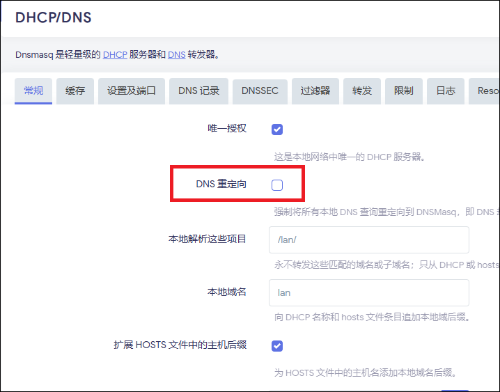
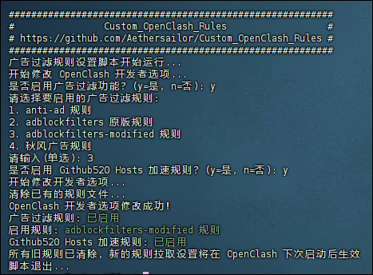
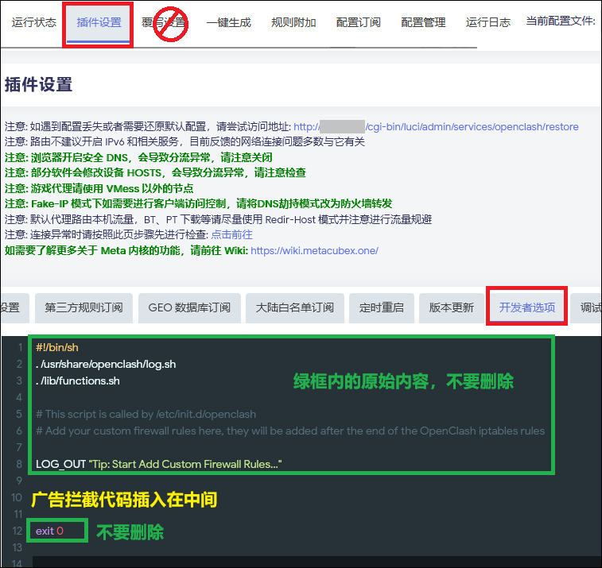

# 🚫 无插件广告拦截功能设置方案 (已废弃)

> [!CAUTION]
> **本方案已停止维护，该页面仅作存档**
>
> 本页面所描述的广告拦截功能已不再推荐使用。该方案可能存在兼容性问题，且不再获得后续更新支持。
>
> **推荐替代方案**：
> 建议安装 `luci-app-adblock-fast` (直接安装 `luci-i18n-adblock-fast-zh-cn` 即可)。  
> 该插件同样基于 Dnsmasq 实现拦截，但提供了更完善的 GUI 管理界面和更稳定的规则更新机制，且不常驻后台，**插件本身无任何性能开销**。  
> 本项目的维护者亦是 `adblock-fast` 和 `luci-app-adblock-fast` 仓库的协作者之一。  
> 使用以上插件出现任何问题，均可向本项目维护者进行反馈。  

---
> [!CAUTION]
> **以下内容已归档，仅作文物展示**
---

## 📖 1. 方案简介

本方案的核心原理是利用 OpenClash 的 **"开发者选项"** 功能，在插件启动时运行自定义 Shell 脚本。脚本会自动拉取远程的广告过滤规则文件（Dnsmasq 格式），并将其加载到系统的 Dnsmasq 服务中，从而实现无需安装额外插件的广告拦截与隐私防护。

### ⚠️ 风险提示

1. **稳定性风险**：由于脚本依赖 curl 拉取远程文件，受网络环境影响较大，可能导致拉取失败或 Dnsmasq 启动异常。
2. **维护责任**：若您坚持使用本方案，需具备一定的排查能力（如查看日志、分析脚本报错）。项目维护者不对使用本方案导致的任何网络故障负责。
3. **效果预期**：本方案仅实现 DNS层面的域名屏蔽。对于视频贴片广告、网页内嵌脚本广告，建议配合浏览器扩展（如 uBlock Origin）以获得最佳效果。

---

## 📜 2. 规则源说明

> 本项目引用的规则源仅基于维护者的个人测试与偏好，保持技术中立。

### 2.1. 广告过滤规则库

| 规则名称 | 简介 | 特点 |
| :--- | :--- | :--- |
| **[anti-AD](https://github.com/privacy-protection-tools/anti-AD)** | 中文区知名的广告过滤列表。 | 🎯 **精准**：致力于高命中率与低误杀率，兼顾隐私保护。 |
| **[adblockfilters](https://github.com/217heidai/adblockfilters)** | 全面的规则合集，每8小时更新。 | 📚 **全面**：上游包含大量常见规则，自带去重机制。 |
| **[adblockfilters-modified](https://github.com/Aethersailor/adblockfilters-modified)** | 本项目维护者定制的增强版。 | 🐋 **巨量**：集成 anti-ad, OISD, 1Hosts 等，条目达 65w+。**误杀率较高，慎用。** |
| **[秋风广告规则](https://github.com/TG-Twilight/AWAvenue-Ads-Rule)** | 优秀的轻量化规则列表。 | 🍃 **轻量**：专注于移动端与家用环境，流量节省效果显著。 |

> [!NOTE]
> **包含关系说明**：
> `adblockfilters-modified` ⊇ `adblockfilters` ⊇ `秋风广告规则`
> `anti-ad` ⊇ `秋风广告规则`
>
> 请根据设备性能和拦截需求选择其一即可，无需重复添加。

### 2.2. 加速规则

- **[GitHub520](https://github.com/521xueweihan/GitHub520)**：通过 Hosts 加速 GitHub 访问，解决图片加载失败等问题。

---

## ⚙️ 3. 部署前置条件

> [!IMPORTANT]
> **关键设置：关闭 DNS 重定向**

在部署前，请务必前往 `网络` > `DHCP/DNS` 页面，**取消勾选** `DNS 重定向` 功能。

- **原因**：若开启重定向，DNS 请求可能被劫持而跳过 Dnsmasq，导致广告过滤失效。
- **注意**：如果是 LEDE 源码固件，可能无此选项，可忽略。



---

## 🛠️ 4. 部署方法

请在 **一键脚本** 或 **手动配置** 中二选一。

### 4.1. 方式一：一键脚本 (SSH)

适合熟悉终端操作的用户。SSH 连接路由器后执行以下命令，根据提示选择规则即可。

```bash
curl -sSL https://testingcf.jsdelivr.net/gh/Aethersailor/Custom_OpenClash_Rules@refs/heads/main/shell/edit_custom_firewall_rules.sh -o edit_custom_firewall_rules.sh && chmod +x edit_custom_firewall_rules.sh && ./edit_custom_firewall_rules.sh
```



### 4.2. 方式二：手动配置 (Web 界面)

适合不习惯使用 SSH 的用户。

1. 进入 `OpenClash` > `插件设置` > `开发者选项`。
2. 在脚本编辑框中，找到 `exit 0` 这一行。
3. 将下方的任一脚本文本，**完整粘贴** 到 `exit 0` **之前**。



---

#### 📋 脚本模板选择

> 点击下方标题展开查看具体脚本代码。一般用户推荐使用 **选项 1** 或 **选项 2**。

<details>
<summary><strong>选项 1：anti-AD + GitHub520 (推荐，平衡之选)</strong></summary>

```bash
# ==============以下是广告过滤规则拉取脚本=================
(
    MAX_WAIT_TIME=30
    WAIT_INTERVAL=2
    elapsed_time=0

    if /etc/init.d/openclash status | grep -q "Syntax:"; then
        LOG_OUT "[广告过滤规则拉取脚本] 正在检测 OpenClash 运行状态..."
        LOG_OUT "[广告过滤规则拉取脚本] 等待 10 秒以确保 OpenClash 已启动..."
        sleep 10
    else
        LOG_OUT "[广告过滤规则拉取脚本] 正在检测 OpenClash 运行状态..."
        while ! /etc/init.d/openclash status | grep -q "running"; do
            if [ $elapsed_time -ge $MAX_WAIT_TIME ]; then
                LOG_OUT "[广告过滤规则拉取脚本] 未能在 30 秒内检测到 OpenClash 运行状态，脚本已停止运行..."
                exit 1
            fi
            sleep $WAIT_INTERVAL
            elapsed_time=$((elapsed_time + WAIT_INTERVAL))
        done
        LOG_OUT "[广告过滤规则拉取脚本] 检测到 OpenClash 正在运行，10 秒后开始拉取规则..."
        sleep 10
    fi

    LOG_OUT "[广告过滤规则拉取脚本] 开始检测 dnsmasq 规则目录..."
    UCI_OUTPUT=$(uci show dhcp.@dnsmasq[0] 2>/dev/null)
    
    if echo "$UCI_OUTPUT" | grep -qE 'cfg[0-9a-f]{6}'; then
        HASH_ID=$(echo "$UCI_OUTPUT" | grep -oE 'cfg[0-9a-f]{6}' | head -1) 
        TARGET_DIR="/tmp/dnsmasq.${HASH_ID}.d"
        LOG_OUT "[广告过滤规则拉取脚本] 当前 dnsmasq 规则目录: $TARGET_DIR"
    elif echo "$UCI_OUTPUT" | grep -qE '@dnsmasq\[[0-9]+\]'; then
        TARGET_DIR="/tmp/dnsmasq.d"
        LOG_OUT "[广告过滤规则拉取脚本] 当前dnsmasq 规则目录: $TARGET_DIR"
    else
        TARGET_DIR=$(find /tmp -maxdepth 1 -type d -name "dnsmasq.*.d" | head -n 1)
        if [ -z "$TARGET_DIR" ]; then
            LOG_OUT "[广告过滤规则拉取脚本] 错误：未找到有效的 dnsmasq 规则目录，脚本已停止！"
            exit 1
        fi
        LOG_OUT "[广告过滤规则拉取脚本] 检测失败，使用已存在的 dnsmasq 规则目录: $TARGET_DIR"
    fi
    
    if [ ! -d "$TARGET_DIR" ]; then
        mkdir -p "$TARGET_DIR"
    fi

    LOG_OUT "[广告过滤规则拉取脚本] 清除已有规则…"
    rm -f "$TARGET_DIR"/*ad*.conf 
    sed -i '/# AWAvenue-Ads-Rule Start/,/# AWAvenue-Ads-Rule End/d' /etc/hosts
    sed -i '/# GitHub520 Host Start/,/# GitHub520 Host End/d' /etc/hosts

    LOG_OUT "[广告过滤规则拉取脚本] 拉取最新的 anti-AD 广告过滤规则，规则体积较大，请耐心等候…"
    curl -sS -L -4 --retry 5 --retry-delay 1 "https://testingcf.jsdelivr.net/gh/privacy-protection-tools/anti-AD@refs/heads/master/adblock-for-dnsmasq.conf" -o "$TARGET_DIR/anti-ad-for-dnsmasq.conf" >/dev/null 2>/tmp/anti-ad-curl.log
    CURL_EXIT=$?

    if [ $CURL_EXIT -eq 0 ]; then
        LOG_OUT "[广告过滤规则拉取脚本] anti-AD 规则拉取成功！保存路径：${TARGET_DIR}/anti-ad-for-dnsmasq.conf"
    else
        LOG_OUT "[广告过滤规则拉取脚本] anti-AD 规则拉取失败 (错误码:$CURL_EXIT)，查看 /tmp/anti-ad-curl.log 获取详细信息。"
        echo "CURL Exit Code: $CURL_EXIT" >> /tmp/anti-ad-curl.log
    fi

    LOG_OUT "[广告过滤规则拉取脚本] 拉取最新的 GitHub520 加速规则…"
    curl -sSL -4 --retry 5 --retry-delay 1 "https://raw.hellogithub.com/hosts" >> /etc/hosts 2> /tmp/github520-curl.log
    CURL_EXIT_GH=$?

    if [ $CURL_EXIT_GH -eq 0 ]; then
        LOG_OUT "[广告过滤规则拉取脚本] GitHub520 加速规则拉取成功！已追加到 /etc/hosts 文件中。"
    else
        LOG_OUT "[广告过滤规则拉取脚本] GitHub520 加速规则拉取失败 (错误码:$CURL_EXIT_GH)，查看 /tmp/github520-curl.log 获取详细信息。"
        echo "CURL Exit Code: $CURL_EXIT_GH" >> /tmp/github520-curl.log
    fi

    sed -i '/^$/d' /etc/hosts
    sed -i '/!/d' /etc/hosts

    LOG_OUT "[广告过滤规则拉取脚本] 重新加载 dnsmasq 服务以应用规则…"
    /etc/init.d/dnsmasq stop
    /etc/init.d/dnsmasq start
    LOG_OUT "[广告过滤规则拉取脚本] 脚本运行完毕！"

) &
# ==============广告过滤规则拉取脚本结束==============
```

</details>

<details>
<summary><strong>选项 2：原版 adblockfilters + GitHub520 (全面之选)</strong></summary>

```bash
# ==============以下是广告过滤规则拉取脚本=================
(
    MAX_WAIT_TIME=30
    WAIT_INTERVAL=2
    elapsed_time=0

    if /etc/init.d/openclash status | grep -q "Syntax:"; then
        LOG_OUT "[广告过滤规则拉取脚本] 正在检测 OpenClash 运行状态..."
        LOG_OUT "[广告过滤规则拉取脚本] 等待 10 秒以确保 OpenClash 已启动..."
        sleep 10
    else
        LOG_OUT "[广告过滤规则拉取脚本] 正在检测 OpenClash 运行状态..."
        while ! /etc/init.d/openclash status | grep -q "running"; do
            if [ $elapsed_time -ge $MAX_WAIT_TIME ]; then
                LOG_OUT "[广告过滤规则拉取脚本] 未能在 30 秒内检测到 OpenClash 运行状态，脚本已停止运行..."
                exit 1
            fi
            sleep $WAIT_INTERVAL
            elapsed_time=$((elapsed_time + WAIT_INTERVAL))
        done
        LOG_OUT "[广告过滤规则拉取脚本] 检测到 OpenClash 正在运行，10 秒后开始拉取规则..."
        sleep 10
    fi

    LOG_OUT "[广告过滤规则拉取脚本] 开始检测 dnsmasq 规则目录..."
    UCI_OUTPUT=$(uci show dhcp.@dnsmasq[0] 2>/dev/null)
    
    if echo "$UCI_OUTPUT" | grep -qE 'cfg[0-9a-f]{6}'; then
        HASH_ID=$(echo "$UCI_OUTPUT" | grep -oE 'cfg[0-9a-f]{6}' | head -1) 
        TARGET_DIR="/tmp/dnsmasq.${HASH_ID}.d"
        LOG_OUT "[广告过滤规则拉取脚本] 当前 dnsmasq 规则目录: $TARGET_DIR"
    elif echo "$UCI_OUTPUT" | grep -qE '@dnsmasq\[[0-9]+\]'; then
        TARGET_DIR="/tmp/dnsmasq.d"
        LOG_OUT "[广告过滤规则拉取脚本] 当前dnsmasq 规则目录: $TARGET_DIR"
    else
        TARGET_DIR=$(find /tmp -maxdepth 1 -type d -name "dnsmasq.*.d" | head -n 1)
        if [ -z "$TARGET_DIR" ]; then
            LOG_OUT "[广告过滤规则拉取脚本] 错误：未找到有效的 dnsmasq 规则目录，脚本已停止！"
            exit 1
        fi
        LOG_OUT "[广告过滤规则拉取脚本] 检测失败，使用已存在的 dnsmasq 规则目录: $TARGET_DIR"
    fi
    
    if [ ! -d "$TARGET_DIR" ]; then
        mkdir -p "$TARGET_DIR"
    fi

    LOG_OUT "[广告过滤规则拉取脚本] 清除已有规则…"
    rm -f "$TARGET_DIR"/*ad*.conf 
    sed -i '/# AWAvenue-Ads-Rule Start/,/# AWAvenue-Ads-Rule End/d' /etc/hosts
    sed -i '/# GitHub520 Host Start/,/# GitHub520 Host End/d' /etc/hosts

    LOG_OUT "[广告过滤规则拉取脚本] 拉取最新的 adblockfilters 广告过滤规则，规则体积较大，请耐心等候…"
    curl -sS -L -4 --retry 5 --retry-delay 1 "https://testingcf.jsdelivr.net/gh/217heidai/adblockfilters@refs/heads/main/rules/adblockdnsmasq.txt" -o "$TARGET_DIR/adblockfilters-for-dnsmasq.conf" >/dev/null 2>/tmp/adblockfilters-curl.log
    CURL_EXIT=$?

    if [ $CURL_EXIT -eq 0 ]; then
        LOG_OUT "[广告过滤规则拉取脚本] adblockfilters 规则拉取成功！保存路径：${TARGET_DIR}/adblockfilters-for-dnsmasq.conf"
    else
        LOG_OUT "[广告过滤规则拉取脚本] adblockfilters 规则拉取失败 (错误码:$CURL_EXIT)，查看 /tmp/adblockfilters-curl.log 获取详细信息。"
        echo "CURL Exit Code: $CURL_EXIT" >> /tmp/adblockfilters-curl.log
    fi

    LOG_OUT "[广告过滤规则拉取脚本] 拉取最新的 GitHub520 加速规则…"
    curl -sS -L -4 --retry 5 --retry-delay 1 "https://raw.hellogithub.com/hosts" >> /etc/hosts >/dev/null 2>/tmp/github520-curl.log
    CURL_EXIT_GH=$?

    if [ $CURL_EXIT_GH -eq 0 ]; then
        LOG_OUT "[广告过滤规则拉取脚本] GitHub520 加速规则拉取成功！已追加到 /etc/hosts 文件中。"
    else
        LOG_OUT "[广告过滤规则拉取脚本] GitHub520 加速规则拉取失败 (错误码:$CURL_EXIT_GH)，查看 /tmp/github520-curl.log 获取详细信息。"
        echo "CURL Exit Code: $CURL_EXIT_GH" >> /tmp/github520-curl.log
    fi

    sed -i '/^$/d' /etc/hosts
    sed -i '/!/d' /etc/hosts

    LOG_OUT "[广告过滤规则拉取脚本] 重新加载 dnsmasq 服务以应用规则…"
    /etc/init.d/dnsmasq stop
    /etc/init.d/dnsmasq start
    LOG_OUT "[广告过滤规则拉取脚本] 脚本运行完毕！"

) &
# ==============广告过滤规则拉取脚本结束==============
```

</details>

<details>
<summary><strong>选项 3：adblockfilters-modified + GitHub520 (高性能设备专用)</strong></summary>

```bash
# ==============以下是广告过滤规则拉取脚本=================
(
    MAX_WAIT_TIME=30
    WAIT_INTERVAL=2
    elapsed_time=0

    if /etc/init.d/openclash status | grep -q "Syntax:"; then
        LOG_OUT "[广告过滤规则拉取脚本] 正在检测 OpenClash 运行状态..."
        LOG_OUT "[广告过滤规则拉取脚本] 等待 10 秒以确保 OpenClash 已启动..."
        sleep 10
    else
        LOG_OUT "[广告过滤规则拉取脚本] 正在检测 OpenClash 运行状态..."
        while ! /etc/init.d/openclash status | grep -q "running"; do
            if [ $elapsed_time -ge $MAX_WAIT_TIME ]; then
                LOG_OUT "[广告过滤规则拉取脚本] 未能在 30 秒内检测到 OpenClash 运行状态，脚本已停止运行..."
                exit 1
            fi
            sleep $WAIT_INTERVAL
            elapsed_time=$((elapsed_time + WAIT_INTERVAL))
        done
        LOG_OUT "[广告过滤规则拉取脚本] 检测到 OpenClash 正在运行，10 秒后开始拉取规则..."
        sleep 10
    fi

    LOG_OUT "[广告过滤规则拉取脚本] 开始检测 dnsmasq 规则目录..."
    UCI_OUTPUT=$(uci show dhcp.@dnsmasq[0] 2>/dev/null)
    
    if echo "$UCI_OUTPUT" | grep -qE 'cfg[0-9a-f]{6}'; then
        HASH_ID=$(echo "$UCI_OUTPUT" | grep -oE 'cfg[0-9a-f]{6}' | head -1)  # 添加 head -1 确保只获取第一个匹配项
        TARGET_DIR="/tmp/dnsmasq.${HASH_ID}.d"
        LOG_OUT "[广告过滤规则拉取脚本] 当前 dnsmasq 规则目录: $TARGET_DIR"
    elif echo "$UCI_OUTPUT" | grep -qE '@dnsmasq\[[0-9]+\]'; then
        TARGET_DIR="/tmp/dnsmasq.d"
        LOG_OUT "[广告过滤规则拉取脚本] 当前dnsmasq 规则目录: $TARGET_DIR"
    else
        TARGET_DIR=$(find /tmp -maxdepth 1 -type d -name "dnsmasq.*.d" | head -n 1)
        if [ -z "$TARGET_DIR" ]; then
            LOG_OUT "[广告过滤规则拉取脚本] 错误：未找到有效的 dnsmasq 规则目录，脚本已停止！"
            exit 1
        fi
        LOG_OUT "[广告过滤规则拉取脚本] 检测失败，使用已存在的 dnsmasq 规则目录: $TARGET_DIR"
    fi
    
    if [ ! -d "$TARGET_DIR" ]; then
        mkdir -p "$TARGET_DIR"
    fi

    LOG_OUT "[广告过滤规则拉取脚本] 清除已有规则…"
    rm -f "$TARGET_DIR"/*ad*.conf
    sed -i '/# AWAvenue-Ads-Rule Start/,/# AWAvenue-Ads-Rule End/d' /etc/hosts
    sed -i '/# GitHub520 Host Start/,/# GitHub520 Host End/d' /etc/hosts

    LOG_OUT "[广告过滤规则拉取脚本] 拉取最新的 adblockfilters-modified 广告过滤规则，规则体积较大，请耐心等候…"
    curl -sS -4 -L --retry 5 --retry-delay 1 "https://testingcf.jsdelivr.net/gh/Aethersailor/adblockfilters-modified@refs/heads/main/rules/adblockdnsmasq.txt" -o "$TARGET_DIR/adblockfilters-modified-for-dnsmasq.conf" >/dev/null 2>/tmp/adblockfilters-modified-curl.log
    CURL_EXIT=$?

    if [ $CURL_EXIT -eq 0 ]; then
        LOG_OUT "[广告过滤规则拉取脚本] adblockfilters-modified 规则拉取成功！保存路径：${TARGET_DIR}/adblockfilters-modified-for-dnsmasq.conf"
    else
        LOG_OUT "[广告过滤规则拉取脚本] adblockfilters-modified 规则拉取失败 (错误码:$CURL_EXIT)，查看 /tmp/adblockfilters-modified-curl.log 获取详细信息。"
        echo "CURL Exit Code: $CURL_EXIT" >> /tmp/adblockfilters-modified-curl.log
    fi

    LOG_OUT "[广告过滤规则拉取脚本] 拉取最新的 GitHub520 加速规则…"
    curl -sSL -4 --retry 5 --retry-delay 1 "https://raw.hellogithub.com/hosts" >> /etc/hosts 2> /tmp/github520-curl.log
    CURL_EXIT_GH=$?

    if [ $CURL_EXIT_GH -eq 0 ]; then
        LOG_OUT "[广告过滤规则拉取脚本] GitHub520 加速规则拉取成功！已追加到 /etc/hosts 文件中。"
    else
        LOG_OUT "[广告过滤规则拉取脚本] GitHub520 加速规则拉取失败 (错误码:$CURL_EXIT_GH)，查看 /tmp/github520-curl.log 获取详细信息。"
        echo "CURL Exit Code: $CURL_EXIT_GH" >> /tmp/github520-curl.log
    fi

    sed -i '/^$/d' /etc/hosts
    sed -i '/!/d' /etc/hosts

    LOG_OUT "[广告过滤规则拉取脚本] 重新加载 dnsmasq 服务以应用规则…"
    /etc/init.d/dnsmasq stop
    /etc/init.d/dnsmasq start
    LOG_OUT "[广告过滤规则拉取脚本] 脚本运行完毕！"

) &
# ==============广告过滤规则拉取脚本结束==============
```

</details>

<details>
<summary><strong>选项 4：秋风广告规则 + GitHub520 (轻量/家用)</strong></summary>

```bash
# ==============以下是广告过滤规则拉取脚本=================
(
    MAX_WAIT_TIME=30
    WAIT_INTERVAL=2
    elapsed_time=0

    if /etc/init.d/openclash status | grep -q "Syntax:"; then
        LOG_OUT "[广告过滤规则拉取脚本] 正在检测 OpenClash 运行状态..."
        LOG_OUT "[广告过滤规则拉取脚本] 等待 10 秒以确保 OpenClash 已启动..."
        sleep 10
    else
        LOG_OUT "[广告过滤规则拉取脚本] 正在检测 OpenClash 运行状态..."
        while ! /etc/init.d/openclash status | grep -q "running"; do
            if [ $elapsed_time -ge $MAX_WAIT_TIME ]; then
                LOG_OUT "[广告过滤规则拉取脚本] 未能在 30 秒内检测到 OpenClash 运行状态，脚本已停止运行..."
                exit 1
            fi
            sleep $WAIT_INTERVAL
            elapsed_time=$((elapsed_time + WAIT_INTERVAL))
        done
        LOG_OUT "[广告过滤规则拉取脚本] 检测到 OpenClash 正在运行，10 秒后开始拉取规则..."
        sleep 10
    fi

    LOG_OUT "[广告过滤规则拉取脚本] 开始检测 dnsmasq 规则目录..."
    UCI_OUTPUT=$(uci show dhcp.@dnsmasq[0] 2>/dev/null)
    
    if echo "$UCI_OUTPUT" | grep -qE 'cfg[0-9a-f]{6}'; then
        HASH_ID=$(echo "$UCI_OUTPUT" | grep -oE 'cfg[0-9a-f]{6}' | head -1) 
        TARGET_DIR="/tmp/dnsmasq.${HASH_ID}.d"
        LOG_OUT "[广告过滤规则拉取脚本] 当前 dnsmasq 规则目录: $TARGET_DIR"
    elif echo "$UCI_OUTPUT" | grep -qE '@dnsmasq\[[0-9]+\]'; then
        TARGET_DIR="/tmp/dnsmasq.d"
        LOG_OUT "[广告过滤规则拉取脚本] 当前dnsmasq 规则目录: $TARGET_DIR"
    else
        TARGET_DIR=$(find /tmp -maxdepth 1 -type d -name "dnsmasq.*.d" | head -n 1)
        if [ -z "$TARGET_DIR" ]; then
            LOG_OUT "[广告过滤规则拉取脚本] 错误：未找到有效的 dnsmasq 规则目录，脚本已停止！"
            exit 1
        fi
        LOG_OUT "[广告过滤规则拉取脚本] 检测失败，使用已存在的 dnsmasq 规则目录: $TARGET_DIR"
    fi
    
    if [ ! -d "$TARGET_DIR" ]; then
        mkdir -p "$TARGET_DIR"
    fi

    LOG_OUT "[广告过滤规则拉取脚本] 清除已有规则…"
    rm -f "$TARGET_DIR"/*ad*.conf 
    sed -i '/# AWAvenue-Ads-Rule Start/,/# AWAvenue-Ads-Rule End/d' /etc/hosts
    sed -i '/# GitHub520 Host Start/,/# GitHub520 Host End/d' /etc/hosts

    LOG_OUT "[广告过滤规则拉取脚本] 拉取最新的 秋风广告规则…"
    curl -sSL -4 --retry 5 --retry-delay 1 https://testingcf.jsdelivr.net/gh/TG-Twilight/AWAvenue-Ads-Rule@main/Filters/AWAvenue-Ads-Rule-hosts.txt | \
    sed '/127.0.0.1 localhost/d; /::1 localhost/d; 1s/^/# AWAvenue-Ads-Rule Start\n/; $s/$/\n# AWAvenue-Ads-Rule End/' >> /etc/hosts

    LOG_OUT "[广告过滤规则拉取脚本] 清除已有的 GitHub520 加速规则…"
    sed -i '/# GitHub520 Host Start/,/# GitHub520 Host End/d' /etc/hosts

    LOG_OUT "[广告过滤规则拉取脚本] 拉取最新的 GitHub520 加速规则…"
    curl -sSL -4 --retry 5 --retry-delay 1 "https://raw.hellogithub.com/hosts" >> /etc/hosts 2> /tmp/github520-curl.log

    if [ $? -eq 0 ]; then
        LOG_OUT "[广告过滤规则拉取脚本] GitHub520 加速规则拉取成功！"
    else
        LOG_OUT "[广告过滤规则拉取脚本] GitHub520 加速规则拉取失败，查看 /tmp/github520-curl.log 获取详细信息。"
    fi

    sed -i '/^$/d' /etc/hosts
    sed -i '/!/d' /etc/hosts

    LOG_OUT "[广告过滤规则拉取脚本] 重新加载 dnsmasq 服务以应用规则…"
    /etc/init.d/dnsmasq stop
    /etc/init.d/dnsmasq start
    LOG_OUT "[广告过滤规则拉取脚本] 脚本运行完毕！"

) &
# ==============广告过滤规则拉取脚本结束==============
```

</details>

<details>
<summary><strong>选项 5：仅添加 GitHub520 加速规则</strong></summary>

```bash
# ==============以下是广告过滤规则拉取脚本=================
(
    MAX_WAIT_TIME=30
    WAIT_INTERVAL=2
    elapsed_time=0

    if /etc/init.d/openclash status | grep -q "Syntax:"; then
        LOG_OUT "[广告过滤规则拉取脚本] 正在检测 OpenClash 运行状态..."
        LOG_OUT "[广告过滤规则拉取脚本] 等待 10 秒以确保 OpenClash 已启动..."
        sleep 10
    else
        LOG_OUT "[广告过滤规则拉取脚本] 正在检测 OpenClash 运行状态..."
        while ! /etc/init.d/openclash status | grep -q "running"; do
            if [ $elapsed_time -ge $MAX_WAIT_TIME ]; then
                LOG_OUT "[广告过滤规则拉取脚本] 未能在 30 秒内检测到 OpenClash 运行状态，脚本已停止运行..."
                exit 1
            fi
            sleep $WAIT_INTERVAL
            elapsed_time=$((elapsed_time + WAIT_INTERVAL))
        done
        LOG_OUT "[广告过滤规则拉取脚本] 检测到 OpenClash 正在运行，10 秒后开始拉取规则..."
        sleep 10
    fi

    LOG_OUT "[广告过滤规则拉取脚本] 开始检测 dnsmasq 规则目录..."
    # 通过 uci 命令获取配置标识符
    UCI_OUTPUT=$(uci show dhcp.@dnsmasq[0] 2>/dev/null)
    
    if echo "$UCI_OUTPUT" | grep -qE 'cfg[0-9a-f]{6}'; then
        HASH_ID=$(echo "$UCI_OUTPUT" | grep -oE 'cfg[0-9a-f]{6}' | head -1) 
        TARGET_DIR="/tmp/dnsmasq.${HASH_ID}.d"
        LOG_OUT "[广告过滤规则拉取脚本] 当前 dnsmasq 规则目录: $TARGET_DIR"
    elif echo "$UCI_OUTPUT" | grep -qE '@dnsmasq\[[0-9]+\]'; then
        TARGET_DIR="/tmp/dnsmasq.d"
        LOG_OUT "[广告过滤规则拉取脚本] 当前dnsmasq 规则目录: $TARGET_DIR"
    else
        TARGET_DIR=$(find /tmp -maxdepth 1 -type d -name "dnsmasq.*.d" | head -n 1)
        if [ -z "$TARGET_DIR" ]; then
            LOG_OUT "[广告过滤规则拉取脚本] 错误：未找到有效的 dnsmasq 规则目录，脚本已停止！"
            exit 1
        fi
        LOG_OUT "[广告过滤规则拉取脚本] 检测失败，使用已存在的 dnsmasq 规则目录: $TARGET_DIR"
    fi
    
    if [ ! -d "$TARGET_DIR" ]; then
        mkdir -p "$TARGET_DIR"
    fi

    LOG_OUT "[广告过滤规则拉取脚本] 清除已有规则…"
    rm -f "$TARGET_DIR"/*ad*.conf 
    sed -i '/# AWAvenue-Ads-Rule Start/,/# AWAvenue-Ads-Rule End/d' /etc/hosts
    sed -i '/# GitHub520 Host Start/,/# GitHub520 Host End/d' /etc/hosts

    LOG_OUT "[广告过滤规则拉取脚本] 拉取最新的 GitHub520 加速规则…"
    curl -sSL -4 --retry 5 --retry-delay 1 "https://raw.hellogithub.com/hosts" >> /etc/hosts 2> /tmp/github520-curl.log
    CURL_EXIT_GH=$?

    if [ $CURL_EXIT_GH -eq 0 ]; then
        LOG_OUT "[广告过滤规则拉取脚本] GitHub520 加速规则拉取成功！已追加到 /etc/hosts 文件中。"
    else
        LOG_OUT "[广告过滤规则拉取脚本] GitHub520 加速规则拉取失败 (错误码:$CURL_EXIT_GH)，查看 /tmp/github520-curl.log 获取详细信息。"
        echo "CURL Exit Code: $CURL_EXIT_GH" >> /tmp/github520-curl.log
    fi

    sed -i '/^$/d' /etc/hosts
    sed -i '/!/d' /etc/hosts

    LOG_OUT "[广告过滤规则拉取脚本] 重新加载 dnsmasq 服务以应用规则…"
    /etc/init.d/dnsmasq stop
    /etc/init.d/dnsmasq start
    LOG_OUT "[广告过滤规则拉取脚本] 脚本运行完毕！"

) &
# ==============广告过滤规则拉取脚本结束==============
```

</details>

---

## 🗑️ 5. 如何还原

若功能异常或不再需要，请进入 OpenClash 开发者选项，**删除上述添加代码**，保留默认内容即可。

默认代码示例（仅供参考）：

```bash
#!/bin/sh
. /usr/share/openclash/log.sh
. /lib/functions.sh

# This script is called by /etc/init.d/openclash
# Add your custom firewall rules here, they will be added after the end of the OpenClash iptables rules

LOG_OUT "Tip: Start Add Custom Firewall Rules..."

exit 0
```
