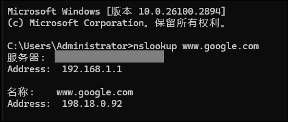
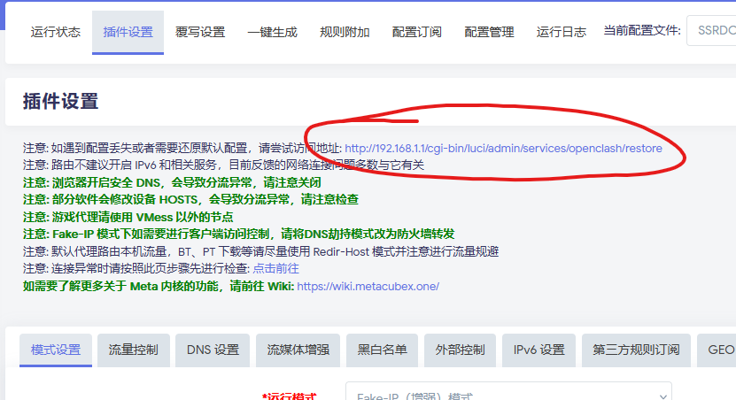

**非本项目原因导致的故障，不保证解决，维护者仅能在时间充足的情况下，出于热心进行指导和协助。**  

* OpenClash 自身问题，请去 OpenClash 仓库反馈，在本项目反馈是没用的。  

* 上游规则错误，请去规则对应仓库反馈，或者自行修改。本项只是对上游规则的一个集中引用，作者无法解决规则本身的问题。  

***

# 固件类问题  

## 推荐固件  

> **强烈推荐使用 ImmrotalWrt 官方发布版**  

- **选择版本**：Stable Release 或 SNAPSHOT 版本均可。注意 SNAPSHOT 默认不带 luci，建议使用 Firmware Selector 生成带 luci 的固件再刷入。   

  - 喜欢追新：使用 SNAPSHOT 版本。  

  - 喜欢稳定：使用 Stable Release 版本。

- **有个性化需求**：使用 Firmware Selector 在线生成自带插件的固件，无需编译知识。  

**推荐更新方式**：使用值守式系统更新（`luci-app-attendedsysupgrade`）或 `owut` 一键生成带当前插件的固件并刷入。  

> 首次刷入固件，你可以直接刷入官方发布版，再手动安装插件。也可以使用 Firmware Selector 生成带你需要的插件的固件再刷入，比如增加 luci、luci-app-openclash 等插件。  
> 下一次升级时，只要你安装的插件都是来自官方软件源的插件，值守式更新就会生成完全一样的固件刷入，实现保留配置和插件的平滑升级。

**如何方便的在每次升级后更新 dev 版本的 OpenClash**：参考以下内容：[dev 版本爱好者如何便捷的升级插件](https://github.com/Aethersailor/Custom_OpenClash_Rules/wiki/%E5%85%B6%E4%BB%96%E8%AF%B4%E6%98%8E#dev-%E7%89%88%E6%9C%AC%E7%88%B1%E5%A5%BD%E8%80%85%E5%A6%82%E4%BD%95%E6%96%B9%E4%BE%BF%E5%8D%87%E7%BA%A7%E6%8F%92%E4%BB%B6)

本项目维护者部署的多台设备均使用 ImmortalWrt SNAPSHOT，使用场景包括家庭以及生产环境下的主路由，包含 X86、ARM 等不同架构的设备，常年运行均未出现任何问题。  

- ImmortalWrt：[GitHub](https://github.com/immortalwrt/immortalwrt)  

- ImmortalWrt Downloads：[下载地址](https://downloads.immortalwrt.org/)  

- ImmortalWrt Firmware Selector：[官方发布版本下载和在线定制固件](https://firmware-selector.immortalwrt.org/)

项目维护者确保本项目内容保证和此固件完美兼容，并及时进行更新适配。  

OpenWrt 官方版本作为备选，因为它的软件源中没有 OpenClash，注意需要自行安装相关依赖，并将 Dnsmasq 替换为 Dnsmasq-full  


以上两款固件是**唯二**推荐使用的固件，其他固件**一概不推荐**。 

## 不建议使用的固件  

- **老版本固件**：这里指所有版本号低于对应源码的 “Stable Release” 的固件  

- **某些“深度定制”的魔改固件，如“iStore”固件。**

- **臃肿的“高大全”固件**：插件可能存在冲突。  

- **“大杂烩”式的“定制”固件**：例如 openxxx.ai 的定制固件。  


推荐首选 **ImmortalWrt 官方固件**，备选 **OpenWrt 官方固件**。  

原则上**不推荐**任何第三方编译固件，**不管固件作者多么有名**。**强烈建议**使用官方固件或者使用官方的 Image Builder 生成个性化固件。 

没有修改代码的刚需，就**没有任何必要**自行编译固件或使用他人编译的固件，官方的 Image Builder 完全可以满足需求。  
 
**以上建议，完全是基于本项目维护者过去的`个人经验`做出的，不具有时效性，不代表任何立场，且不一定完全正确，请自行斟酌和尝试。**  

**注意**：若使用不推荐的固件，出现问题请自行解决，或者用了谁的固件你去问谁，不要问我。

> 自编译/在线编译固件，务必使用 Firewall4(Nftables)。  

***

## 不建议使用旁路由  

> **旁路由是一种错误的组网设置，强烈建议使用主路由组网，抛弃旁路由。**

个人观点：[关于旁路由的一些吐槽](6.关于“旁路由”的一些吐槽.md)  

**维护者观点**：**如无必要，勿增实体**，大到设备，小到插件，原则皆是如此。**关于旁路由问题，不做任何解答。**  

谁教你用旁路由的，你就去找谁提问，不要在本项目提问。  
 

***

# 基本故常排查  

出现异常，请先按照 OpenClash 官方的排障步骤排查问题：[点击前往](
https://github.com/vernesong/OpenClash/wiki/%E7%BD%91%E7%BB%9C%E8%BF%9E%E6%8E%A5%E5%BC%82%E5%B8%B8%E6%97%B6%E6%8E%92%E6%9F%A5%E5%8E%9F%E5%9B%A0)  


# 分流和访问问题  

## 一些国内网站/APP/小程序打不开

本项目分流策略对于所有不属于 geosite:cn 的域名在没有命中特定的规则时，默认使用代理进行访问。  

geosite:cn 对国内冷门域名的收录，难免有遗漏，一些冷门国内网站/APP/小程序设置了禁止中国大陆以外的所有访问，比如各地的水电煤气缴费网站或小程序，绕道代理去访问这些内容会无法连接。  

设置“漏网之鱼”策略组直连，即可临时解决这个问题，漏网之鱼直连后将无法通过 DNS 泄露测试，但不存在真正意义上的 DNS 泄露。  

同时，有时间和兴趣的用户，在遇到此类情况时，建议通过 dashboard 里观察对应的连接包含的域名，通过 TG 群组或者 issue 的方式进行提交，维护者会将对应域名 PR 至上游规则中。

## 订阅模板的影响范围  

订阅模板不会影响 GeoSite 范围内的国内域名访问问题，分流异常通常源于上游规则。  

订阅模板只是一个对上游第三方规则的集中引用，模板自身并不会导致分流这个问题，分流问题是由上游的规则碎片引起的。大陆域名和 IP 的分流也是依托引用的大陆白名单和 GEO 数据库完成的。  

上游规则、大陆白名单、GEOIP 数据库、GEOSITE 数据库内容和本项目没有关系，它们导致的分流异常情况请不要向我反馈，我也无法解决。有需要请去上游规则的仓库进行反馈。  

但就本项目维护者自身经验而言，上游规则碎片和 GEO 数据库很少出现分流错误的问题。偶发性的问题不会对日常使用造成严重影响。    

## 绕过大陆功能异常  

> 正常情况下，包含在 geosite:cn 中，且指向 IP 包含在大陆白名单中的大陆域名，不应该进入Clash内核。  

如果遇到某些热门国内网站无法绕过内核，请确认以上两点是否符合。  

**解决方案**： 

1. 更新 GEOIP 数据库、GEOSITE 数据库和大陆白名单。  
 
> 更新 GEOIP 数据库、GEOSITE 数据库和中国大陆白名单！  
> 更新 GEOIP 数据库、GEOSITE 数据库和中国大陆白名单！  
> 更新 GEOIP 数据库、GEOSITE 数据库和中国大陆白名单！  

重要的事情说三遍，一定要更新，否则 OpenClash 自带的绕过中国大陆功能会出现问题，国内域名会进入内核，全部走节点，导致速度下降。  

如果国内常见的主流网站出现分流不正常。说明你的 OpenClash 工作不正常，请先更新 GEOIP 数据库、GeoSite 数据库和大陆白名单。  

正常情况下，除非是冷门域名，否则国内连接不应进入内核。  

如果你认为规则出现了分流错误，请自行进入 Dashboard 检索对应域名命中的策略组，以及相关策略组引用的规则，然后至对应项目的仓库反馈。  

此类问题如果发 issue ，可能会得到类似回答，或者在维护者时间充足的情况下，有可能会引导排查相关故障。  

冷门域名请在 TG 群中即时 @Aethersailor 进行上报，会临时添加直连规则，并定期提交 PR 至 geosite 的上游仓库实现绕过内核直连。  

## 开启 OpenClash 的情况下某些绕过内核的访问卡顿  

首先请确认：  

1. 对应域名是返回的国内地址而非 Fake-IP

2. 关闭 OpenClash 的情况下，可以正常访问  

对于绕过内核的域名，OpenClash 只影响域名解析  

可以进行如下尝试：禁用“追加上游 DNS”，在 Nameserver 下启用一个或多个国内 DOH DNS 服务器地址。  

## BT 和 PT 等下载流量分流问题

针对下载流量分流的建议：  

1. **独立下载设备**：为设备 IP 设置直连规则。  

建议修改 覆写设置 > 规则设置 > 自定义规则 > 上方文本框内容 

如果下载设备是 NAS 这样的独立设备，自行替换规则中的 IP 地址为下载设备的局域网地址。  

假设下载机局域网地址为 192.168.1.201

```text
- SRC-IP-CIDR,192.168.1.201/32,DIRECT
```  

设置后，下载机的全部流量将直连。  

  


2. **非独立设备**：设置 80/443 以外端口直连。

策略组中设置“非标端口”策略组直连，可规避 80/443 端口以外的所有下载流量。如需避免 80/443 端口下载流量，请设置“漏网之鱼”直连


## 冷门国内域名  

冷门国内域名分流异常，可参考 [关于冷门国内域名的收录](https://github.com/Aethersailor/Custom_OpenClash_Rules/wiki/%E5%85%B6%E4%BB%96%E8%AF%B4%E6%98%8E#%E5%85%B3%E4%BA%8E%E5%86%B7%E9%97%A8%E5%9B%BD%E5%86%85%E5%9F%9F%E5%90%8D%E7%9A%84%E6%94%B6%E5%BD%95)。

## 某些策略组对应的服务（比如 Youtube）打不开？  

1. 检查 Dashboard 中对应的策略组是否选择了正确的节点。  

例如，Youtube 打不开，可能是因为 Dashboard 中 Youtube 策略组选择了“新加坡节点”分组，但你并没有新加坡节点，所以肯定是打不开的。此时需要你手动指定其他可用的节点。  

流媒体服务设置默认为新加坡节点是因为新加坡节点有更多的简体中文内容，这一点是适配本项目推荐机场的。  

不要一上来就抱怨不能用，先在 dashboard 里选择好节点再说  

## DDNS 服务工作异常  

如果你的 OpenWrt 中部署了 DDNS 服务，并且使用了境外 DDNS 服务商的 API，有可能会出现 DDNS 域名被错误设置为 Fake-IP 的情况。  

将相关服务商的 API 域名填入 Fake-IP Filter 中即可。  

参考：https://github.com/Aethersailor/Custom_OpenClash_Rules/issues/83

* ## Google Play 更新异常  

如果遇到 Google Play 更新异常（一直转圈）的问题  

请尝试在 流量控制 > 绕过指定区域 IPv4 黑名单中添加如下四条域名：  

```
services.googleapis.cn  
googleapis.cn  
xn--ngstr-lra8j.com  
clientservices.googleapis.com  
```

  

**如果你同时启用了 ipv6 ，请在 ipv6 设置中的绕过大陆黑名单中同时添加上述四条域名**  

  


## 海外网站打不开 

海外网站打不开，并且内核日志里没有访问记录  

1. 清空“流量控制 > WAN 接口名称”。  

2. 确保 dnsmasq 的 DNS 重定向功能已关闭。

## 刚配置完成就开始出现 DNS 泄露和污染  

1. 检查设备的 DNS 是否指向了 OpenClash 所在的 OpenWrt  

2. 检查 OpenClash 是否为 Dnsmasq 的上游服务器  

3. 使用 nslookup 检查海外域名（如 www.google.com ）是否返回 Fake-IP （如 198.18.0.1 这样的 198 开头的地址）  

4. 开启 IPv6 的情况下，建议关闭路由的 SLACC 和 DHCPv6 中分配 IPv6 DNS 的相关设置，强迫下游设备使用路由的 IPv4 地址解析 IPv6 域名请求  

## DNS 泄露   

不要一上来就怀疑本项目的配置方案和模板有问题，项目维护者可以承诺以上内容没有任何会导致 DNS 泄露的问题，任何质疑都是浪费你我的时间。    

出现 DNS 泄露，首先检查你的 DNS 解析流程是否正确  

正确的解析流程应当是 设备 > OpenWrt Dnsmasq(53端口) > OpenClash(7874端口)  

出现泄露，先使用以下命令确认你的设备（如 PC）的上游 DNS 是否为 OpenWrt，是否可以取得 Fake-IP：  

```
nslookup www.google.com
```  

返回的结果，应当显示你的 DNS 服务器地址为 OpenWrt 的地址，并且结果为 Fake-IP 地址范围的地址。  

  

如果取得的不是 Fake-IP 或者上游 DNS 地址不对，说明你的设备的上游 DNS 不是 OpenWrt，先自行解决这个问题。此类问题纯属个人设置导致的，与本项目无关，请勿提问。    

旁路由用户常见此问题，一定要手动指定 IPv4 DNS 为 OpenWrt 的局域网地址，并将 IPv6 DNS 留空。  

如果设备的上游 DNS 地址为 OpenWrt 的地址，但是返回的不是 Fake-IP，说明你的 Dnsmasq 的上游 DNS 不是 OpenClash。如果你已经严格按照本项目的方案配置了 OpenClash，是不可能出现这种情况的。  

请再次检查 OpenClash 设置，以及 OpenWrt 中是否启用了其他会劫持 53 端口或者改变 Dnsmasq 上游服务器参数的插件。  


如果是所有配置完美无瑕，正常使用一段时间无泄露，升级 OpenClash 或者内核后，莫名其妙的开始泄露  

重启提供再测试，如果还泄露，按照上面的步骤检查，如果设置没问题，还原 OpenClash 配置，重启系统后，重新配置  

  


## Steam 无法登录/无法访问商店或社区等页面  

本项目规则中 Steam 默认直连，如果你的网络以前无法正常使用 Steam ，那么现在必然还是无法正常使用 Steam。需要指定你所需要使用的节点才能开启 Steam 代理登录。
  
在 Dashboard 中，将 Steam 策略组设为你需要代理访问 Steam 节点，即可实现通过代理 Steam 除下载以外的其他流量。  

## 如何添加自定义规则  

**路径**：OpenClash 覆写设置 > 规则设置  

1. 勾选“自定义规则”。  

2. 在框内按需添加规则。  

3. 保存设置后，重启 OpenClash 即可生效。  


***

# 订阅转换报错问题  

## 手动订阅可以成功，定时订阅失败  

更改订阅时间为其他时间，或者更换其他的订阅服务。   

## 订阅配置文件时出现“校验失败”报错  

启用订阅设置中的“跳过证书验证”选项，如果你已经启用了该功能并出现报错，则尝试关闭该功能。如果问题依然出现，尝试更换订阅更新时间已经更换其他订阅转换服务。  

## 订阅配置各种失败的终极解决办法  

如果 OpenClash 自带的订阅转换服务全部不可用，你可以使用本项目提供的订阅转换服务地址：  

```
https://api.asailor.org/sub
```

填写进“订阅转换服务地址”中即可生效。  

> 本项目的订阅转换后端服务支持 IPv4/IPv6 双栈访问，纯属用爱发电，未做任何限制，请勿滥用。  

## 本地搭建的订阅转换服务无法更新订阅  

本项目的规则模板均使用 jsDeliver 的 CDN 进行加速，理论上在全球任何地方地方均可正常访问。

如都不能访问，请自行测试自建后端的网络可以使用哪个 github 反代 CDN，并替换相应的地址。

### dashboard 中的规则分组和本项目的不一致  

此问题多见于自建后端用户，因为你的网络问题，自建后端无法拉取远程模板导致。  

本项目的规则模板均使用 jsDeliver 的 CDN 进行加速，理论上在全球任何地方地方均可正常访问。

如都不能访问，请自行测试自建后端的网络可以使用哪个 github 反代 CDN，并替换相应的地址。

自建后端即默认你有足够的能力排除相应的故障，由此导致的问题请勿提问。  

***

# 其他问题  

## OpenClash 不能启动或者其他错误  

本项目提供的仅仅是订阅转换模板以及 OpenClash 有关的设置方案，且所有设置操作均基于 OpenClash 的图形界面，没有任何超出常规范围的设置和修改，因此不会导致 OpenWrt 以及 OpenClash 工作异常。不要怀疑设置是否有问题。  

建议使用主路由工作环境。  

旁路由/二级路由相关设置基于本人对 OpenWrt 以及 OpenClash 的理解而形成，理论上不会导致问题，请自己根据实际情况调整。  

有问题可以到 Telegram 群组内反映，会有热心人解答。  

## 注意事项  

**OpenClash 设置以及订阅转换模板具有普适性** ，按照方案设置后如果有异常，请从方案和模板以外的因素自行查找原因。请不要怀疑本项目的方案是否有错误，这只会浪费你的时间。  

故障原因包括但不限于 OpenClash Dev 版本自身、Clash 内核自身、订阅转换服务亦或是搭配其他插件、他人编译的固件、老旧的固件版本、OpenWrt 设置错误，以及某些设备内置 DNS 等原因。  

以上原因均与本项目内容无关，请自行排查故障。相关 issue 将被直接关闭，不再予以解答。 

## 关注通知频道  

本项目通知频道：https://t.me/custom_openclash_rules  

有时候推送一些普遍性问题的解决方案  

 