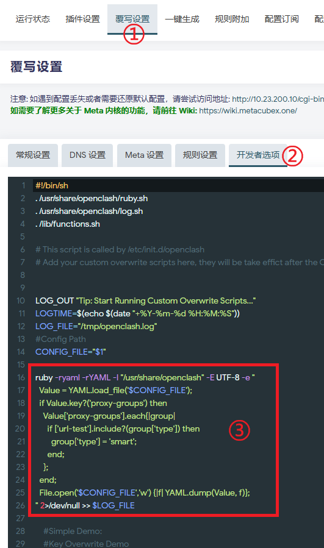

想到什么写什么

***

# 1. 订阅转换相关

## 1.1. ImmortalWrt 下搭建订阅转换后端服务  
有些人可能会担心使用公共订阅转换服务会泄露自己的订阅链接，从而选择自建订阅转换服务。  

在 ImmortalWrt 固件的软件源中，已经包含了 subconverter 软件包，只需简单几部操作就可以搭建属于自己的本地订阅转换后端服务。  

如果你的固件软件源中同样有 subconverter 软件包，可以参考此操作。

具体操作步骤： 
```
1. 点击“更新列表”

2. 在过滤器中输入 subconverter

3. 点击 subconverter 软件包后的“安装”，安装对应的软件包  
```

  

没有特殊需求的话，使用 subconverter 的默认配置即可，默认配置已经关闭了缓存功能。也不需要去修改安全相关的参数，毕竟这个订阅转换后端服务只有你自己的内网可用。  

然后在 `OpenClash > 配置订阅`中，填写自定义订阅转换服务地址：  
```
http://127.0.0.1:25500/sub
```


模板链接建议使用 jsDeliver 的加速地址，连通性比较好，或者其他加速 CDN 地址也行，反正别用 GitHub 原始地址就行了。

保存并应用，即可开始使用自建的订阅转换后端服务进行订阅。  

## 1.2. 自建订阅转换后端服务导入本地模板和规则  

以 ImmortalWrt 下搭建的 subconverter 为例，其配置文件所在目录为 `/etc/subconverter `  

将你自己维护的订阅转换模板 .ini 文件，放置在 `/etc/subconverter` 下的 `config` 目录中，比如 `example.ini` 文件  

在 OpenClash 中配置好`订阅转换服务地址`后，在`自定义模板的地址`中，无需再填写远程模板地址，直接填写文件名 `example.ini` ，subconverter 在转换时即可调用你的本地模板  

  

对于规则文件`.list`文件，可以放置在 `/etc/subconverter` 下的 `rules` 目录中，在订阅转换模板中使用本地地址进行调用即可。  

例如：  
```
ruleset=🎯 全球直连,rules/your_rules.list
```

如此配置后，你的订阅转换完全可以脱离远程文件运行，可以直接在本地进行维护模板和规则，无需再上传 GitHub。  

***

# 2. OpenClash 相关

## 2.1. 本项目方案如何使用 Smart 内核  

Smart 内核是 OpenClash 作者 vernesong 推出的魔改版内核，支持 Smart 策略组功能，有点类似 Load-balance（负载均衡）策略组。

内核特性：https://github.com/vernesong/OpenClash/releases/tag/mihomo  

本项目的模板目前都是使用的 Url-test（自动测速）策略组，由于订阅转换后端暂时还不支持 Smart 策略组，所以请按照以下两个步骤实现对 Url-test 策略组的自动替换。

### 2.1.1. 更换 Smart 内核

在 OpenClash `插件设置 > 版本更新`中，将 `Smart 内核`选择为`启用`，然后直接点击下方内核处的`检查并更新`按钮。 
 
注意选择启用后**切勿**点保存，务必**直接**点更新。 


OpenClash 即会更新为 Smart 内核。

### 2.1.2. 修改“开发者选项”  

进入 `覆写设置 > 开发者选项` 页面，注意是`覆写设置`下的`开发者选项`，**不是**`插件设置`下的开发者选项。

复制以下代码，插入在原有内容的`CONFIG_FILE="$1"`之后，`exit 0`之前。  

> 代码来自于 OpenClash 插件作者在其他 TG 群组中发布的消息。

```
ruby -ryaml -rYAML -I "/usr/share/openclash" -E UTF-8 -e "
  Value = YAML.load_file('$CONFIG_FILE');
  if Value.key?('proxy-groups') then
    Value['proxy-groups'].each{|group|
      if ['url-test'].include?(group['type']) then
        group['type'] = 'smart';
      end;
    };
  end;
  File.open('$CONFIG_FILE','w') {|f| YAML.dump(Value, f)};
" 2>/dev/null >> $LOG_FILE
```

具体位置如下图所示。  

  

然后应用配置，OpenClash 在每次启动时即会将原有配置中的所有 Url-test 自动测速策略组替换为 Smart 策略组。  

因为推荐机场的节点质量相当好，所以我自己并没有使用 Smart 内核。  

所以，Smart 策略组的相关问题就不要问我了哈。  