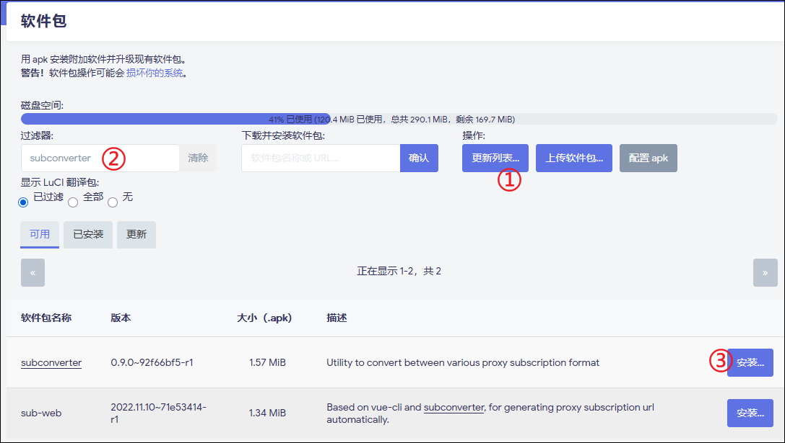
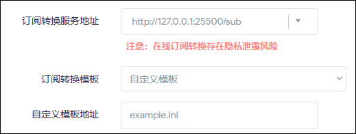

想到什么写什么

***

# 1. 订阅转换相关

## 1.1. ImmortalWrt 下搭建订阅转换后端服务  
有些人可能会担心使用公共订阅转换服务会泄露自己的订阅链接，从而选择自建订阅转换服务。  

在 ImmortalWrt 固件的软件源中，已经包含了 subconverter 软件包，只需简单几部操作就可以搭建属于自己的本地订阅转换后端服务。  

如果你的固件软件源中同样有 subconverter 软件包，可以参考此操作。

具体操作步骤： 
```
1. 点击“更新列表”

2. 在过滤器中输入 subconverter

3. 点击 subconverter 软件包后的“安装”，安装对应的软件包  
```

  

没有特殊需求的话，使用 subconverter 的默认配置即可，默认配置已经关闭了缓存功能。也不需要去修改安全相关的参数，毕竟这个订阅转换后端服务只有你自己的内网可用。  

然后在 `OpenClash > 配置订阅`中，填写自定义订阅转换服务地址：  
```
http://127.0.0.1:25500/sub
```


由于 OpenClash 中自带的订阅转换模板地址均为 GitHub 直链，在国内大部分地区无法直接访问，所以如果你的自建后端是使用的国内网络，务必使用模板的加速地址

模板链接建议使用 jsDeliver 的加速地址，连通性比较好，或者其他加速 CDN 地址也行，反正别用 GitHub 原始地址就行了。

保存并应用，即可开始使用自建的订阅转换后端服务进行订阅。  

**注意：本地网络搭建的自建后端，有可能无法直连访问 GitHub，也就无法拉取所有 GitHub 直链的文件（包括但不限于模板、规则等），请自行解决 GitHub 的访问问题，否则后端会使用默认的内置模板进行转换，无法达到本项目所要实现的效果。**

## 1.2. 自建订阅转换后端服务导入本地模板和规则  

以 ImmortalWrt 下搭建的 subconverter 为例，其配置文件所在目录为 `/etc/subconverter `  

将你自己维护的订阅转换模板 .ini 文件，放置在 `/etc/subconverter` 下的 `config` 目录中，比如 `example.ini` 文件，在订阅转换模板地址中使用本地路径进行调用即可，例如 `config/example.ini`

你也可以将模板文件直接放在 /base 下，在`自定义模板的地址`中，无需再填写路径，直接填写文件名 `example.ini` ，subconverter 在转换时即可调用你的本地模板  

  

对于规则文件`.list`文件，可以放置在 `/etc/subconverter` 下的 `rules` 目录中，在订阅转换模板地址中使用本地路径进行调用即可，例如 `rules/your_rules.list`。


例如：  
```
ruleset=🎯 全球直连,rules/your_rules.list
```

如此配置后，你的订阅转换完全可以脱离远程文件运行，可以直接在本地进行维护模板和规则，无需再上传 GitHub。  

***

# 2. OpenWrt 相关  

## 2.1. 固件扩容  

关于 OpenWrt/ImmortalWrt 的扩容，网上各种教程五花八门。在使用官方发布固件的情况下，借助软件源内的 owut 插件，配合官方的 ASU 服务器，可以非常无脑的实现扩容，并且在日后的升级中保留容量，丝滑升级到新版本。  

具体操作步骤：  

1. SSH 连接 OpenWrt/ImmortalWrt  

2. 使用 opkg update / apk update 更新软件源  