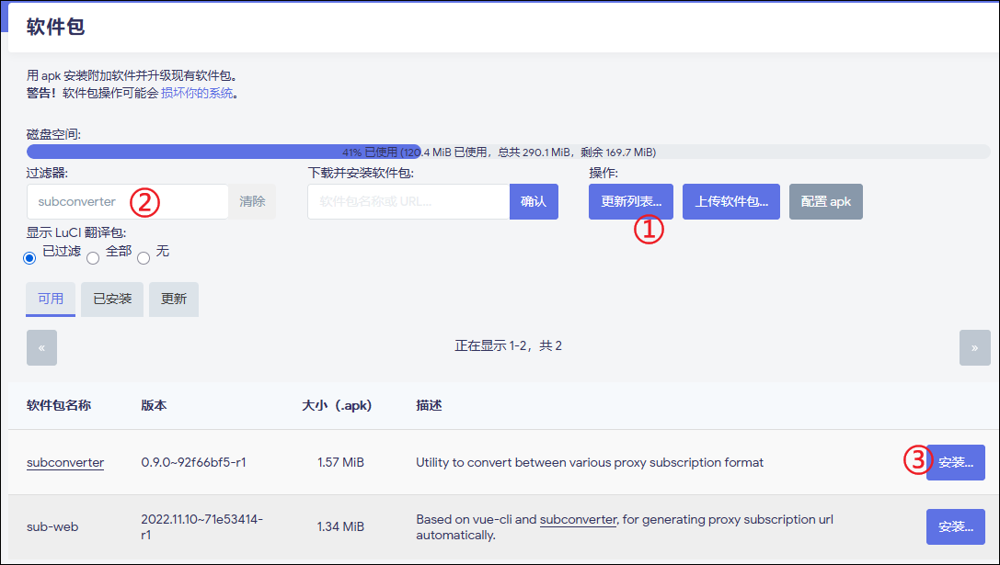
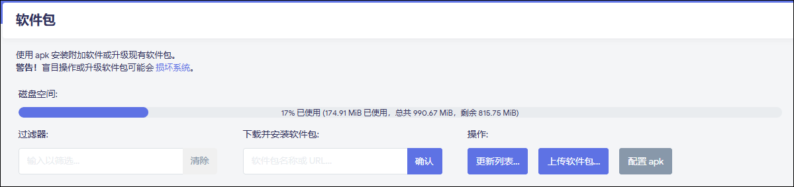

# 💡 一些零碎的教程

> 自己写了一些关于 OpenClash 和 OpenWrt 的实用配置教程，零零碎碎。

---

## 目录

- 1. 配置转换相关
  - 1.1. ImmortalWrt 下搭建本地转换服务
  - 1.2. 本地转换服务导入模板和规则
- 2. OpenWrt 相关
  - 2.1. 固件扩容（有风险）
  - 2.2. OpenWrt x Tailscale 子网互通方案（fw4 / snapshot）

---

## 📦 1. 配置转换相关

### 1.1. ImmortalWrt 下搭建本地转换服务

部分用户倾向于在本地运行转换服务，避免依赖外部服务。

ImmortalWrt 固件的软件源中默认包含了 `subconverter` 软件包。通过安装该软件包，可以在本地快速搭建轻量级的转换服务。

**安装步骤：**

```text
1. 进入软件包界面，点击"更新列表"

2. 在过滤器中输入 subconverter

3. 找到 subconverter 软件包，点击"安装"
```



通常情况下，使用默认配置即可满足需求（默认已关闭缓存），无需修改配置参数。

安装完成后，在 OpenClash 的订阅配置页面中，将 `订阅转换服务地址` 修改为：

```text
http://127.0.0.1:25500/sub
```


**重要配置说明：**

由于 OpenClash 内置的模板地址多为 GitHub 直链，在某些网络环境下可能不稳定。若转换服务侧拉取失败，可将模板链接替换为可用的备用下载源（如 jsDelivr 的对应地址），以确保转换服务正常运行。

> [!WARNING]
> **注意**：如果转换服务无法访问模板/规则地址，将导致无法拉取远程模板和规则文件，服务会自动回退至内置默认模板，从而导致策略组/规则结构不符合预期。请确保转换服务侧网络连通性或使用可用的备用下载源。

---

### 1.2. 本地转换服务导入模板和规则

以 ImmortalWrt 为例，subconverter 的默认配置文件路径为 `/etc/subconverter`。

#### 导入本地模板

将自定义的 `.ini` 模板文件上传至 `/etc/subconverter/config` 目录（例如 `example.ini`）。在引用时，使用路径 `config/example.ini`。

或者，将模板文件上传至 `/etc/subconverter/base` 目录。在 OpenClash 的 `自定义模板的地址` 栏中，直接填写文件名 `example.ini` 即可调用。


#### 导入本地规则

将规则文件（`.list`）上传至 `/etc/subconverter/rules` 目录。在模板文件中引用时，使用路径 `rules/your_rules.list`。

**配置示例：**

```ini
ruleset=🎯 全球直连,rules/your_rules.list
```

通过以上配置，即可实现完全本地化的转换服务，便于自行维护模板和规则，不再依赖远程 GitHub 文件。

---

## 🖥️ 2. OpenWrt 相关

<a id="firmware-expansion"></a>

### 2.1. 固件扩容（有风险）

使用官方发布的 OpenWrt/ImmortalWrt 固件时，可以通过 `owut` 配合 ASU（Attended Sysupgrade）服务器，在生成升级固件时指定根文件系统大小，并在后续升级中继续沿用该设置。

> [!CAUTION]
> **扩容与系统升级都属于高风险操作。** 更改根文件系统大小时，部分平台可能丢失配置；OpenWrt 官方文档特别提示 x86 平台曾多次出现这一情况。操作前务必下载完整配置备份，并确认即使 LAN 地址恢复为 `192.168.1.1`，你仍能重新连接设备。
>
> 本教程基于 ext4 分区验证，squashfs 分区未经测试。不同设备、分区布局与 ASU 服务器的行为可能不同，请以当前设备的 `owut check` 输出为准。

**操作步骤：**

#### 步骤 1：SSH 连接设备

#### 步骤 2：更新软件源

根据固件的包管理器版本执行更新命令：

- **APK**：`apk update`
- **OPKG**：`opkg update`

#### 步骤 3：安装必要插件

安装 `owut` 和 `attendedsysupgrade`：

- **APK**：`apk add luci-i18n-attendedsysupgrade-zh-cn owut`
- **OPKG**：`opkg install luci-i18n-attendedsysupgrade-zh-cn owut`

#### 步骤 4：虚拟机扩容（物理机请跳过）

若运行在 PVE、ESXi 等虚拟化平台，需先在虚拟机管理界面调整虚拟磁盘大小。虚拟磁盘大小必须大于或等于调整后的容量。  

#### 步骤 5：设置目标固件大小

默认情况下，`owut` 仅在当前请求中应用临时参数。配置永久参数可确保后续升级自动维持指定容量。

> [!TIP]
> 固件大小上限受所用 ASU 服务器限制。OpenWrt 官方服务器当前通常允许的最大值为 1024MB；执行前请在服务器状态信息中确认 `Maximum requested root filesystem size`。

执行以下命令写入配置：

```bash
uci set attendedsysupgrade.owut=owut
# 设置固件大小为 1024MB (1GB)
uci set attendedsysupgrade.owut.rootfs_size='1024'
uci commit

```

#### 步骤 6：执行扩容与升级

先执行检查，确认目标版本、软件包变更、文件系统类型与根文件系统大小均符合预期：

```bash
owut check
```

确认无异常并完成备份后，再运行升级命令：

```bash
owut upgrade --force
```

> [!TIP]
> 本扩容教程建议使用 `--force`。仅修改 `rootfs_size` 时，目标固件版本可能与当前版本相同，`owut` 可能判断“没有检测到版本变更”而不继续；`--force` 可以在这种情况下强制完成构建、下载和升级。它也会允许存在软件包降级的升级继续执行，因此仍应先查看 `owut check` 的结果，确认变更符合预期后再执行。

升级成功后，`rootfs_size` 配置会继续供 `owut` 使用；新版 LuCI Attended Sysupgrade 也能读取该设置。配置是否能在首次改变分区大小时完整保留，取决于具体平台，因此必须保留可恢复的备份。

参考：[OpenWrt 官方 owut 文档](https://openwrt.org/docs/guide-user/installation/sysupgrade.owut)



---

### 2.2. OpenWrt x Tailscale 子网互通方案（fw4 / snapshot）

#### 2.2.1. 目标

- 原则上最小化配置，不进行任何无用的配置修改操作
- 配合值守式系统升级，在正常情况下保留配置；升级后仍需复查服务与路由状态
- 多台 OpenWrt 路由器之间实现三层子网互通
- 各自子网公网出口独立
- 不合并 LAN 广播域，不会自动转发二层广播
- 仅允许通过明确 IP 访问对端
- 子网设备增删无需调整防火墙规则
- 不需要在公网开放任何端口

#### 2.2.2. 适用环境

- OpenWrt/ImmortalWrt Snapshot
- 防火墙：fw4 + nftables
- Tailscale 使用软件源中自带版本
- 各 LAN 子网不重叠

> [!NOTE]
> 本教程以双节点作为示例，添加更多节点的操作相同，只要内网地址不重复即可。

示例：

| 节点 | 子网 |
| ---- | ---- |
| A | 192.168.1.0/24 |
| B | 192.168.2.0/24 |


#### 2.2.3. Tailscale 配置（每台路由器都做）

##### 2.2.3.1. 安装并启动 Tailscale

```sh
apk update
apk add tailscale
```

```sh
/etc/init.d/tailscale enable
/etc/init.d/tailscale start
```

使用 OpenWrt 软件包自带的 init 脚本启动，可以保留状态并在设备重启后自动恢复。不要使用 `tailscaled &` 临时放到后台运行。

确认服务正在运行，并检查 IPv4 转发：

```sh
pgrep -a tailscaled
sysctl net.ipv4.ip_forward
```

`net.ipv4.ip_forward` 的值应为 `1`。OpenWrt 作为路由器时通常已经启用。

##### 2.2.3.2. 加入 Tailscale 并通告子网

A（192.168.1.0/24）：

```sh
tailscale up \
  --advertise-routes=192.168.1.0/24 \
  --snat-subnet-routes=false \
  --accept-routes \
  --accept-dns=false
```

B（192.168.2.0/24）：

```sh
tailscale up \
  --advertise-routes=192.168.2.0/24 \
  --snat-subnet-routes=false \
  --accept-routes \
  --accept-dns=false
```

`--snat-subnet-routes=false` 用于保留原始 LAN 源地址，适合本文的站点到站点互通目标；`--accept-routes` 则让 Linux/OpenWrt 接受其他子网路由器通告的路由。

SSH 界面中会出现登录链接，复制并用浏览器打开后会跳转 Tailscale 官网，自行注册或登录 Tailscale 账号即可。  
在浏览器中登录后，SSH 界面会自动提示 `Success`，表示绑定成功。

##### 2.2.3.3. 控制台操作（一次性）

在 Tailscale 官网控制台的 Admin Console 中：

- 在 Machines 页面分别批准双方通告的 subnet routes。

完成 routes 批准即可，无需再修改 Access controls、ACL 或 grants。

##### 2.2.3.4. 路由确认（可选）

```sh
ip route get <对端网关IP>
```

期望结果：

```
dev tailscale0
```

#### 2.2.4. 防火墙配置（fw4 核心）

> [!IMPORTANT]
> fw4 + 动态接口（`tailscale0`）必须使用 `option device`，不要使用 `option network`。

##### 2.2.4.1. 创建 / 修正 tailscale zone

```sh
uci add firewall zone
uci set firewall.@zone[-1].name='tailscale'
uci set firewall.@zone[-1].device='tailscale0'
uci set firewall.@zone[-1].input='ACCEPT'
uci set firewall.@zone[-1].output='ACCEPT'
uci set firewall.@zone[-1].forward='REJECT'
```

##### 2.2.4.2. 添加 forwarding（仅这两条）

```sh
uci add firewall forwarding
uci set firewall.@forwarding[-1].src='lan'
uci set firewall.@forwarding[-1].dest='tailscale'

uci add firewall forwarding
uci set firewall.@forwarding[-1].src='tailscale'
uci set firewall.@forwarding[-1].dest='lan'
```

##### 2.2.4.3. 提交并重载

```sh
uci commit firewall
fw4 check
/etc/init.d/firewall reload
```

只有 `fw4 check` 无报错时才继续重载；如检查失败，请先修正配置，避免防火墙规则加载异常。

##### 2.2.4.4. 核查 fw4 是否真正生效（关键）

```sh
nft list chain inet fw4 input
```

必须出现：

```
iifname "tailscale0" jump input_tailscale
```

#### 2.2.5. 验证流程（顺序不可乱）

##### 2.2.5.1. 路由器 <-> 路由器

```sh
ping 192.168.2.1
ping 192.168.1.1
```

##### 2.2.5.2. 子网设备 <-> 子网设备

```sh
ping 192.168.2.X
```

再从 B 子网设备反向测试 A 子网设备，并用 `traceroute` 或 `tcpdump -ni tailscale0` 确认流量确实经过 `tailscale0`。如果小包可通但部分网页或大包连接异常，再检查路径 MTU/MSS；不要先盲目放宽防火墙。

#### 2.2.6. 结语

以上方案用于 fw4 + snapshot + Tailscale 的三层子网互通，不会合并两个 LAN 的二层广播域。按本文配置时，它与本项目 OpenClash 设置方案不存在已知冲突；系统升级后仍应复查 Tailscale 服务状态、路由批准、访问控制策略与 fw4 规则是否正常加载。

参考资料：

- [Tailscale：Site-to-site networking](https://tailscale.com/docs/features/site-to-site)
- [Tailscale：Subnet routers](https://tailscale.com/docs/features/subnet-routers)
- [Tailscale：Route injection](https://tailscale.com/docs/reference/route-injection)
